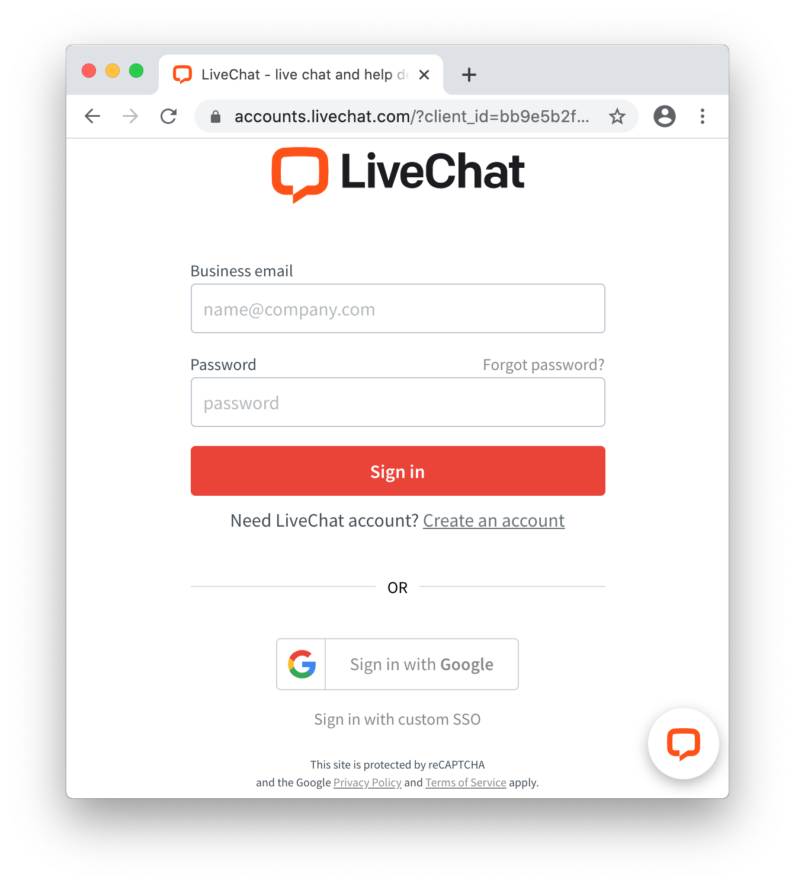

# Introduction

## User flow

"Sign in with LiveChat" flow is the easiest way to get access to basic information in LiveChat accounts. It allows you to quickly build an app that can access this information.

User starts the flow by clicking the "Sign in with LiveChat" button:


If user is not signed in to LiveChat, he is asked to do that:



Then, user must allow the app to access specified parts of his LiveChat account:


Finally, the app receives an `access_token` that allows it perform LiveChat API calls, limited to what the user agreed to in the prompt.

For example, you can display the LiveChat tracking code, which already includes the user's account license number:

<CodeSample path={'TRACKING CODE'}>

```js
<!-- Start of LiveChat (www.livechat.com) code -->
<script>
    window.__lc = window.__lc || {};
    window.__lc.license = 11069052;
    ;(function(n,t,c){function i(n){return e._h?e._h.apply(null,n):e._q.push(n)}var e={_q:[],_h:null,_v:"2.0",on:function(){i(["on",c.call(arguments)])},once:function(){i(["once",c.call(arguments)])},off:function(){i(["off",c.call(arguments)])},get:function(){if(!e._h)throw new Error("[LiveChatWidget] You can't use getters before load.");return i(["get",c.call(arguments)])},call:function(){i(["call",c.call(arguments)])},init:function(){var n=t.createElement("script");n.async=!0,n.type="text/javascript",n.src="https://cdn.livechatinc.com/tracking.js",t.head.appendChild(n)}};!n.__lc.asyncInit&&e.init(),n.LiveChatWidget=n.LiveChatWidget||e}(window,document,[].slice))
</script>
<noscript><a href="https://www.livechatinc.com/chat-with/11069052/" rel="nofollow">Chat with us</a>, powered by <a href="https://www.livechatinc.com/?welcome" rel="noopener nofollow" target="_blank">LiveChat</a></noscript>
<!-- End of LiveChat code -->
```

</CodeSample>

## Use cases

With the "Sign in with LiveChat" flow, you can easily build an app which:

- obtains access to LiveChat user's email, account ID or organization ID,
- will receive an `access_token` that can be used to perform different LiveChat API calls,
- will receive `code` using PKCE extension, which could be used to obtain account `refresh_token` and `access_token`.

# Setup

## Step 1: Create a new app

Create a new "LiveChat OAuth 2.1 Client" app in <a href="https://developers.livechatinc.com/console/">Developers Console</a>. You will receive a new `client_id` that can be used in the next steps.

Please note that **Redirect URI** field must match the URL of the website that has the "Sign in with LiveChat" button installed. The button will not work with any other URL addresses.

## Step 2: Include the SDK library

The SDK is available in two formats: an NPM module and a CDN-hosted library.

### NPM module

```bash
npm install --save @livechat/accounts-sdk@^2.0.0
```

```js
import AccountsSDK from '@livechat/accounts-sdk';
```

If you build an app using Webpack, you can just import the `AccountsSDK` module from the NPM.

### CDN-hosted library

```html
<script src="//cdn.livechatinc.com/accounts/accounts-sdk.min.js"></script>
```

If you do not use Webpack, you can still include the library using a `<script>` tag in your HTML. This will create an `AccountsSDK` global object.

## Step 3: Prepare button container

```html
<div id="login-button" style="background: url(.../livechat_sing_in.png)"></div>
```

```js
// javascript
const instance = new AccountsSDK({
  client_id: '<your_app_client_id>',
  redirect_uri: '<your_app_redirect_uri>'
});

document.getElementById('login-button').onclick = (e) => {
  if (e && e.preventDefault) {
    e.preventDefault();
  }

  sdk.popup().authorize().then((authorizeData)=>{
    const transaction = sdk.verify(authorizeData);
    if (transaction != null) {
      // authorization success
      // authorizeData contains `accessToken` or `code`
      // transaction contains state and optional code_verifier (code + PKCE)
      console.log("User access token: " + transaction.accessToken)
      document.getElementById('login-button').style.display = "none"
    } else {
      console.log("Redirect state don't matches previous one")
    }
  }).catch((e)=>{
    console.error("Failed to authorize user", e)
  })
};
```

During creation of Sign In LiveChat button, you can use [LiveChat Designs](https://livechat.design/).

<Warning>

[**Don't forget to test the give consent step**](/monetization/app-review-process/#common-problems). Use `prompt: "consent"` to force the app to **ask you for access** to certain resources. It’s necessary for you to test the app as if you were a user who installs the app from Marketplace.

</Warning>

# SDK documentation

## Classes

### **AccountsSDK**

Main instance of SDK using to authorize user in LiveChat Accounts.

#### **constructor(options = {})**

> Example class creation

```js
const instance = new AccountsSDK({
  client_id: '<your_app_client_id>'
});
```

Constructor accepts an `options` object with the following properties:

  - **client_id** - Application registered client ID
  - **prompt** - use `consent` to force consent prompt in popup and redirect flows, default: `''`
  - **response_type** - OAuth response type, use `token` or `code`, default: `'token'`
  - **popup_flow** - `auto` - close popup when not required, `manual` - always show popup, default: `'auto'`
  - **state** - OAuth state param
  - **verify_state** - check if state matches after redirect, default: `true`
  - **scope** - request exact scopes - must be configured for a given client id, string separated with `,`, default: `null`
  - **redirect_uri** - OAuth redirect uri, default: current location
  - **email_hint** - fill in email in forms
  - **server_url** - authorization server url
  - **tracking** - tracking querystring params
  - **transaction** - object with options for transaction manager
  - **pkce** - object with `PKCE` configuration

Object `transaction` consists from following parameters:
  - **namespace** - transaction keys prefix, default: `'com.livechat.accounts'`
  - **key_length** - transaction random state length, default: `32`
  - **force_local_storage** - try to use local storage instead of cookies, default: `false`

`PKCE` configuration properties:
  - **enabled** - Oauth 2.1 PKCE extension enabled, default: `true`
  - **code_verifier** - override auto generated code verifier
  - **code_verifier_length** - code verifier length, between 43 and 128 characters https://tools.ietf.org/html/rfc7636#section-4.1, default: `128`
  - **code_challange_method** - code challenge method, use `S256` or `plain`, default: `S256`

<aside class="notice">
  Use of PKCE extension is required when JavaScript application wants to acquire authorization code and exchange it for tokens.
</aside>

#### **instance.iframe(options = {})** - Returns `Iframe` object instance built on top of sdk.

```js
  const iframe = instance.iframe();
```

#### **instance.popup(options = {})** - Returns `Popup` object instance built on top of sdk.

```js
  const popup = instance.popup();
```

#### **instance.redirect(options = {})** - Returns `Redirect` object instance built on top of sdk.

```js
  const redirect = instance.redirect();
```

#### **instance.authorizeURL(options = {}, flow = '')** - Creates authorization URL for given flow and parameters.

```js
  const authURL = instance.authorizeURL();
```

#### **instance.verify(authorizeData)** - This function verifies if redirect transaction params are valid, returns `Transaction` if valid, `null` otherwise.

```js
  const transactionData = instance.verify(authorizeData);
  if (transactionData) {
    console.log("Verified correctly");
  } else {
    console.log("Url/state mismatch");
  }
```

<aside class="notice">
  `options` objects in all methods of `AccountsSDK` object is used to overwrite data provided upon initialization.
</aside>

### **Iframe**

Class responsible for acquiring user authorization data through `iframe`.

#### **constructor(sdk, options)**

Constructor accepts an `sdk` instance and `options` object with the same parameters as `AccountsSDK`.

```js
const instance = new AccountsSDK({
  client_id: '<your_app_client_id>'
});

const iframe = new Iframe(instance, instance.options);
```

<aside class="notice">
  Iframe object instance could be also created via `sdk` with:
  ```js
  const iframe = instance.iframe();
  ```
</aside>

#### **iframe.authorize()** - Returns promise which resolves with user authorization data or error.

```js
  iframe.authorize().then((authorizeData) => {
    console.log("authorize data acquired: " + authorizeData);
  }).catch(e => {
    console.error("Failed to acquire authorization data: " + e);
  });
```

#### **iframe.iframeID()** - Returns created iframe id.

```js
  const iID = iframe.iframeID();
```

#### **iframe.removeIframe()** - Removes created iframe.

```js
  iframe.removeIframe();
```

<aside class="notice">
  Running authorization through iframe is not recommended due to ITP (Intelligent Tracking Prevention) 2.0
</aside>

### **Popup**

Class responsible for acquiring user authorization data through `popup` window.

#### **constructor(sdk, options)**

Constructor accepts an `sdk` instance and `options` object with the same parameters as `AccountsSDK`.

```js
const instance = new AccountsSDK({
  client_id: '<your_app_client_id>'
});

const popup = new Popup(instance, instance.options);
```

<aside class="notice">
  Popup object instance could be also created via `sdk` with:
  ```js
  const popup = instance.popup();
  ```
</aside>

#### **popup.authorize()** - Returns promise which resolves with user authorization data or error.

```js
  popup.authorize().then((authorizeData) => {
    console.log("authorize data acquired: " + authorizeData);
  }).catch(e => {
    console.error("Failed to acquire authorization data: " + e);
  });
```

### **Redirect**

Class responsible for acquiring user authorization data through `redirect` method.

#### **constructor(sdk, options)**

Constructor accepts an `sdk` instance and `options` object with the same parameters as `AccountsSDK`.

```js
const instance = new AccountsSDK({
  client_id: '<your_app_client_id>'
});

const redirect = new Redirect(instance, instance.options);
```

<aside class="notice">
  Redirect object instance could be also created via `sdk` with:
  ```js
  const redirect = instance.redirect();
  ```
</aside>

#### **redirect.authorize()** - Starts redirect authorization flow.

```js
  redirect.authorize();
```

#### **redirect.authorizeData()** - Checks if the current origin was redirected to with authorize data and returns promise which resolves with user authorization data or error.

```js
  redirect.authorizeData().then((authorizeData) => {
    console.log("authorize data acquired: " + authorizeData);
  }).catch(e => {
    console.error("Failed to acquire authorization data: " + e);
    redirect.authorize(); // Try to redirect user to authorization once more
  });
```

### **Transaction**

#### **constructor(options)** - Creates new instance of transaction helper. Constructor accepts `options` object with the same parameters as `AccountsSDK`.

```js
  const transaction = new Transaction({});
```

#### **generate(params)** - Generates new transaction from params and stores it in cookie/local storage for 30 minutes.

```js
  transaction.generate({
    user_page: "/login_test",
    state: "fdac3321gfd"
  });
```

#### **get(state)** - Returns transaction generated for given state.

```js
  const transactionData = transaction.get("fdac3321gfd");
```

#### **clear(state)** - Removes transaction generated for provided state.

```js
  transaction.clear("fdac3321gfd");

  transaction.get("fdac3321gfd"); // Will return `{}` object
```

## Exchanging code for tokens using PKCE extension

In order to acquire both `access_token` and `refresh_token` by frontend application we should use [PKCE](https://www.oauth.com/oauth2-servers/oauth-native-apps/pkce/) Extension which prevents usage of hijacked redirect by malicious apps.

In order to use it we should start with providing to PKCE enabled options to SDK instance:

```js
  const instance = new AccountsSDK({
    client_id: '<your_app_client_id>',
    redirect_uri: '<your_app_redirect_uri>',
    response_type: "code",
    pkce: {
      enabled: true
    }
  });
```

Then using `redirect` flow we are able to receive code authorization data:

```js
  instance.redirect().authorizeData().then((authorizeData) => {
    const transactionData = instance.verify(authorizeData);
    if (transactionData === null) {
      console.log("Failed to verify authorization data");
      return;
    }
    fetch(instance.options.server_url + "/v2/token", {
        headers: {
          'Accept': 'application/json',
          'Content-Type': 'application/json'
        },
        method: "POST",
        body: JSON.stringify({
          grant_type: "authorization_code",
          code: authorizeData.code,
          client_id: transactionData.client_id,
          redirect_uri: transactionData.redirect_uri,
          code_verifier: transactionData.code_verifier,
      })
    })
    .then((res) => { res.json()}).then((data) => {console.log("User tokens: " + data)})
    .catch((e) => { console.log("Failed to exchange code: " + e) })
  }).catch(e => {
    // As we don't have any authorization data, then we can try o authorize user
    const wasRedirected = sessionStorage.getItem('lc_accounts');
    if (wasRedirected === "yes") {
      console.error("Couldn't authorize user: " + e);
      return
    }
    sessionStorage.setItem('lc_accounts', yes);
    instance.redirect().authorize(); // Initiate authorization redirect flow

  })
```

## Response format

All `authorize` methods returns user authorization data on success resolve or error when something goes wrong.

### Success

If the user passes through authorization process then returned data will consists of following elements, depending on provided `response_type` in options object.

If `response_type` was set to **access_token**:

- **access_token** – used for authorization in LiveChat API calls,
- **scopes** – array of scopes that `access_token` has access to,
- **expires_in** – number of seconds from now that `access_token` will be valid,
- **account_id** – LiveChat Accounts user id,
- **organization_id** – LiveChat Accounts organization id on which account is logged in,
- **client_id** – `client_id` that you passed in the `init` method.

If `response_type` was set to **code**:

- **code** – must be exchanged to `access_token` and `refresh_token`,
- **scopes** – array of scopes that `access_token` generated by this code will have access to,
- **expires_in** – number of seconds from now that `code` will be valid,
- **account_id** – LiveChat Accounts user id,
- **organization_id** – LiveChat Accounts organization id on which account is logged in,
- **client_id** – `client_id` that you passed in the `init` method.

### Error

If authorization process fail then promise is going to be rejected with error, with the following properties:

```js
  {
    "oauth_exception": "<exception_name>"
    "identity_exception": "<exception_name>"
    "description": "<exception_description>"
  }
  ""
```

#### Authentication errors

- **identity_exception** – error type. Possible values:<br/><br/>
  - `unauthorized` – Resource owner identity is not known or consent is missing..<br/><br/>

#### Authorization errors

- **oauth_exception** – error type. Possible values:<br/><br/>

  - `invalid_request` – request is missing a required parameter, includes an invalid parameter value, includes a parameter more than once or is otherwise malformed. Examples: wrong HTTP method, invalid HTTP body encoding.<br/><br/>
  - `unauthorized_client` – client is not authorized to request a token using this method. Examples: missing `client_id` param, incorrect `client_id` value, `refresh_token` not found, invalid `client_secret`, invalid `redirect_uri`.<br/><br/>
  - `access_denied` – resource owner or authorization server denied the request. For example, requested scope includes a scope not originally granted by the resource owner.<br/><br/>
  - `unsupported_response_type` – authorization server does not support obtaining a token using this method. For example, `response_type` is not `token` or `code`.<br/><br/>

