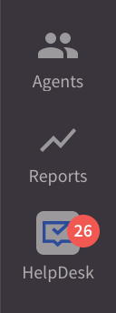

# Introduction

Agent App Widgets are web applications loaded inside the **LiveChat Agent App** user interface. Read about their possible locations in the [Building LiveChat apps](/extending-ui/extending-agent-app/#app-locations) guide.
The [Agent App SDK](/extending-ui/extending-agent-app/agent-app-sdk/#top) is currently the primary way to develop your own widgets.

## Use cases

Widgets are primary elements of the Agent App user interface. You can use them to:

- embed and display static content, for example, knowledge base articles, conversation prompts, or context information.
- embed your SaaS service or web app as part of the agents' workspace.
- query external services with visitor's email or LiveChat group ID (CRM, marketing automation, etc.).
- create a store with [in-app purchases](/monetization/billing-api/) to sell additional services or features of your app.
- query LiveChat APIs to do basically anything with the visitor, agent, or chat.

## Before you start

From a technical point of view, widgets are regular web applications. For that reason, you need to have some knowledge of HTML, CSS, and JavaScript to build your own widget.

Bear in mind that widgets are front-end elements of the LiveChat Agent App. If your intention is to build a server-side app, we encourage you to check out the [Messaging APIs](../../../messaging/).

# Getting started

Follow the intructions to create a basic Agent App Widget. Before you start, make sure you <a href="https://accounts.livechat.com" target="_blank">have an account</a>.

1. Go to the Apps section in {{DEVELOPER_CONSOLE_URL}}.
2. Click **Create new app +** and give your app a name.
3. Go to **Building blocks** and add a new **Agent App Widgets** block.
    - Enter the **Widget source URL**, which is the address of your application. If it's not ready yet, you can use our [sample apps](#sample-apps) to play around.
    - Choose the **widget placement**. It allows you to decide where exactly in the Agent App you want to display your integration. Currently, the possible locations are: the Details section, message box, Settings, main menu (fullscreen apps). [Read more](/extending-ui/extending-agent-app/#app-locations) about app locations.  
4. Additionally, you can configure your app's short decription and add an icon for better visibility in the Agent App. You can do that in the **Display details** tab.
5. Go to the **Private installation** tab and install the app on your account.

After the successful installation, you'll see the widget in your LiveChat Agent App.
## Sample apps

If you'd like to experiment with some of the already existing apps, make sure to check out the repository we've prepared. Once installed, these widgets will be displayed in the right sidebar of the Agent App.

- [Tag Master](https://github.com/livechat/sample-apps/tree/master/Tag%20Master): allows user to create, view, and delete tags and canned responses in easy and predictable way.
- [Progress](https://github.com/livechat/sample-apps/tree/master/progress): creates reports based on data from chats.
- [Supervisor](https://github.com/livechat/sample-apps/tree/master/supervisor): helps to monitor the weekly progress of your agents, as well as their availability.

<SectionLink href="https://github.com/livechat/sample-apps/">
  See the repo
</SectionLink>


## Installing the SDK

You can download the SDK directly from NPM as an ES6 or CommonJS module.

Install the SDK from NPM...

<CodeSample>

```
npm install @livechat/agent-app-sdk
```

</CodeSample>

...then import the ES6 module...

<CodeSample>

```js
import * as LiveChat from "@livechat/agent-app-sdk";
```

</CodeSample>

...or require the CommonJS.

<CodeSample>

```js
const LiveChat = require("@livechat/agent-app-sdk");
```

</CodeSample>

You can also use the UMD build of the SDK directly in the browser.

You can also use the UMD build:

<CodeSample>

```html
<script src="https://unpkg.com/@livechat/agent-app-sdk@latest/dist/agentapp.umd.min.js"></script>
<script>
  LiveChat.createDetailsWidget().then(function(widget) {
    // do something with widget
  });
</script>
```

</CodeSample>

# Basic use

The specific usage of the Agent App SDK depends on the type of widget you want to create. The currently available widget types are the following:

- [Details widget](#details-widgets)
- [MessageBox](#messagebox)
- [Fullscreen widget](#fullscreen-widgets)

All widgets created with the Agent App SDK share a common interface, which lets you listen for the events happening in the Agent App.

Supposing that `widget` is a widget instance:

<CodeSample>

```js
function handleEvent(event) {
  // perform logic when event happens,
  // you can also use the data attached to the event
}

// Subscribe to event
widget.on("event", handleEvent);

// Unsubscribe from event
widget.off("event", handleEvent);
```

</CodeSample>

Each widget type offers a different set of events that you can listen for.

## Details widgets

If you want to use your app in the Details section, you should use the `createDetailsWidget` function. It returns a promise resolving to a details widget instance.

<CodeSample>

```js
import { createDetailsWidget } from "@livechat/agent-app-sdk";

createDetailsWidget().then(widget => {
  // build your logic around the widget
});
```

</CodeSample>

### Events

#### `customer_profile`

Emitted when an agent opens a conversation within Chats or Archives, or when an agents selects the customer profile in the Customers sections. The handler will get the customer profile object as an argument.

Listen for the customer profile changes:

<CodeSample>

```js
widget.on("customer_profile", profile => {
  // read the new profile
});
```

</CodeSample>

The customer profile object will have the following shape:

| Property          | Description                                                                                                                                          |
| ----------------- | ---------------------------------------------------------------------------------------------------------------------------------------------------- |
| `id`              | Unique ID of a visitor                                                                                                                               |
| `name`            | Visitor name (if provided)                                                                                                                           |
| `email`           | Visitor email (if provided)                                                                                                                          |
| `chat`            | Object with two properties: `id` (unique chat id) and `groupID` (unique group id); this object may be empty when a visitor is not currently chatting |
| `source`          | String representing the source of an event; possible values: `chats`, `customers`, `archives`                                                        |
| `geolocation`     | Object containing detailed information about customer's geolocation                                                                                  |
| `customVariables` | Object containing [custom variables](https://www.livechatinc.com/help/custom-variables-configuration/) for given customer/chat (if provided)         |

#### `customer_details_section_button_click`

Emitted when you click a button located in a section in Customer Details. The handler gets the following payload:

| Property   | Description                                              |
| ---------- | -------------------------------------------------------- |
| `buttonId` | The `id` of the button taken from the section definition |

React to button clicks within Customer Details widgets

<CodeSample>

```js
widget.on("customer_details_section_button_click", ({ buttonId }) => {
  // perform an action when the button is clicked
});
```

</CodeSample>

### Methods

#### Get the customer profile

If you want to access the current customer profile, you should use the `getCustomerProfile` method.

Get the current customer profile

<CodeSample>

```js
const profile = widget.getCustomerProfile();
```

</CodeSample>

The returned profile will be an object identical to the one emitted by the `customer_profile` event. It can also be `null` if no profile was recorded.

#### Append text to the message box

You can add any text to the current chat message box by using the `putMessage` method. The method returns a promise.

Append text to the message box

<CodeSample>

```js
widget.putMessage("this text will be appended").then(() => {
  // the text should be appended now
});
```

</CodeSample>

#### Modify Customer Details widget's state

If you configured a [Customer Details widget](#creating-a-customer-details-widget), you can modify its section state using the `modifySection` method. The method accepts the section state definition as its only parameter, and returns a promise.

You can look up the [component types](#component-types) to see how to create the state definition.

The `title` of a given section has to match the one specified in the initial state. Otherwise, the section won't change. Also, the Agent App ignores the commands without valid section definitions. Make sure that the definition you're sending is correct.

Modify the Customer Details widget's state

<CodeSample>

```js
widget
  .modifySection({
    title: "My widget",
    components: [
      {
        type: "title",
        data: {
          value: "The title will be modified"
        }
      }
    ]
  })
  .then(() => {
    // the widget should be modified now
  });
```

</CodeSample>

## MessageBox

The `createMessageBoxWidget` function creates a widget instance to be used in MessageBox.

<CodeSample>

```js
import { createMessageBoxWidget } from ‘@livechat/agent-app-sdk’;

createMessageBoxWidget().then(widget => {
  // do something with the widget
});
```

</CodeSample>

### Methods

#### Set a message to be stored by MessageBox

<CodeSample>

```
putMessage(msg: IRichMessage | string): Promise<void>
```

</CodeSample>

Calling this method does not automatically send the message right away. The message is sent once an agent clicks the _Send_ button. The message accepts the regular message type as `string` or rich messages. The latter must implement the `IRichMessage` interface.

Set a message to be stored by MessageBox

<CodeSample>

```js
const richMessage = {
  template_id: "cards",
  elements: [
    {
      title: "My cat photo",
      image: "imgs/john-the-cat.jpg"
    }
  ]
};

widget.putMessage(richMessage);
```

</CodeSample>

#### Rich Message object format

- `custom_id`, `properties` and `elements` are optional
- `elements` may contain 1-10 element objects
- all `elements` properties are optional: `title`, `subtitle`, `image`, and `buttons`
- property `url` on `image` is required
- optional `image` properties: `name`, `content_type`, `size`, `width`, and `height`
- `buttons` may contain 1-11 button objects (1-13 if using API version 3.2 and above)
- `template_id` describes how the event should be presented in an app
- `elements.buttons.postback_id` describes the action sent via the `send_rich_message_postback` method
- multiple buttons (even from different elements) can contain the same `postback_id`; calling `send_rich_message_postback` with this id will add a user to all these buttons at once.
- `elements.buttons.user_ids` describes users who sent the postback with `"toggled": true`

<SectionLink href="https://developers.livechatinc.com/docs/extending-ui/extending-chat-widget/rich-messages/">
  Read more about Rich Messages
</SectionLink>

## Fullscreen widgets

If you want to connect a Fullscreen widget to the LiveChat Agent App, you should use the `createFullscreenWidget` function. It returns a promise resolving to a Fullscreen widget instance.

<CodeSample>

```js
import { createFullscreenWidget } from "@livechat/agent-app-sdk";

createFullscreenWidget().then(widget => {
  // build your logic around the widget
});
```

</CodeSample>

### Events

This widget currently does not support any events.

### Methods

#### Set notification badge

If you want to notify Agents there’s something important inside the widget, use the `setNotificationBadge` method.

<CodeSample>

```js
widget.setNotificationBadge(26);
```

</CodeSample>

It displays a notification badge on top of your app’s icon:

<p style="max-width: 70px">
  
</p>

If you want to remove the badge, invoke the method with the `null` parameter.

<CodeSample>

```js
widget.setNotificationBadge(null);
```

</CodeSample>

Make sure Agents can dismiss the notification to avoid cluttered UI.

# Advanced use

## Developing your own widget

If you're building your own widget and you need to interact with the Agent App, be sure to use the [Agent App SDK](#top).

## Accessing LiveChat data

You can leverage the OAuth2.0 authorization flow to use all of LiveChat APIs. Head to [Sign in with LiveChat](/getting-started/authorization/sign-in-with-livechat/) docs for more information.

## Layout and Styling

If you're using React, you can use the [LiveChat Design System](/extending-ui/extending-agent-app/design-system/), which is a component library used directly in the LiveChat user interface.

## Hosting the widget

You can host your widget locally or on a dedicated server. The hosted content has to be served over the **HTTPS Protocol**.

During development, you can use a self-signed certificate for `localhost` or upload your widget to an SSL-enabled host. You can also leverage bundlers like [Webpack](https://webpack.js.org/configuration/dev-server/) to use an https-enabled development server.

If you need a quick way to **deploy** your widget, you can use [Netlify Drop](https://developers.livechatinc.com/blog/widget-hosting-on-netlify/).

## Creating a Customer Details widget

When developing an app in the **Details** section, you can add some content to the **Customer Details** view and display it as a widget. This way you turn it into a **Customer Details widget**.

Let's define the terms we use in this document:

- **Section** - an element of **Customer Details**. It contains a complete set of information grouped under a single widget.
- **Component** - a single line in a section. It can have one of the pre-defined formats and be filled with data from the app.

### How to add a widget

To display a widget, first, you need to declare the initial state of a section. Go to **Apps** in [Developer Console](https://developers.livechatinc.com/console/apps) and create a new **Details** widget or update an exisiting one. The initial state of a section can be added using the `Initial state` input.

Example of the initial state JSON:

<CodeResponse>

```json
{
  "customerDetailsSections": [
    {
      "title": "Example section",
      "components": [
        {
          "type": "button",
          "data": {
            "label": "Example button",
            "id": "example-button"
          }
        }
      ]
    }
  ]
}
```

</CodeResponse>

You can define as many sections as you want. Once your widget is running within the Agent App, you can't add nor remove any sections. However, you can still modify the components within any section.

Also, the `title` attribute in the section initial state acts as a section ID. You **should not** modify it.

### How to update a section

You can control your widget and change its components using the Agent App SDK. Please refer to the [Modify the Customer Details widget](#modify-customer-details-widgets-state).

### Component types

Here's the list of all the components you can use to build the Customer Details app.

#### Section

Section is a container for components.

Example of a section component

<CodeResponse>

```json
{
  "title": "card with image",
  "components": [],
  "imgUrl": "https://www.gstatic.com/webp/gallery/4.jpg",
  "openApp": true
}
```

</CodeResponse>

| Property     | Required | Type                |
| ------------ | -------- | ------------------- |
| `title`      | Yes      | string              |
| `components` | Yes      | array of components |
| `imgUrl`     | No       | string              |
| `openApp`    | No       | boolean             |

#### Title

Title could be used in several cases. Component look depends on the given data.

Example of a title component

<CodeResponse>

```json
{
  "type": "title",
  "data": {
    "title": "title",
    "value": "value",
    "description": "description",
    "imgUrl": "https://www.gstatic.com/webp/gallery/4.jpg"
  }
}
```

</CodeResponse>

| Property      | Required | Type                              | Note                                 |
| ------------- | -------- | --------------------------------- | ------------------------------------ |
| `title`       | Yes      | string                            |                                      |
| `value`       | No       | string                            |                                      |
| `description` | No       | string                            |                                      |
| `imgUrl`      | No       | string                            |                                      |
| `imgSize`     | No       | Value: "small" or "big" (default) |                                      |
| `link`        | No       | string                            | URL added when the title is a link   |
| `id`          | No       | string                            | ID passed to the widget on click     |
| `clickable`   | No       | boolean                           | Adds a border and makes it clickable |
| `openApp`     | No       | boolean                           | Opens widget on click                |

#### Button

Simple button component

Example of a button component

<CodeResponse>

```json
{
  "type": "button",
  "data": {
    "id": "second-button",
    "label": "second button",
    "openApp": true,
    "primary": true
  }
}
```

</CodeResponse>

| Property    | Required | Type    | Description            |
| ----------- | -------- | ------- | ---------------------- |
| `id`        | Yes      | string  |                        |
| `label`     | Yes      | string  |                        |
| `openApp`   | No       | boolean | Default value: `false` |
| `primary`   | No       | boolean | Default value: `false` |
| `secondary` | No       | boolean | Default value: `false` |

##### Click events

You can listen for button clicks using the SDK. Note that `buttonId` will be the same as the `id` from the schema. If you want to capture a specific click, you need to make sure that the `id` is unique across all definitions.

#### Label with value

Example of label with value component

<CodeResponse>

```json
{
  "type": "label_value",
  "data": {
    "label": "Name",
    "value": "Stefan",
    "iconUrl": "https://www.gstatic.com/webp/gallery/4.jpg"
  }
}
```

</CodeResponse>

| Property  | Required | Type   | Description |
| --------- | -------- | ------ | ----------- |
| `label`   | No       | string |             |
| `value`   | No       | string |             |
| `iconUrl` | No       | string |             |
| `url`     | No       | string |             |

#### Link

Example of a link component

<CodeResponse>

```json
{
  "type": "link",
  "data": {
    "value": "click me",
    "url": "http://google.com",
    "inline": false
  }
}
```

</CodeResponse>

| Property | Required | Type    | Description     |
| -------- | -------- | ------- | --------------- |
| `url`    | Yes      | string  |                 |
| `value`  | No       | string  |                 |
| `inline` | No       | boolean | default: `true` |

#### Line

Line could be used to separate section content. It has no components inside.

Example of a line component

<CodeResponse>

```json
{
  "type": "line"
}
```

</CodeResponse>

#### Customer

Renders a line with a customer's avatar, name, and email.

<CodeResponse title={'SAMPLE CUSTOMER COMPONENT'}>

```json
{
  "type": "customer"
}
```

</CodeResponse>

#### Tags

Renders a list of tags with an optional label.

<CodeResponse title={'SAMPLE TAG COMPONENT'}>

```json
{
  "type": "tags",
  "data": {
    "tags": ["new", "important", "private"],
    "label": "Tags:"
  }
}
```

</CodeResponse>

| Property | Required | Type             |
| -------- | -------- | ---------------- |
| `tags`   | Yes      | array of strings |
| `label`  | No       | string           |

# Troubleshooting

## There are errors in the console

Check out your browser's console to see if there are any of the errors listed below.

| Error                                                                                                                                                                                             | Explanation                                                                                                                                                                                                                                    |
| ------------------------------------------------------------------------------------------------------------------------------------------------------------------------------------------------- | ---------------------------------------------------------------------------------------------------------------------------------------------------------------------------------------------------------------------------------------------- |
| _Mixed Content: The page at 'https://my.livechatinc.com/' was loaded over HTTPS, but requested an insecure resource '...'. This request has been blocked; the content must be served over HTTPS._ | For security reasons the Agent App is served over HTTPS and so must be the extension. Learn more on why we need SSL-enabled address in MDN article about [mixed content](https://developer.mozilla.org/en-US/docs/Web/Security/Mixed_content). |
| _Refused to display '...' in a frame because an ancestor violates the following Content Security Policy directive: "..."._                                                                        | The host that serves the plugin has specific [Content Security Policy](https://developer.mozilla.org/en-US/docs/Web/HTTP/CSP) set up.                                                                                                          |
| _Refused to display '...' in a frame because it set 'X-Frame-Options' to 'SAMEORIGIN'._                                                                                                           | The host serving the content of the plugin has specific [X-Frame-Options](https://developer.mozilla.org/en-US/docs/Web/HTTP/Headers/X-Frame-Options) header set up.                                                                            |

# Contact us

If you have any feature requests related to the Agent App Widgets, let us know! We're open for your insights and suggestions. Feel free to drop us an email at [developers@livechatinc.com](mailto:developers@livechatinc.com).
