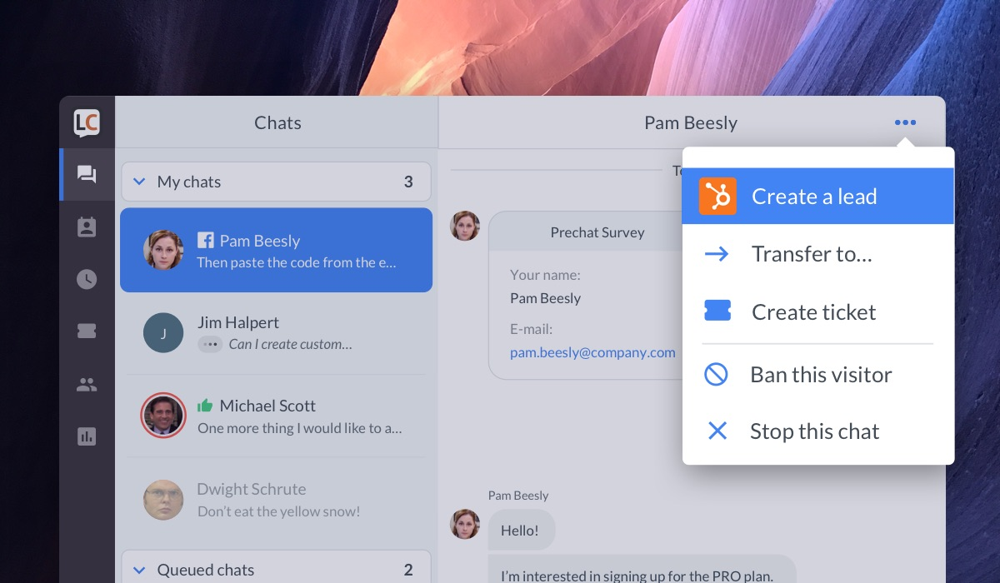
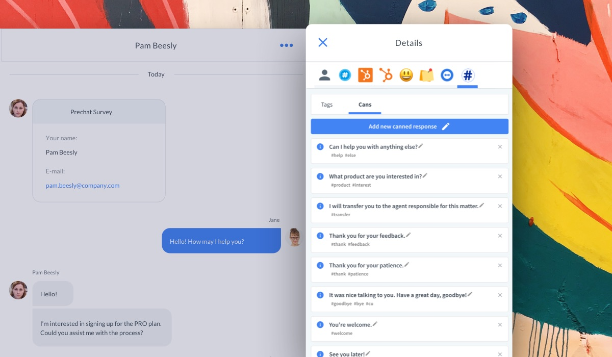
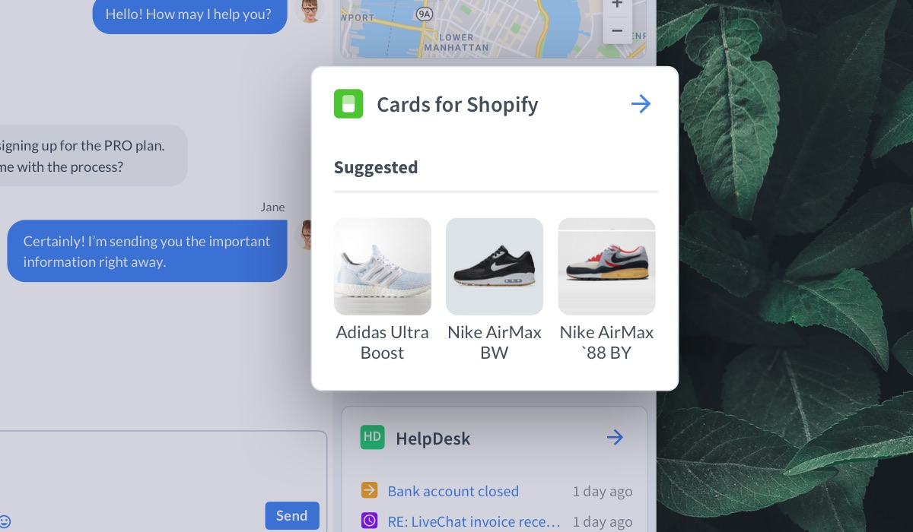
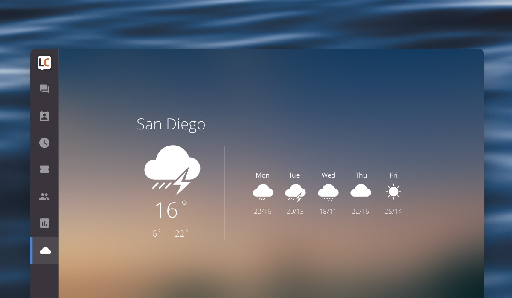

# Chat Actions

The simplest way to extend the LiveChat Agent App is by using Chat Actions. They are buttons available at hand while chatting.

Popular use cases handle actions such as ticket creation, sending chat transcript, or banning a visitor. This is where Chat Actions are displayed in the UI:

<!--  -->

Check out our [blog post](https://developers.livechat.com/blog/chat-actions/) about Chat Actions to learn more.

# App locations

Your app can extend several areas of the LiveChat Agent App interface:

- the Details section, by adding a new tab with your web content or a new widget in the default Customer Details tab
- the Main menu, by adding a new, fullscreen section with your web content
- Chat Actions, by adding a new action button in the Chat Action menu
- the Message Box, by adding an integration displayed right in that area

If you feel we lack some options, please drop us a line at [developers@livechat.com](mailto:developers@livechat.com)!

## Details section

Apps in the Details tabs are the most common way to extend LiveChat UI. They are displayed in the right sidebar of the Agent App when browsing Chats or Archives.

In the example above, the **Tag Master** app is installed. It's one of the open-source [sample apps](https://github.com/livechat/sample-apps) you can [clone](https://github.com/livechat/sample-apps/tree/master/Tag%20Master) and play with.

Apps located in the Details section are **contextual**. It means they inherit the properties of the currently opened chat. You can use this information to present contextual data for the particular chats.

### Customer Details widgets

Additionally, those apps can expose a widget in the native Customer Details tab. Those widgets serve as shortcuts or essence of the information presented in the app.

Widgets are simply tiles displayed one below another. In this example, we see how **Cards for Shopify** and **CartValue** extend default Customer Details tab. Widgets are a great solution for displaying information that agents need to have at hand, as they don't need to switch between tabs.

See the [documentation](/extending-ui/extending-agent-app/agent-app-sdk/#getting-started) to learn how to embedd your app in the Details section.

## Main menu (fullscreen apps)

The application icon is located in the **navigation bar** on the left.

Clicking the icon loads the app URL as an iframe. The application is displayed fullscreen, right in the Agent App.

Keep in mind that this feature is not supported on the mobile version of the LiveChat Agent App.

Fullscreen apps help to reduce _context switching_. Users no longer need to switch between the Agent App and tabs in the browser. As long as the application they work with is installed as a **Fullscreen app**, they can perform all the operations without leaving the Agent App. It's particularly important for LiveChat Desktop App users.

See how to create a fullscreen app in the [documentation](/extending-ui/extending-agent-app/agent-app-sdk/#fullscreen-widgets).

## MessageBox

With this type of widget placement you can integrate your apps in the Message Box. You could use it to send gifs or present items from an online store. It would make the whole chatting experience much more engaging. You could also use it to send files from [Dropbox](https://www.livechat.com/marketplace/apps/dropbox/).

<iframe
  width="560"
  height="315"
  src="https://www.youtube.com/embed/P07QVFOrT04"
  frameborder="0"
  allow="accelerometer; autoplay; encrypted-media; gyroscope; picture-in-picture"
  allowfullscreen
></iframe>

The integration is simple and intuitive. You open the app, select the element, and confirm your choice by clicking **Send**. This mechanism protects you from sending an element by accident. To learn more about the implementation, see [MessageBox](/extending-ui/extending-agent-app/agent-app-sdk/#messagebox).

## App settings

Some applications require settings configuration, especially when they use external services. After installing the app, users need to do the setup in order for the application to work.

We provide a special place called Settings page, where you can embed a page with configuration. It's recommended to use it together with [Sign in with LiveChat](/getting-started/authorization/sign-in-with-livechat/).

See how to set up a Settings page for your app in the [documentation](/extending-ui/extending-agent-app/agent-app-sdk/#getting-started).
