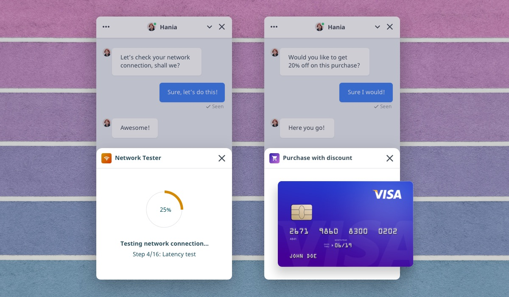
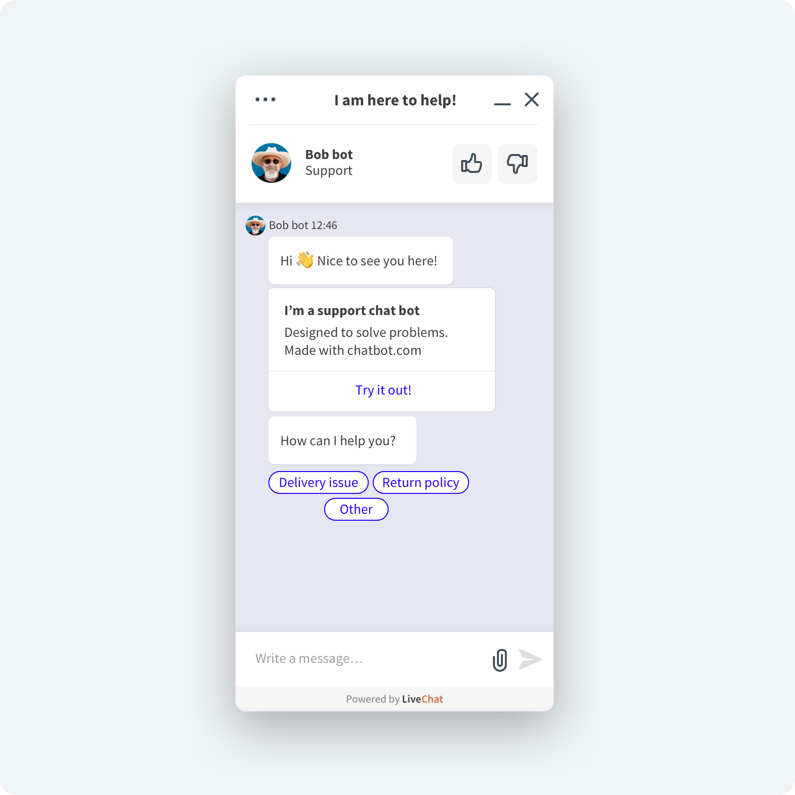

# Mobile Chat Widgets

Have you got a mobile app? You can still make use of LiveChat and improve your _mobile_ user experience! All you need to do is install the mobile **Chat Widget** compatible with your app.

- Mobile [Chat Widget for iOS](/getting-started/installing-livechat/ios-widget/) apps
- Mobile [Chat Widget for Android](/getting-started/installing-livechat/android-widget/) apps

# JavaScript API

[**Chat Widget JavaScript API**](/extending-ui/extending-chat-widget/javascript-api/) is an easy yet powerful way to integrate your website or application with the **LiveChat** platform.

The integration of your app with the **Chat Widget** can be multiform and contextual.  
E-commerce owners often use JavaScript API to pass visitor data or to track sales made via chat (read about [Sales tracker](https://www.livechat.com/help/sales-tracker/) to learn more).

Also, it could be used to improve the customer support experience. There might be some app locations where users usually get stuck or have problems. To troubleshoot that, you could add a _chat-with-customer-support_ button. Users would click it to ask customer support for help. Similarily, you could put such a button in the _Contact_ or _Help_ section of your app. Those are the tabs where users normally look for support.

What's more, you could use [methods](/extending-ui/extending-chat-widget/javascript-api/#methods) and [callbacks](/extending-ui/extending-chat-widget/javascript-api/#callbacks) to send additional data about a chat or visitor. It's possible to manipulate the Chat Widget state (maximize, minimize, hide) and build handlers for the events happening in conversations.

Building a Single Page App (SPA)? We're fine with that! LiveChat integrates well with SPAs, and you will be able to use the API without any problem.

# Moments

[Chat Widget Moments](/extending-ui/extending-chat-widget/chat-widget-moments/) are webpages embedded in an iframe, displayed during a chat.

Thanks to **Moments**, customers can perform specific actions. For example, you could pick a date from a popping up calendar instead of typing it manually, or let your customer make a purchase right on the spot. Moments were created to solve complex problems easily and securely. You can think of them as an accessible API to integrate the **Chat Widget** with some other software.

# Rich messages

Do you want to captivate your Customers even more, using interactive and stylish messages? [Rich messages](/extending-ui/extending-chat-widget/rich-messages/) are the way to go. Thanks to them you can use images, buttons and more to make your conversations smooth and engaging.

# Customer SDK

You can build advanced custom solutions with the use of [Customer SDK](/extending-ui/extending-chat-widget/customer-sdk/). With this JavaScript library, you can create a chat widget from scratch. It allows you to meet a specific scenario, but is definitely the most challenging option.
Before you interact with this API, keep in mind that complicated solutions call for strong coding skills.
