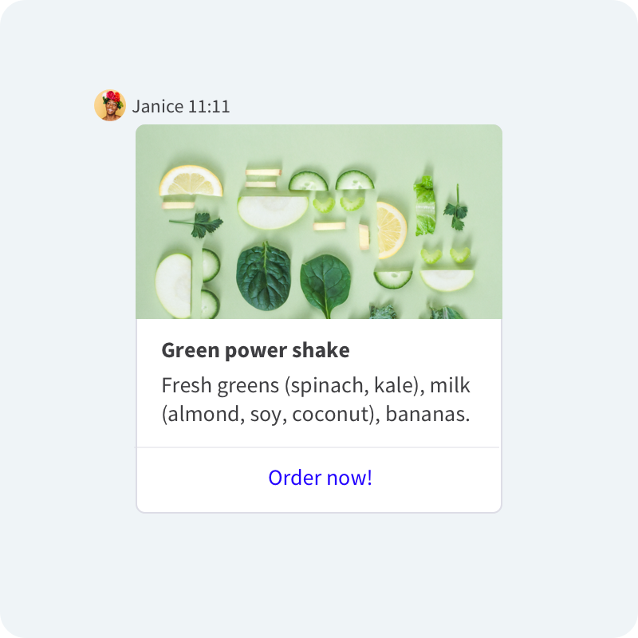
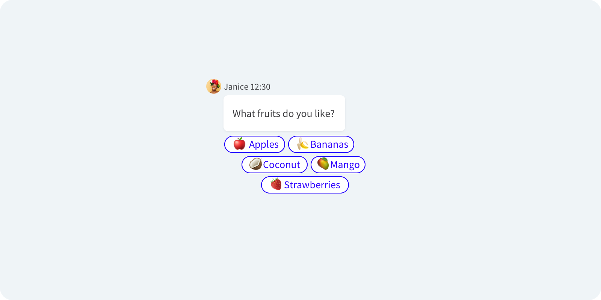

# Introduction
[Rich Messages](https://www.livechatinc.com/help/rich-messages/) are more than just plain text. Those interactive blocks make use of images, buttons, and text to improve your work in multiple ways. With Rich Messages you can, for example:

- Let your Customers get more details about your business.
- Quickly send responses to your messages. 
- Make phone calls.
- Open small apps called [Moments](/extending-ui/extending-chat-widget/chat-widget-moments/).


Rich Messages are also the core feature of our **ChatBot** integration. If you're not familiar with ChatBot,<br />the [Chatbots explained](https://www.livechatinc.com/help/chatbots-explained/) article will come in handy.

# Rich Messages overview
Rich Messages are built with three basic building blocks: **text**, **image**, and **buttons**. Combining them in different configurations creates numerous opportunities. Following that, at LiveChat, we have grouped them into the following categories.

## Cards
Cards are single-message blocks, which can contain an image, a title, a subtitle, and buttons. Neither of these elements is mandatory, so you could create a card containing just a picture, just text, or only buttons.



## Carousels
Carousels are a combination of multiple cards. For example, by just showing a title and image, you can present multiple products in a more attractive way.


## Quick Replies
Quick Replies are a specific type of buttons - they are smaller. As a result, many more of them can fit on the screen. They might be useful when you want your users to choose one of the predefined responses.



# Getting started
As mentioned before, Rich Messages are a combination of the basic building blocks. How do we know what to show, then? We base that on the JSON object received via the [Customer Chat API](../../../messaging/customer-chat-api/#rich-message). Apart from the author and other strictly messaging-related data, the core of the Rich Messages looks like that:

<CodeSample>

```json
{
    "template_id": "cards",
    "elements": [{
        "title": "Title",
        "subtitle": "Subtitle",
        "image": {
            "name": "example.png",
            "url": "https://images.pexels.com/photos/34950/pexels-photo.jpg",
            "content_type": "image/png",
            "size": 1024,
            "width": 640,
            "height": 480
        },
        "buttons": [{
            "type": "message",
            "text": "text",
            "postback_id": "send_message",
            "user_ids": [],
            "value": "text"
        }]
    }]
}
```

</CodeSample>

This is how it would look in the Chat Widget:

<div style="max-width: 800px; padding: 30px 30px 30px 30px; background-color: rgb(240, 244, 247); border-radius: 10px; margin-bottom: 20px">
    <div style="display: flex; justify-content: center">
        <RichMessagePreview richMessage={{
            "template_id": "cards",
            "elements": [{
                "title": "Title",
                "subtitle": "Subtitle",
                "image": {
                    "name": "example.png",
                    "url": "https://images.pexels.com/photos/34950/pexels-photo.jpg",
                    "content_type": "image/png",
                    "size": 1024,
                    "width": 640,
                    "height": 480
                },
                "buttons": [{
                    "type": "message",
                    "text": "text",
                    "postback_id": "send_message",
                    "user_ids": [],
                    "value": "text"
                }]
            }]
        }}/>
    </div>
</div>

Let's go through each element:

* `template_id` - defines how every Rich Message will be presented. It could be either `cards`, which covers both Cards and Carousels, or `quick_replies`, which corresponds to Quick Replies. This is a required parameter.
* `elements` - optional; an array of elements included in a Rich Message, for example, multiple Cards. The maximum number of elements is 11.
* `elements.title` and `elements.subtitle` - both optional; display formatted text on Cards.
* `elements.image` - optional; displays images on Cards. Optional parameters are the following: `name`, `url`, `content_type`, `size`, `width`, `height`. 
* `elements.buttons` - optional; an array of displayed buttons. The maximum number of buttons is 11. They can have the following parameters (all required if the `elements.buttons` is included):
    * `elements.buttons.type` - defines the behavior after a user clicks the button. It might have the following values:
        * `webview` - opens a [Moment](/extending-ui/extending-chat-widget/chat-widget-moments/).
        * `message` - sends a message postback in the chat.
        * `url` - opens a given URL in a new tab.
        * `phone` - allows Customers to call the number given directly from the chat.
    * `elements.buttons.postback_id` - a description of the sent action.
    * `elements.buttons.user_ids` - an array of the users who clicked the button. It can be empty.
    * `elements.buttons.value` - defines what value the button should have depending on its type. It's either a message to be sent, a URL to be opened in a Moment or in a new tab, or a phone number to call.
    * `elements.buttons.webview_height` - required only if the `type` of the button is set to `webview`. It defines the size of the Moment shown to the user. It might be set to `compact`, `full` or `tall`.

Since most of these parameters are optional, you have a lot of freedom and a number of possibilities to unleash your creativity.

# Usage examples
Now, when the power of Rich Messages is revealed, we can test out some of the opportunities they give us.

## Predefined answers to choose from
Imagine that you repeatedly ask your Customers the same questions, and there's a limited number of answers you get. For example, if you run the support, it might be "Which OS are you using?". You'd like to know if it's "Windows", "MacOS" or "Other", so you can easily guide Customers through the process of gaining data. You can use `quick_replies` to do that:

<CodeSample>

```json
{
    "template_id": "quick_replies",
    "elements": [{
        "title": "What OS are you using?",
        "buttons": [{
                "type": "message",
                "text": "Windows",
                "postback_id": "send_message",
                "user_ids": [],
                "value": "Windows"
            },
            {
                "type": "message",
                "text": "MacOS",
                "postback_id": "send_message",
                "user_ids": [],
                "value": "MacOS"
            },
            {
                "type": "message",
                "text": "Other",
                "postback_id": "send_message",
                "user_ids": [],
                "value": "Other"
            }
        ]
    }]
}
```

</CodeSample>

After sending, this is how it would look in the Chat Widget:

<div style="max-width: 800px; padding: 30px 30px 30px 30px; background-color: rgb(240, 244, 247); border-radius: 10px; margin-bottom: 20px">
    <div style="max-width: 300px; margin-left: auto; margin-right: auto;">
        <RichMessagePreview richMessage={{
            "template_id": "quick_replies",
            "elements": [{
                "title": "What OS are you using?",
                "buttons": [{
                        "type": "message",
                        "text": "Windows",
                        "postback_id": "send_message",
                        "user_ids": [],
                        "value": "Windows"
                    },
                    {
                        "type": "message",
                        "text": "MacOS",
                        "postback_id": "send_message",
                        "user_ids": [],
                        "value": "MacOS"
                    },
                    {
                        "type": "message",
                        "text": "Other",
                        "postback_id": "send_message",
                        "user_ids": [],
                        "value": "Other"
                    }
                ]
            }]
        }} />
    </div>
</div>

Now, after a user clicks the button, it will send the appropriate message right in the chat. Easy!

## Leaving contact info
Sometimes, your process involves calls with Customers. What you could do is send your phone number as text, but it can lead to misunderstandings if someone copies the number incorrectly. Use Rich Messages to tackle this problem, and improve your communication with Customers.

<CodeSample>

```json
{
    "template_id": "cards",
    "elements": [{
        "title": "Support",
        "subtitle": "Click 'Call' button to connect directly with our support. We work 24/7!",
        "buttons": [{
            "type": "phone",
            "text": "Call",
            "postback_id": "action_call",
            "user_ids": [],
            "value": "0123456789"
        }]
    }]
}
```

</CodeSample>

This will display a Card with a button that opens Customers' default phone application:

<div style="max-width: 800px; padding: 30px 30px 30px 30px; background-color: rgb(240, 244, 247); border-radius: 10px; margin-bottom: 20px">
    <div style="display: flex; justify-content: center">
        <RichMessagePreview richMessage={{
            "template_id": "cards",
            "elements": [{
                "title": "Support",
                "subtitle": "Click 'Call' button to connect directly with our support. We work 24/7!",
                "buttons": [{
                    "type": "phone",
                    "text": "Call",
                    "postback_id": "action_call",
                    "user_ids": [],
                    "value": "0123456789"
                }]
            }]
        }} />
    </div>
</div>

## Showing off your products
If you run an online shop, there must be dozens of situations when Customers ask for your advice. With the use of Rich Messages, you can present your goods with links in the form of a Carousel:

<CodeSample>

```json
{
    "template_id": "cards",
    "elements": [{
            "title": "Tomatoes",
            "subtitle": "The tomato is the edible, often red, berry of the plant Solanum lycopersicum, commonly known as a tomato plant. They are also very tasty!",
            "image": {
                "url": "https://images.pexels.com/photos/1327838/pexels-photo-1327838.jpeg"
            },
            "buttons": [{
                "type": "url",
                "text": "Open link",
                "postback_id": "open_url",
                "user_ids": [],
                "value": "https://example.org/?product1"
            }]
        },
        {
            "title": "Cucumber",
            "subtitle": "There are three main varieties of cucumber: slicing, pickling, and seedless. Within these varieties, several cultivars have been created.",
            "image": {
                "url": "https://images.pexels.com/photos/37528/cucumber-salad-food-healthy-37528.jpeg"
            },
            "buttons": [{
                "type": "url",
                "text": "Open link",
                "postback_id": "open_url",
                "user_ids": [],
                "value": "https://example.org/?product2"
            }]
        },
        {
            "title": "Potatoe",
            "subtitle": "Potatoe is a root vegetable, very popular around the world. With the potatoe, you can do a lot, for example prepare awesome french fries.",
            "image": {
                "url": "https://images.pexels.com/photos/144248/potatoes-vegetables-erdfrucht-bio-144248.jpeg"
            },
            "buttons": [{
                "type": "url",
                "text": "Open link",
                "postback_id": "open_url",
                "user_ids": [],
                "value": "https://example.org/?product3"
            }]
        }
    ]
}
```

</CodeSample>

Here's what your Customer will see in the Chat Widget:

<div style="max-width: 800px; padding: 30px 30px 30px 30px; background-color: rgb(240, 244, 247); border-radius: 10px; margin-bottom: 20px">
    <div style="max-width: 300px; margin-left: auto; margin-right: auto;border: 1px solid rgba(0, 0, 0, 0.1); border-radius: 10px; width: 100%; box-shadow: rgba(0, 0, 0, 0.25) 0px 4px 16px">
        <div style="margin: 3px">
            <RichMessagePreview richMessage={{
                "template_id": "cards",
                "elements": [{
                        "title": "Tomatoes",
                        "subtitle": "The tomato is the edible, often red, berry of the plant Solanum lycopersicum, commonly known as a tomato plant. They are also very tasty!",
                        "image": {
                            "url": "https://images.pexels.com/photos/1327838/pexels-photo-1327838.jpeg"
                        },
                        "buttons": [{
                            "type": "url",
                            "text": "Open link",
                            "postback_id": "open_url",
                            "user_ids": [],
                            "value": "https://example.org/?product1"
                        }]
                    },
                    {
                        "title": "Cucumber",
                        "subtitle": "There are three main varieties of cucumber: slicing, pickling, and seedless. Within these varieties, several cultivars have been created.",
                        "image": {
                            "url": "https://images.pexels.com/photos/37528/cucumber-salad-food-healthy-37528.jpeg"
                        },
                        "buttons": [{
                            "type": "url",
                            "text": "Open link",
                            "postback_id": "open_url",
                            "user_ids": [],
                            "value": "https://example.org/?product2"
                        }]
                    },
                    {
                        "title": "Potatoe",
                        "subtitle": "Potatoe is a root vegetable, very popular around the world. With the potatoe, you can do a lot, for example prepare awesome french fries.",
                        "image": {
                            "url": "https://images.pexels.com/photos/144248/potatoes-vegetables-erdfrucht-bio-144248.jpeg"
                        },
                        "buttons": [{
                            "type": "url",
                            "text": "Open link",
                            "postback_id": "open_url",
                            "user_ids": [],
                            "value": "https://example.org/?product3"
                        }]
                    }
                ]
            }} />
        </div>
    </div>
</div>

This way, they can visit product pages and review them much more easily!

## Sharing knowledge with your Customer
[Moments](/extending-ui/extending-chat-widget/chat-widget-moments/) are powerful apps with the button type `webview`. However, `webview` can also contain static websites. Let's assume, once again, that you run a support team and would like to share an article explaining simple steps to follow:

<CodeSample>

```json
{
    "template_id": "cards",
    "elements": [{
        "title": "How to?",
        "subtitle": "Let me guide you through the simple steps you should follow.",
        "buttons": [{
            "type": "webview",
            "text": "Open link",
            "postback_id": "open_url",
            "user_ids": [],
            "value": "https://example.org/?how-to",
            "webview_height": "full"
        }]
    }]
}
```

</CodeSample>

It will show a simple Card with a button, which opens the article right in the chat upon clicking:

<div style="justify-self:center">
	<RichMessagePreview richMessage={{
		"template_id": "cards",
		"elements": [{
			"title": "How to?",
			"subtitle": "Let me guide you through the simple steps you should follow.",
			"buttons": [{
				"type": "webview",
				"text": "Open link",
				"postback_id": "open_url",
				"user_ids": [],
				"value": "https://example.org/?how-to",
				"webview_height": "full"
			}]
		}]
	}} />
</div>


# How to use Rich Messages in LiveChat?
Currently, there are several ways to use Rich Messages in LiveChat.

## ChatBot
Rich Messages are an essential feature of [ChatBot](https://www.livechatinc.com/chatbot/). Thanks to Rich Messages, communication between Bots and Customers is less complicated. You can make sure that Customers follow the exact interactions you thought of. With [Rich Messages](https://www.livechatinc.com/help/rich-messages/) and an easy-to-use ChatBot configurator, your Customers' chatting experience will be smooth and satisfying.


## Marketplace
There's a lot of apps on the LiveChat [Marketplace](https://www.livechatinc.com/marketplace/) that make use of Rich Messages.

If you have used BigCommerce to set up your online store and LiveChat to communicate with Customers, you should try out our [Product Cards for Big Commerce](https://www.livechatinc.com/help/product-cards-bigcommerce/) app. After installation, you can send the previews of your products to Customers directly from the Agent App. They'll be presented as Cards or Carousels:


Another app that might be useful if you have an account on [KnowledgeBase](https://www.knowledgebase.ai/), is the [KnowledgeBase integration](https://www.livechatinc.com/marketplace/apps/knowledge-base/). It allows you to send your articles as Cards, making them much more engaging for your Customers.

There's also the [Calendly integration](https://www.livechatinc.com/marketplace/apps/calendly/). It sends a Rich Message opening a Moment app, which allows your Customers to schedule a meeting within the chat:


The [Join.me integration](https://www.livechatinc.com/marketplace/apps/joinme/) is yet another example. It allows you to send to Customers invitations to sessions. The invitations are in the form of Cards with buttons. Upon clicking, the button opens screen sharing, which makes the whole experience simple and seamless!

If you feel inspired to create your own app, be sure to check our tutorial on [Building LiveChat apps](https://developers.livechatinc.com/build-apps/)!

## Agent App SDK
Agent App SDK introduces the MessageBox integration. This is where you can create your own application that will give Agents a possibility to send all Rich Messages you want. The documentation is available [here](../../extending-agent-app/agent-app-sdk/#messagebox). Keep in mind that this would require some programming knowledge.

## Agent Chat and Customer Chat APIs
Both the [Agent Chat API](../../../messaging/agent-chat-api/) and [Customer Chat API](../../../messaging/customer-chat-api/) handle Rich Messages. Whether you decide to build your own chat or create your own Bot, you can make use of them.
