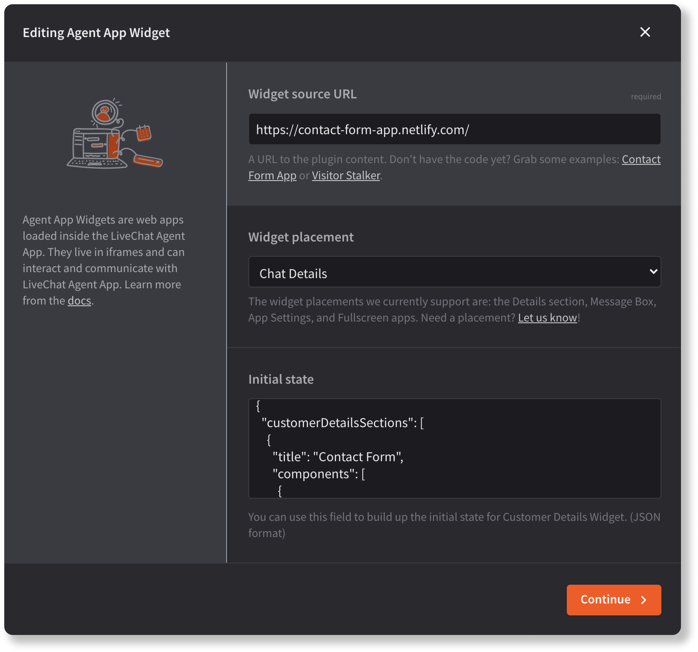
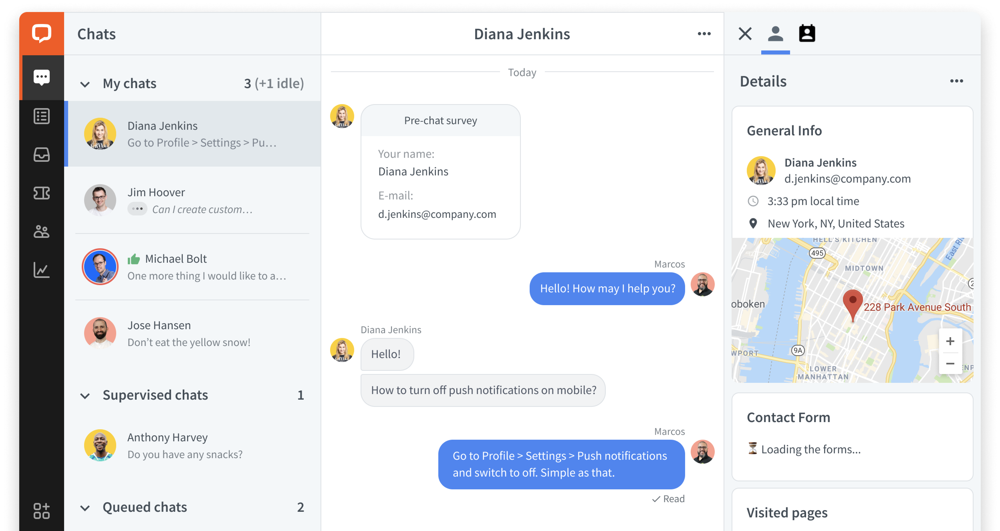

## Introduction

Agent App Widgets are web apps loaded inside the LiveChat Agent Application. They live in iframes and can interact and communicate with the Agent App.
You can use them to:

- embed and display static content, for example, knowledge base articles, conversation prompts, or context information.
- embed your SaaS service or web app as part of the agents' workspace.
- query external services with visitor's email or LiveChat group ID (CRM, marketing automation, etc.).
- create a store with in-app purchases to sell additional services or features of your app.

## Building block configuration

To create an Agent App Widget, you need to edit the two required fields: **Widget source URL** and **Widget placement**.

**Widget source URL** is the address of your deployed application. You can also enter `https://localhost/` while you develop the app. If you don't have to code yet but want to play around, feel free to use our [sample apps](/extending-agent-app/agent-app-sdk/#sample-apps).

As for the **widget placement**, you can choose one of the following locations: the Details section, message box, main menu (fullscreen apps), and Settings. [Read more](/extending-agent-app/#app-locations) about app placements.

<div style="max-width: 600px; margin-bottom: 30px">
  
</div>

<Section>
<Text>

**Initial state** is an optional field that allows you to add content to the Customer Details view thus turning your widget into a [Customer Details widget](/extending-agent-app/agent-app-sdk/#creating-a-customer-details-widget). To do that, define what will be displayed to users while your widget's still loading. Later on, you can [modify the state of your widget](/extending-agent-app/agent-app-sdk/#modify-customer-details-widgets-state) in your application via Agent App SDK.

<div style="max-width: 700px; margin-bottom: 30px">
  
</div>

</Text>
<Code>
<CodeSample path={'Initial state JSON'}>

```json
{
  "customerDetailsSections": [
    {
      "title": "Contact Form",
      "components": [
        {
          "type": "label_value",
          "data": {
            "value": "⏳ Loading the forms..."
          }
        }
      ]
    }
  ]
}
```

</CodeSample>
</Code>
</Section>

## Resources

- [App locations](/extending-agent-app/#app-locations)
- [Agent App SDK](/extending-agent-app/agent-app-sdk/)
- [Building LiveChat apps 101 webinar](/getting-started/livechat-apps/#building-apps-webinar)
