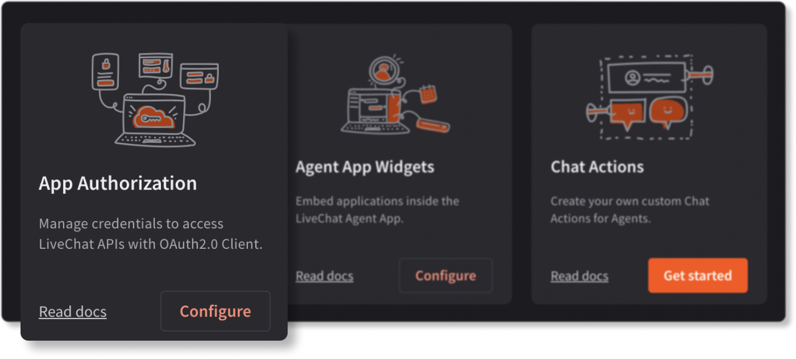

If you want to build an integration that calls the LiveChat APIs, you'll need to implement an authorization flow and configure the **App authorization** building block.

- <SectionLink to={"/getting-started/authorization/"}>Read about different authorization flows</SectionLink>

- <SectionLink to={"/getting-started/authorization/authorization-in-practice/"}>Tutorial: Authorization in practice </SectionLink>

  

