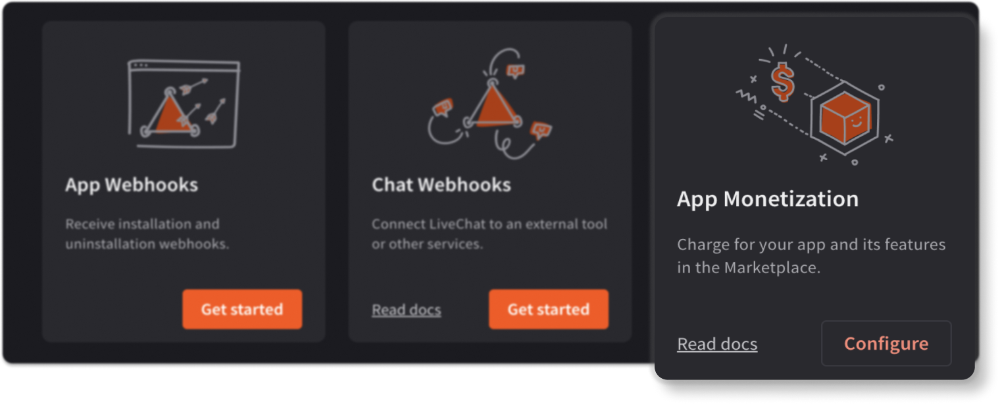

Your application can feature on the {{LIVECHAT_MARKETPLACE_URL}}, available for purchase to over {{NUMBER_OF_CUSTOMERS}} LiveChat users. To create a paid application, you need to configure the App Monetization building block in {{DEVELOPER_CONSOLE_URL}}.

  

## App configuration

Find out how to configure your app's pricing details in a step-by-step tutorial. You'll also learn about key monetization aspects: the LiveChat's commission, payment types, requesting a money withdrawal, and more.

<SectionLink to={"/monetization/how-to-monetize-apps/"}>How to monetize apps</SectionLink>
