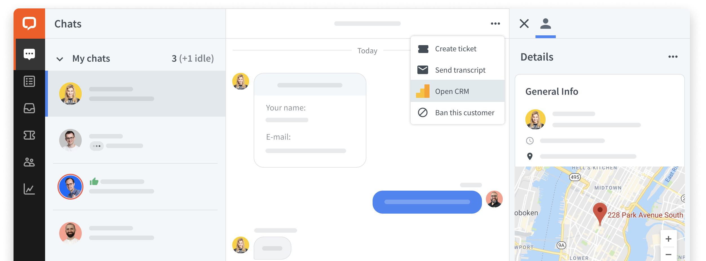
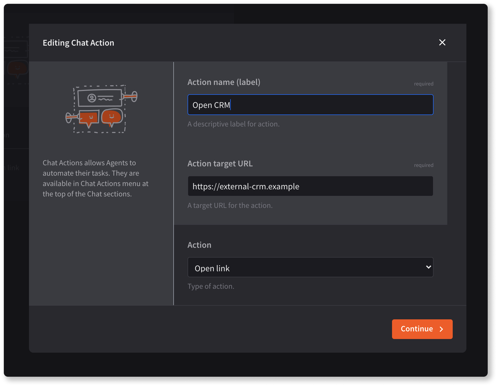

<p>
Chat Actions are one of the easiest way to extend the LiveChat Agent Application. Chat Actions are accessible from the contextual menu (represented by ) in the Agent Application. Use them to help agents speed up their daily work by automating common tasks, such as:
</p>

- opening a link to an external CRM
- displaying a modal with a form that allows to create a new issue, task, or contact
- sending a webhook to notify an external service
- opening an app in the Chat Details section



## Building block configuration

Creating an chat action is a three-step process. Come up with a short name that describes the action and decide on the action type.  There are four action types available:

**1. Open link**

  It opens a link provided as the **Action target URL** in a new tab. See what [parameters](#parameters) we attach to the URL.

**2. Open modal**

  It opens a modal in an iframe. If you choose this option, provide the link to the modal in the **Action target URL**.

**3. Send webook**

   It sends a webhook to the **Action target URL**. To learn what info it contains, see [Parameters](#parameters).

**4. Open widget**

  It opens a widget in the Chat Details section. To use this option, you need to [create an Agent App Widget](/extending-agent-app/agent-app-sdk/#getting-started) first.

<div style="max-width: 600px">
  
</div>

## Parameters

We attach the following query string parameters to the Action target URL:

<CodeSample>

```
https://my-target-action-url.com/
?licence_id=104130623
&agent_id=smith@example.com
&time=1604416744108
&instance_id=0805e283233042b37f460ed8fbf22160  // integration's id
&source=chats
&chat_id=PJ0MRSHTDG
&thread_id=K600PKZON8
&customer_id=b7eff798-f8df-4364-8059-649c35c9ed0c
&customer_name=Thomas
&customer_email=t.anderson@example.com
&customer_host=<customer_host>
&customer_ip=<customer_ip>
&customer_latitude=21.0122
&customer_longitude=52.2297
&customer_country=Poland
&customer_region=Mazowieckie
&customer_city=Warsaw
&customer_timezone=Europe/Warsaw
```

</CodeSample>

## Read more

- [Chat Actions on Platform Updates](https://developers.livechat.com/updates/chat-actions)
- [Extending Agent App](/extending-agent-app/#chat-actions)
