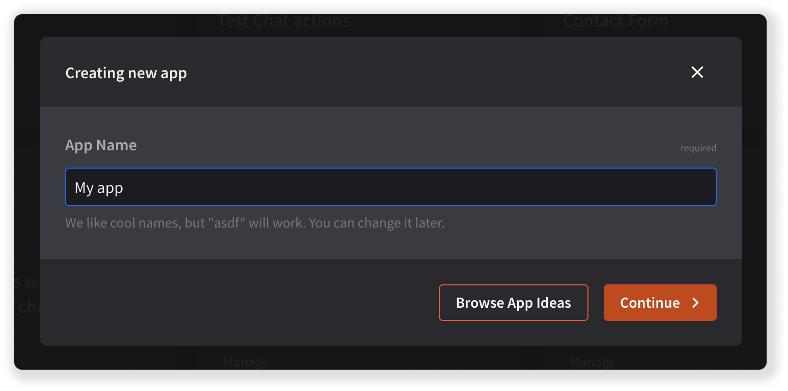

## Introduction

This document explains how to configure the **Chat Webhooks** building block in {{DEVELOPER_CONSOLE_URL}}. It was written for everyone aiming to configure webhooks in their integrations **via user interface** instead of calling the LiveChat [Configuration API](/management/configuration-api/#webhooks) directly. The document assumes you're already familiar with the general idea of webhooks.

The document applies to the so called **new chat webhooks** (v3.3). It's impossible to configure the old chat webhooks (v3.2 or below) via Developer Console – you can only delete the already configured ones. If you're curious about the differences between the old and new chat webhooks, [read this article] (https://developers.livechat.com/updates/setting-up-webhooks-with-livechat-api).

## Tutorial

This tutorial presents how to build a simple application with the Chat Webhooks building block. It also explains the configuration of all other parts that are required for the Chat Webhooks block to be functional. The tutorial applies to the new chat webhooks (v3.3).

In short, you need to take the following steps:

1. [Create an app in Developer Console.](#step-1-create-an-app-in-developer-console)
2. [Configure authorization.](#step-2-configure-authorization)
3. [Configure chat webhooks.](#step-3-configure-chat-webhooks)

The end result of this tutorial will be an application that receives webhooks whenever a pre-determined event occurs.

### Before you start

Log in to {{DEVELOPER_CONSOLE_URL}} or create an account for free.

### Step 1 Create an app in Developer Console

To create a new app, all you need to do is click **Create new app+**, come up with a name, and click **Continue**.

Then, if your app has the frontend side, add and configure [the Agent App Widget building block](/extending-agent-app/agent-app-sdk/#getting-started). If you're building a 100% backend app with no UI, you can skip Agent App Widget configuration.

### Step 2 Configure authorization

Why is it necessary? You're building an application that, once installed, will call the Configuration API to enable webhooks for a user's license. To perform this operation, the user needs to authorize your application first. Configuring authorization will look slightly different for [apps with the frontend side](#frontend-apps) and for [backend apps (no UI)](#backend-apps-no-ui).

#### Frontend apps

**Configure the App Authorization building block**

- Add your app URL to the Redirect URI whitelist.
- Add the `webhooks.state:rw` scope, which will be later on used by LiveChat to enable webhooks for a license that installs your app. (If you don't add this scope, Developer Console won't allow for creating the Chat Webhooks block.)

💡 You can follow along the [Authorization in practice](/getting-started/authorization/authorization-in-practice/) tutorial, where we show how to configure the App Authorization building block step by step.

**Implement an authorization flow**

As a developer, you need to handle the authorization process and the access token. The [Sign in with LiveChat](/authorization/sign-in-with-livechat/) mechanism is a popular way to do that. You can also read about other [authorization flows](/authorization/authorizing-api-calls/#agent-authorization-flows).

#### Backend apps (no UI)

**Configure the App Authorization building block**

- Add the `webhooks.state:rw` scope, which will be later on used by LiveChat to enable webhooks for a license that installs your app. (If you don't add this scope, Developer Console won't allow for creating the Chat Webhooks block.)
- Provide a **Direct installation URL** and add it to the Redirect URI whitelist.

💡 If you don't know what it is and how to use it, watch our live coding session where we expained the topic step by step.

**Handle direct installation and authorization in your app**

You're building a backend app – it has no frontend side, no widget, no interface to communicate with the user. How's the user supposed to authorize your app if there's nowhere to click? The answer is: direct installation flow.

Usually, the authorization process starts in the Agent Application when a user runs the app for the first time. With the direct installation flow enabled, authorization begins on the Marketplace. When a user installs your app, a pop-up with the LiveChat authorization flow appears, and the application asks for access to certain resources. Upon successful authorization, the user is redirected to the **Direct installation URL**, where they can, for example, do the initial app configuration. (It all depends on what you implemented.)

As a developer, you need to handle the authorization flow in your app. For a backend app, we recommend [Authorization code grant](/authorization/authorizing-api-calls/#authorization-code-grant), where your app exchanges `code` for `token`.

### Step 3 Configure chat webhooks

Configuring chat webhooks in Developer Console is equivalent to calling the [Register Webhooks](/management/configuration-api/#register-webhook) method from the Configuration API. However, making use of the Chat Webhooks building block is much more convenient because you don't need to support [enabling webhooks](/management/configuration-api/#enable-license-webhook) – LiveChat will do that for you when someone installs you app.

The configuration of the Chat Webhooks building block is a three-step process and involves the following aspects:

- [Webhook URL](#webhook-url)
- [Secret key](#secret-key)
- [Webhook triggers](#webhook-triggers)

#### Webhook URL

All the webhooks will be sent to the URL you provide in the **Webhook URL** field. That's likely the address of your backend service, but you can use [https://webhook.site](https://webhook.site) for testing.

#### Secret key

We'll include your **secret key** in the payload of each webhook. This way, your application can verify the webhooks came from us. Make sure you save the generated secret key as it will disappear after you refresh the page. Also, if you change something in the building block configuration, you'll need to regenerate the secret key.

#### Webhook triggers

Then, choose **webhook triggers**, the actions that will cause sending a webhook to the Webhook URL every time a specific event occurs. For the majority of events, you can also select a filter. In the example below, webhooks will be sent when there's a new chat or when someone sends new event to the chat. No filters are selected.

- [The list of available webhooks](/management/configuration-api/#availabe-webhooks)
- [The list of webhook filters]((/management/configuration-api/#triggering-actions))

### End result

To finish off, install the app privately (**Private installation** tab in Developer Console) and perform an action that's your webhook trigger (for example, start a chat if you selected the `incoming_chat` webhook). That should trigger sending the webhook to the Webhook URL you provided.

## The old chat webhooks

It's no longer possible to register chat webhooks v3.2 or below (the old chat webhooks) in Developer Console. If you had configured them in the past, they are still fully functional, but we encourage you to migrate them to the current stable version of the Configuration API. You can do that by calling the API directly or by using our [Migration tool]() available in Developer Console.

## Resources

Here's a list of useful resources related to webhooks:

- <a href="https://developers.livechat.com/console/" target="_blank">Webhook tutorial: What are webhooks & how to use them with the LiveChat API?</a> 
- [LiveChat Configuration API](/management/configuration-api/)
- [Available webhooks](management/configuration-api/#webhooks)

## Contact us

If you have any questions or suggestions, feel free to email us at [developers@livechat.com](mailto:developers@livechat.com) or ask on our <a href="https://www.livechat.com/community/" target="_blank">Developer Community</a>.
