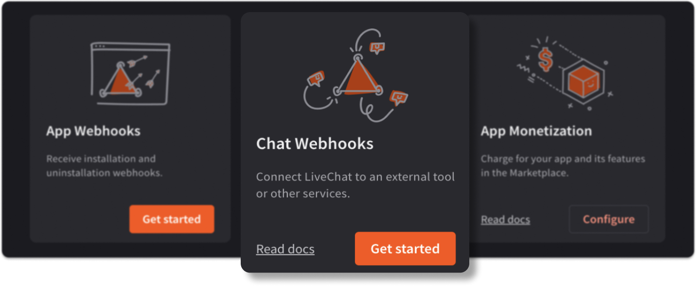
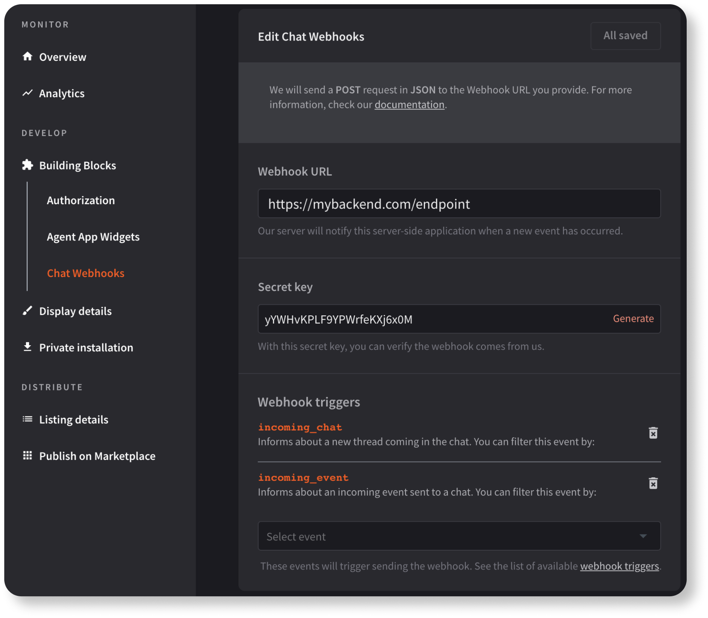

Use chat webhooks to **get notified about the events** happening during chats, for example, when there's an incoming chat, when someone sends a message, or when an agent tags a chat. If you **register a webhook** for any of those events, we will send a POST request to the address you provide during webhook registration, every time these events occur. You can then process incoming webhooks and use them to **integrate LiveChat with external tools** through your application.

There are two ways to register webhooks for your application:

1. **Directly through the Configuration API.** To do that, call the [Register Webhook](/management/configuration-api/#register-webhook) method with the desired configuration.

2. **In Developer Console**. To do that, you need to configure the Chat Webhooks building block in {{DEVELOPER_CONSOLE_URL}}. [This tutorial](#tutorial) will show you how to do that.
  
  ❗️ Currently, Developer Console only supports [webhooks v3.2](/management/configuration-api/#webhooks). If you want to v3.3, you need to register them using the first method.

## Tutorial

Depending on what kind of application you're building ([frontend app](#frontend-apps) or [backend app](#backend-apps)), we show you two possible paths of configuring the Chat webhooks building block.

### Frontend apps

In a nutshell:

1. Create an app in {{DEVELOPER_CONSOLE_URL}} and add the Agent App Widgets building block.
2. Set up the App Authorization building block and implement an authorization flow in your app.
3. Configure the Chat webhooks building block.

#### Step 1 Create an app and add the Agent App Widgets building block

Your web app (also referred to as a *widget*) can be displayed in different parts of the LiveChat Agent Application. We also call those parts *placements* or *locations*. Configuring the Agent App Widgets building block allows you to select the desired placement for your app.

- <SectionLink to={"/extending-agent-app/#app-locations"}>Read about app locations</SectionLink>

- <SectionLink to={"/extending-agent-app/agent-app-sdk/#getting-started"}>Follow a guide on Agent App Widgets</SectionLink>

#### Step 2 Configure authorization

Why is it necessary? You're building an application that, once installed, will call the Configuration API to register webhooks for a user's license. To perform this operation, the user needs to authorize your application first.

**Configure the App Authorization building block**
   - Add your app URL to the Redirect URI whitelist.
   - Add the right scopes. For [registering webhooks](/management/configuration-api/#register-webhook), you need `webhooks--my:rw`, but add all the scopes you'll need, depending on the functionalities of your app.
   
   💡 You can follow along the [Authorization in practice](/getting-started/authorization/authorization-in-practice/) tutorial, where we show how to configure the App Authorization building block step by step.

**Implement an authorization flow**

As a developer, you need to handle the authorization process and the access token. The [Sign in with LiveChat](/authorization/sign-in-with-livechat/) mechanism is a popular way to do that. You can also read about other [authorization flows](/authorization/authorizing-api-calls/#agent-authorization-flows).

#### Step 3 Configure Chat webhooks

- All the webhooks will be sent to the URL you provide in the **Webhook URL** field. That's likely the address of your backend service, but you can use [https://webhook.site](webhook.site) for testing.
- We'll include the **secret key** in the payload of each webhook. This way, your service can verify those webhooks come from us.
- Then, choose **webhook triggers**. For the majority of events, you can also select a filter. In the example below, webhooks will be sent when there's a new chat or when someone sends new event to the chat. No filters are selected.

To finish off, install the app privately (**Private installation** tab in Developer Console) and perform an action that's your webhook trigger. You can also ensure the webhooks were registered properly by calling [List Registered Webhooks](/management/configuration-api/#list-registered-webhooks). Remember about adding the right scopes to use those methods.

### Backend apps

In a nutshell:

1. Create an app in {{DEVELOPER_CONSOLE_URL}}.
2. Set up the App Authorization building block.
3. Handle direct installation and authorization in your app.
4. Configure the Chat webhooks building block.

#### Step 1 Create an app

This is a one-step process as you only need to give your app a name. You don't need to configure the Agent App Widget building block if your application has no frontend side and only runs in the background.

#### Step 2 Set up the App Authorization block

Why is it necessary? You're building an application that, once installed, will call the Configuration API to register webhooks for a user's license. To perform this operation, the user needs to authorize your application first.

In short:

- Add the right scopes. For [registering webhooks](/management/configuration-api/#register-webhook), you need `webhooks--my:rw`, but add all the scopes you'll need, depending on the functionalities of your app.
- Provide a **Direct installation URL** and add it to the Redirect URI whitelist.

💡 We have a [detailed tutorial](/getting-started/authorization/authorization-in-practice/) on how to configure the App Authorization building block for a server-side app. 

#### Step 3 Handle direct installation and authorization in your app

You're building a backend app – it has no frontend side, no widget, no interface to communicate with the user. How's the user supposed to authorize your app if there's nowhere to click? The answer is: direct installation flow.

Usually, the authorization process starts in the Agent Application when a user runs the app for the first time. With the direct installation flow enabled, authorization begins on the Marketplace. When a user installs your app, a pop-up with the LiveChat authorization flow appears, and the application asks for access to certain resources. Upon successful authorization, the user is redirected to the **Direct installation URL**, where they can, for example, do the initial app configuration. (It all depends on what you implemented.)

As a developer, you need to handle the authorization flow in your app. For a backend app, we recommend [Authorization code grant](/authorization/authorizing-api-calls/#authorization-code-grant), where your app exchanges `code` for `token`.

#### Step 4 Configure Chat webhooks

This step is exactly the same as for [frontend apps](#3-configure-chat-webhooks).

## Contact us

If you have any questions or suggestions, feel free to email us at [developers@livechat.com](mailto:developers@livechat.com) or ask on our <a href="https://www.livechat.com/community/" target="_blank">Developer Community</a>.
