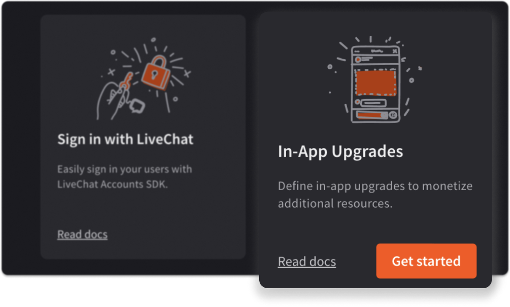
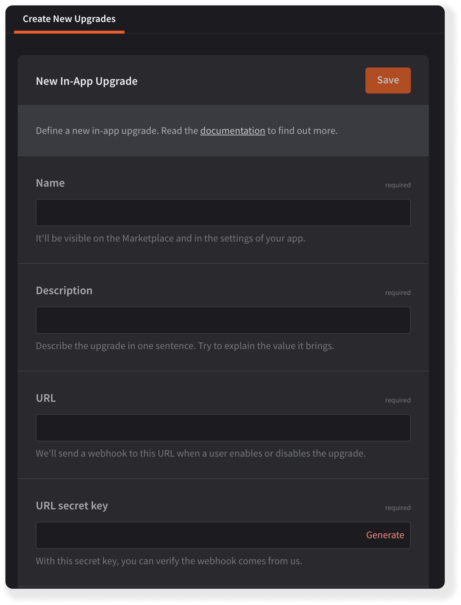

{{DEVELOPER_CONSOLE_URL}} allows you to define additional resources available for purchase in your application. This way, you can monetize the higher usage of a certain resource or unlock extra functionalities.

Use cases:

- adding new workspaces or accounts
- allowing users to define custom forms or templates
- giving access to certain functionalities, such as reports or analytics
- offering packages of extra SMS messages or calls

  

## Building block configuration

### Upgrade info

- Start the upgrade creation by giving it a **name** and a short **description**, which will be displayed to your app users.
- Then, provide us with a **URL** that will receive a webhook whenever users try to buy or deactivate the upgrade. In this case LiveChat works as a proxy, passing along the message. **You need to handle enabling and disabling the upgrade for users on your side.**

  

### Upgrade type

 Select the upgrade type depending on its nature. Some upgrades can be **activated only once**, for example, enabling video calls or access to a certain report, while others allow for **increasing the limit of resources**, for example, SMS messages or connected workspaces.

  

### Upgrade pricing

Define the upgrade price and the payment type. LiveChat takes a **20% commission** from in-app upgrades.

Since you're the app owner, you're not allowed to buy your own upgrade. To check how it's displayed, make your in-app upgrade **free** and switch to **paid** after you've finished testing it.  

  

## Tests & review

To test your upgrade, make it **free** as described in [Upgrade pricing](#upgrade-pricing).
Before you can publish your upgrade, it needs to successfully go through the review process. The same rules as for [the app review process](/monetization/app-review-process/) apply.

## Upgrade activation

Users can activate upgrades from the Marketplace or directly in the settings of your application.

## Price changes

You can change the price of an already published upgrade, however, you'll need to retain the old price for your existing customers.
## Questions?

We're happy to provide our support in case you need it. If you have any questions or suggestions, feel free to contact us at [developers@livechat.com](mailto:developers@livechat.com)
