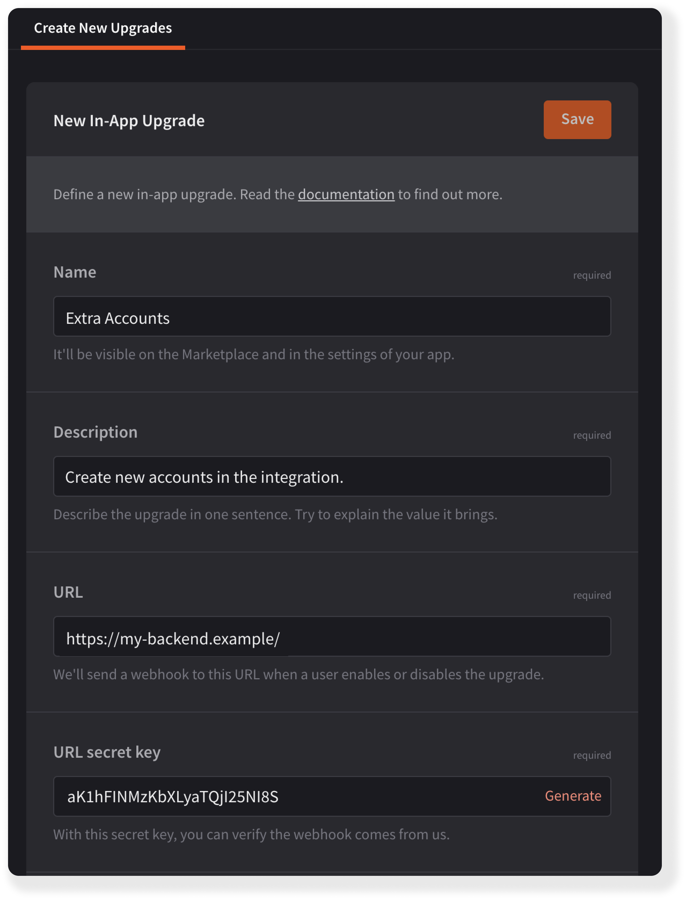
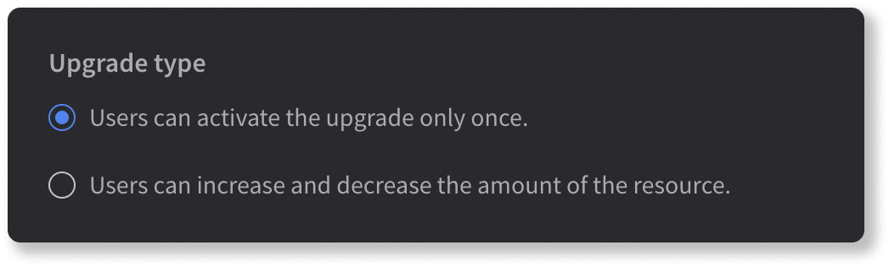
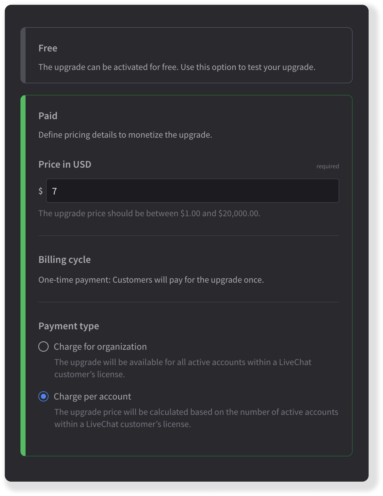
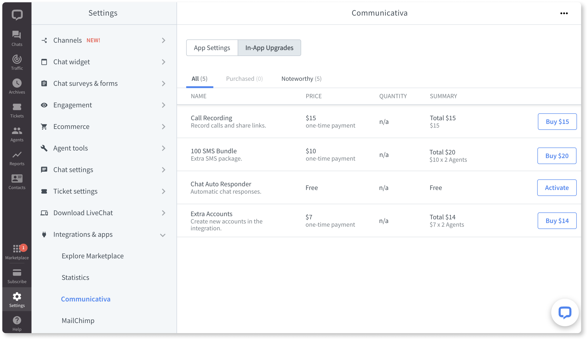
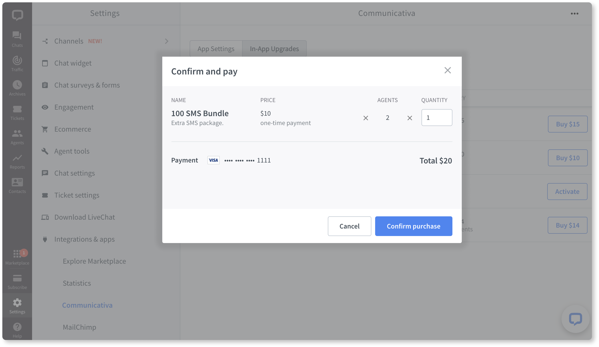

{{DEVELOPER_CONSOLE_URL}} allows you to define additional resources available for purchase in your application. This way, you can monetize the higher usage of a certain resource or unlock extra functionalities.

Use cases:

- adding new workspaces or accounts
- allowing users to define custom forms or templates
- giving access to certain functionalities, such as reports or analytics
- offering packages of extra SMS messages or calls

## Building block configuration

### Upgrade info

<Section>
<Text>

- Start the upgrade creation by giving it a **name** and a short **description**, which will be displayed to your app users.
- Then, provide us with a **URL** that will receive a webhook whenever users try to buy or deactivate the upgrade. In this case LiveChat works as a proxy, passing along the message. **You need to handle enabling and disabling the upgrade for users on your side.** [Read more...](#handling-actions)

<div style="max-width: 400px">
  
</div>

</Text>

<Code>
<CodeResponse title={'sample webhook payload'}>

```json
{
  "resource": {
    "id": "351aksdghgash",
    "name": "Extra Accounts"
  },
  "transaction": "9sSL-efMR",
  "license": "123456",
  "type": "DISABLE", // or ENABLE
  "quantity": 1
}
```

</CodeResponse>
</Code>
</Section>

### Upgrade type

 Select the upgrade type depending on its nature. Some upgrades can be **activated only once**, for example, enabling video calls or access to a certain report, while others allow for **increasing the limit of resources**, for example, SMS messages or connected workspaces.

<div style="max-width: 400px">
  
</div>

### Upgrade pricing

Define the upgrade price and the payment type. LiveChat takes a **20% commission** from in-app upgrades.

Since you're the app owner, you're not allowed to buy your own upgrade. To check how it's displayed, make your in-app upgrade **free** and switch to **paid** after you've finished testing it.  

<div style="max-width: 400px">
  
</div>

## Handling actions

As mentioned above, we'll send you a webhook whenever a user tries to disable or enable an upgrade, but you need to handle the actual action on your side. For successful actions, respond to the incoming webhook with **HTTP 200**. For unsuccessful actions, return **HTTP 4xx** along with the text message that says what went wrong. Make sure the message is specific, concise, and easy to understand.

## Tests & review

To test your upgrade, make it **free** as described in [Upgrade pricing](#upgrade-pricing).
Before you can publish your upgrade, it needs to successfully go through the review process. The same rules as for [the app review process](/monetization/app-review-process/) apply.

## Upgrade activation

Users can activate upgrades from the Marketplace or in **Settings > Integrations & apps** in the Agent App.

<div style="max-width: 750px; margin-bottom: 20px">
  
</div>

The **Quantity** column shows to customers the quantity of a given upgrade they've enabled (purchased or activated for free). If an upgrade has not yet been enabled, it displays **n/a**. For upgrades that can be activated only once (see [Upgrade type](#upgrade-type)), this column will display **1** for enabled upgrades.

The **Summary** column shows the unit price of an upgrade as well as the total price. The latter can differ depending on the payment type (charge per organization or charge per account).

<div style="max-width: 750px; margin-bottom: 20px">
  
</div>

Users can select the resource quantity in the **Confirm and pay** modal.

## Price changes

You can change the price of an already published upgrade, however, your existing customers will be charged the old price (grandfathering applies).
## Questions?

We're happy to provide our support in case you need it. If you have any questions or suggestions, feel free to contact us at [developers@livechat.com](mailto:developers@livechat.com)
