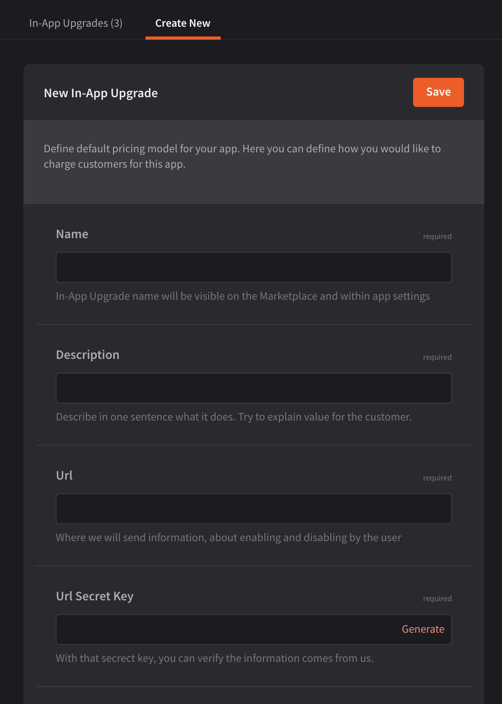
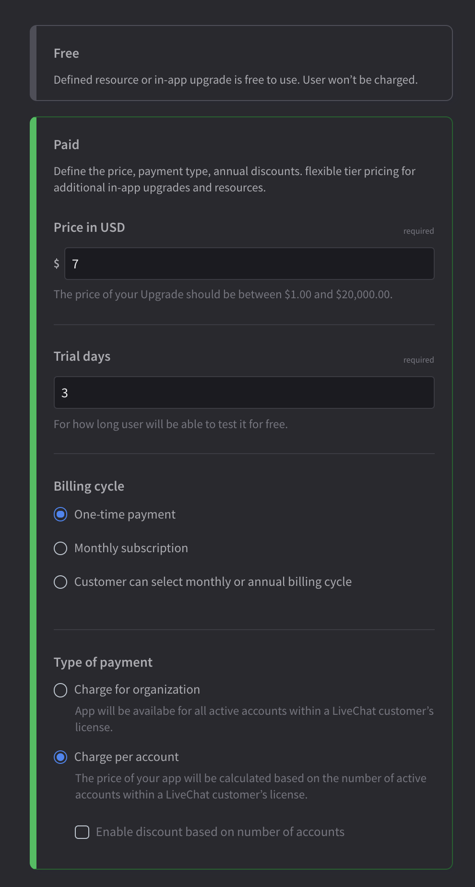

{{DEVELOPER_CONSOLE_URL}} allows you to define additional resources available for purchase in your application. This way, you can monetize the higher usage of a certain resource or unlock extra functionalities. You can also offer those upgrades for free.

Use cases:

- adding new workspaces or accounts
- allowing users to define custom forms or templates
- giving access to certain functionalities, such as reports or analytics 
- offering packages of extra SMS messages or calls 

  

## Building block configuration

### Upgrade info

- Start the upgrade creation by giving it a **name** and a short **description**, which will be displayed to your app users.
- Then, provide us with a **URL** that will receive a webhook whenever users try to buy or deactivate the upgrade. In this case LiveChat works as a proxy, passing along the message. **You need to handle enabling and disabling the upgrade for users on your side.**

  

### Upgrade type

 Select the upgrade type depending on its nature. Some upgrades can be **activated only once**, for example, enabling video calls or access to a certain report, while others allow for **increasing the limit of resources**, for example, SMS messages or connected workspaces.

  

### Upgrade pricing

Define the upgrade price, trial length, billing cycle, and payment type. If you decide to **charge per account**, you can **enable discounts** for licenses with a greater number of accounts.

LiveChat takes a **20% commission** from in-app upgrades.

  

## Activating upgrades

Users can activate upgrades from the Marketplace or directly in the settings of your application.

## Questions?

We're happy to provide our support in case you need it. If you have any questions or suggestions, feel free to contact us at [developers@livechat.com](mailto:developers@livechat.com)
