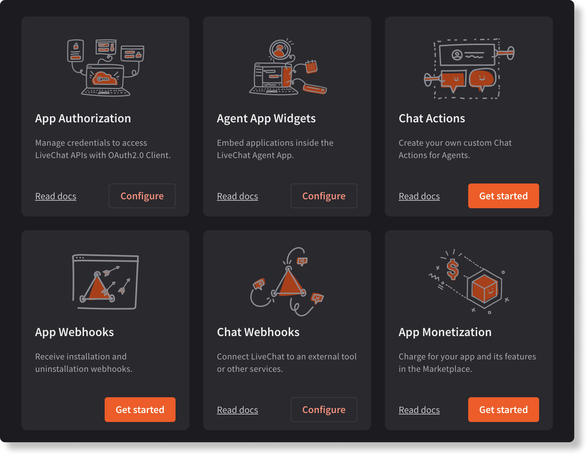

**App guides** are a collection of **tutorials** created to help you navigate through {{DEVELOPER_CONSOLE_URL}} and **effectively use the tools** it provides to build applications. If you're not familiar with Developer Console, it's your own developer portal, where you can build integrations that can be later on published on the {{LIVECHAT_MARKETPLACE_URL}}.

Apart from the actual code of your application, you need to configure its funcionalities with building blocks. They allow you to connect your integration with the LiveChat ecosystem, by, for example, **setting up authorization**, **choosing the integration placement**, or **configuring webhooks**.

## Table of contents

- [App Authorization](/app-guides/app-authorization/)
- [App Monetization](/getting-started/app-guides/app-monetization)
- [App Webhooks](/app-guides/app-webhooks/)
- [Chat Actions](/getting-started/app-guides/chat-actions/)
- [Chat Webhooks](/app-guides/chat-webhooks/)

💡 **More guides coming soon.**

