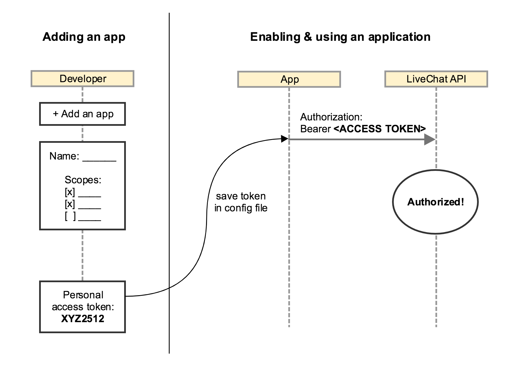

# Introduction

LiveChat uses [OAuth 2.0](https://oauth.net/2/) protocol for **authentication** and **authorization** for all of its services. Before you continue, make sure you understand the following difference:

- **Authentication** is making sure that somebody really is who they say they are. <br/>_E.g.: Checking your passport at the security check is authentication._
- **Authorization** is assigning rules about who is allowed to do what. <br/>_E.g.: Allowing you to take first class seat is authorization._

## Overview

In terms of LiveChat apps, authentication is when you check the user credentials to see if they are signed in. Authorization is when you look up whether you allow them to do something. There are [different authorization flows](#agent-authorization-flows) available for different ways of interacting with LiveChat APIs.

## Basic use cases

### Authorizing WEB API calls

<CodeSample path={'Web API request format'}>

```shell
curl -X POST \
  https://api.livechatinc.com/v3.1/agent/action/<action> \
  -H 'Content-Type: <content-type>' \
  -H 'Authorization: Bearer <your_access_token>' \
  -d '{
        // payload
      }'
```

</CodeSample>

Calling API methods on behalf of LiveChat user is as simple as including `Authorization: Bearer <access_token>` HTTP header in each call. Find out how to acquire the `access_token` in the sections below.

Calling Customer Chat API requires an additional steps to get a different access token. Find out more below.

### Authentication service

You can authenticate users of your app using LiveChat authorization flows. You can leverage the existing LiveChat user base and distribute apps for the community of LiveChat users without the need of building your own authentication service.

### Connect with LiveChat

Let's say you have a service which can import chat data from the external sources. You can use a [Sign in with LiveChat SDK](#sign-in-with-livechat) to create something like _"Connect with LiveChat"_ button. This way your users can connect their LiveChat accounts to your service with just a few clicks.

# Agent authorization flows

All apps integrated with LiveChat must be first created in [LiveChat Developers Console](https://developers.livechatinc.com/console). When a user starts using your app, they will see what parts of his account your app will have access to:


When a user allows the access, your app will receive an `access_token` that will let you access their account.

There are a few scenarios in which you can acquire an `access_token`:

- [Sign in with LiveChat](#sign-in-with-livechat) – the easiest way to get access to any LiveChat account.
- [Public web apps](#public-web-apps) – JavaScript apps available to all LiveChat customers.
- [Private web apps](#private-web-apps) – JavaScript apps available to agents from single LiveChat account.
- [Public server-side apps](#public-server-side-apps) – backend apps available to all LiveChat customers.
- [Private server-side apps (coming soon)](#private-server-side-apps) – backend apps installed on a single LiveChat account.

## Sign in with LiveChat

"Sign in with LiveChat" button is the easiest way to collect `access_token` from a LiveChat user.


In this scenario, LiveChat user enters your website with a "Sign in with LiveChat" button installed. After clicking the button, they enter LiveChat login and password in a pop-up window and grant access to some parts of their account.

In return, you acquire an `access_token` which can be used to call LiveChat APIs.

Read more how to implement this flow in a dedicated ["Sign in with LiveChat"](./sign-in-with-livechat) article.

## Public web apps

Public web apps are JavaScript applications that can access any LiveChat customer account. Examples of public web apps are [LiveChat's Agent App](https://my.livechatinc.com/) and [Developers Console](https://developers.livechatinc.com/console).

To set up your own public app, you must define the URL of the app and the list of scopes – parts of LiveChat account your app will have access to. LiveChat customer who enters your app URL is asked to enter their login and password and grant access for your app.

Then, the user is redirected to your app with `access_token` included in the URL.


### Step 1: Create the app

Go to [Developers Console](https://developers.livechatinc.com/console) and create a new "LiveChat OAuth 2.0 Client" app. **Redirect URI** is the address of your app that will receive `access_token` in a URL. **Scopes** is a list of permissions your app will get.

### Step 2: Redirect to LiveChat OAuth Server

Example redirection to LiveChat OAuth Server:

```shell
https://accounts.livechatinc.com/
  ?response_type=token
  &client_id=2261a58dfe1420acc0dc1bd77158f7ac
  &redirect_uri=https%3A%2F%2Fmy-application.com
  &state=i8XNjC4b8KVok4uw5RftR38Wgp2BFwql
```

When a user runs your app, you should redirect their browser to the following URL:

`https://accounts.livechatinc.com/`

with the following URL params:

- **response_type=token**
- **client_id** – you received it when you created the app in [Developers Console](https://developers.livechatinc.com/console).
- **redirect_uri** – URL of your web application that LiveChat OAuth Server will redirect the user back after successful authorization. It must be one of the URLs that you entered when creating the app in the previous step.
- **state** – you can provide here any value that might be useful to your application. It is strongly recommended to include an anti-forgery token here mitigate the [cross-site request forgery](https://en.wikipedia.org/wiki/Cross-site_request_forgery).

### Step 3: Acquire the access token

Example redirection back to your app:

```
https://my-application.com/
  #access_token=1/fFBGRNJru1FQd44AzqT3Zg
  &token_type=Bearer
  &expires_in=1209600
  &state=i8XNjC4b8KVok4uw5RftR38Wgp2BFwql
```

After successful authorization, the user is redirected back to your app. The URL will include a number of params in the hash section of the URL:

- **access_token** – token you can use to call LiveChat APIs on behalf of the user.
- **expires_in** – number of seconds the `access_token` will be valid. When it expires, you will need to repeat the authorization process to get the new `access_token`.
- **state** – value of the `state` param that you passed in redirection to LiveChat OAuth Server.
- **token_type=Bearer**

Your application should remember `access_token` in localStorage or a cookie until it expires. Caching the token prevents you from redirecting the user to LiveChat OAuth Server every time he visits your app.

### Example app

This example private web application fetches LiveChat agents list and logs it in the console.

<CodeSample path={'index.html'}>

```html
<!DOCTYPE html>
<html>
  <body>
    <script src="//ajax.googleapis.com/ajax/libs/jquery/3.2.1/jquery.min.js"></script>

    <script>
      function getHashParam(key) {
        var params = location.hash.substring(1).split("&");
        var value = params.find(function(item) {
          return item.split("=")[0] === key;
        });
        return value ? value.split("=")[1] : "";
      }

      var clientId = "<client_id>";
      var redirectUri = "http://localhost/test.html";
      var accessToken = getHashParam("access_token");

      if (accessToken) {
        $.ajax({
          url: "./get_agents.php",
          dataType: "json",
          data: {
            access_token: accessToken
          },
          success: agents => {
            console.log(agents);
          }
        });
      } else {
        location.href =
          "https://accounts.livechatinc.com/" +
          "?response_type=token" +
          "&client_id=" +
          clientId +
          "&redirect_uri=" +
          redirectUri;
      }
    </script>
  </body>
</html>
```

</CodeSample>

<CodeSample path={'get_agents.php'}>

```php
<?php
$accessToken = $_GET['access_token'];

$ch = curl_init();
curl_setopt($ch, CURLOPT_URL, 'https://api.livechatinc.com/agents');
curl_setopt($ch, CURLOPT_HTTPHEADER, array(
	'Content-Type: application/json',
	'X-API-Version: 2',
	'Authorization: Bearer ' . $accessToken
));
curl_setopt($ch, CURLOPT_RETURNTRANSFER, true);
curl_setopt($ch, CURLOPT_FOLLOWLOCATION, 1);

$result = curl_exec($ch);
curl_close($ch);

echo $result;
```

</CodeSample>

This example app fetches [Agents list](./management/configuration-api-v2/#list-all-agents) and returns it in the browser's console.

You should update `clientId` and `redirectUri` params from the example to match actual values. You can set up these params when creating the app in [LiveChat Developers Console](https://developers.livechatinc.com/console). Your app must also have access to **read agents list** scopes. Scopes are also configured in the Developers Console.

Please note that the request is performed by the backend script (in this case, PHP) because LiveChat Configuration API v2 does not allow cross-domain requests.

## Private web apps

Private web apps are JavaScript applications that are available only to agents from a single LiveChat account. If you want to build an internal app for your chat agents only, this is a good way to go.

Private web apps work the very same way like [public web apps](#public-web-apps). Please refer to that documentation to understand how it works.

To start building a private web app, set it up [LiveChat Developers Console](https://developers.livechatinc.com/console).

## Public server-side apps

Public server-side apps are applications that have access to user's data for unlimited time.

When your application wants to acquire the `access_token`, you must redirect the user to LiveChat OAuth Server only once. After successful authorization, the user is redirected back to your app along with a single-use authorization code.

Your application exchanges the authorization code for an `access_token` and `refresh_token`. From now now, you can generate new `access_tokens` indefinitely without any action required from the user.


### Step 1: Create the app

Go to [Developers Console](https://developers.livechatinc.com/console) to create a new server-side app. **Redirect URI** is the address of your app that will receive authorization `code` in a URL. **Scopes** is a list of permissions your app will get.

### Step 2: Redirect to LiveChat OAuth Server

Sample URL for redirecting to LiveChat OAuth Server:

```
https://accounts.livechatinc.com/
  ?response_type=code
  &client_id=86pp8cqeg2ac5fimbs8gibluu16ugyvs
  &redirect_uri=https%3A%2F%2Fmy-application.com
  &state=f3NtEuZ5AuxsmnVAzcyLGm17aAaltJTv
```

Start with redirecting your user to the following address: `https://accounts.livechatinc.com/`

Required URL parameters:

- **response_type=code**
- **client_id** – you received it when you created the app in [Developers Console](https://developers.livechatinc.com/console).
- **redirect_uri** – URL of your web application that LiveChat OAuth Server will redirect the user back after successful authorization. It must be one of the URLs that you entered when creating the app in the previous step.

Optional URL parameters:

- **state** – provide any state that might be useful to your application. It will be included in the redirection to `redirect_uri` endpoint.It is strongly recommended to include an anti-forgery token in the state to mitigate the [cross-site request forgery](https://en.wikipedia.org/wiki/Cross-site_request_forgery).

### Step 3: Acquire the code

Example redirection back to your app:

```
https://my-application.com/
  ?code=4/P7q7W91a-oMsCeLvIaQm6bTrgtp7
  &state=f3NtEuZ5AuxsmnVAzcyLGm17aAaltJTv
```

When the user approves the access request, they are redirected back to your app. The URL will include `code` param which should be used to acquire `access_token` and `refresh_token`.

If the user does not approve the request, LiveChat OAuth Server will not redirect the user to your application.

<Section>
<Text>

### Step 4: Exchange code for access token and refresh token

To exchange the `code` for an `access_token` and `refresh_token`, you should perform an HTTP POST request.

Required parameters:

- **grant_type=authorization_code**
- **code** – the authorization code returned from the initial request.
- **client_id** – you received it when you created the app in [Developers Console](https://developers.livechatinc.com/console).
- **client_secret** - you received it when you created the app in [Developers Console](https://developers.livechatinc.com/console).
- **redirect_uri** – the URL of your web application that LiveChat OAuth Server will redirect the user back after successful authorization. It must be one of the URLs that you entered when creating the app in the previous step.

The response will include the following params in JSON format:

- **access_token** – the token you can use to call LiveChat APIs on behalf of the user.
- **account_id** - the ID of the Agent's account.
- **entity_id** - the requester's email address.
- **license_id** - the LiveChat license number.
- **expires_in** – a number in seconds specifying how long the `access_token` will be valid. When it expires, you will need to generate new `access_token` using `refresh_token` (read [Using the refresh token](#using-the-refresh-token) for more details).
- **organization_id** - the ID of the organization's account.
- **refresh_token** – the token that can be used to generate new access tokens.
- **token_type=Bearer**

</Text>
<Code>
<CodeSample path={'POST https://accounts.livechatinc.com/token'}>

```shell
curl "https://accounts.livechatinc.com/token" \
  -X POST \
  -d "grant_type=authorization_code&\
  code=4/P7q7W91a-oMsCeLvIaQm6bTrgtp7&\
  client_id=86pp8cqeg2ac5fimbs8gibluu16ugyvs&\
  client_secret=nBdMN8d7MEp1YYo3&\
  redirect_uri=https://my-application.com"
```

</CodeSample>
<CodeResponse title={'Sample response'}>

```json
{
  "access_token": "1/fFAGRNJru1FTz70BzhT3Zg",
  "account_id": "c2ace1c1-8feb-4903-b7b2-05b8249a31c1",
  "entity_id": "agent1@example.com",
  "expires_in": 28800,
  "license_id": 104130623,
  "organization_id": "3808f8e6-7fe6-468c-a1bd-34e15e08c4eb",
  "refresh_token": "-/khgiugfalskdbcakg2347o8326",
  "token_type": "Bearer"
}
```

</CodeResponse>
</Code>
</Section>

<Section>
<Text>

### Using the refresh token

To obtain a new `access_token`, your application must send an HTTP POST request using the `refresh_token`.

Required parameters:

- **grant_type=refresh_token**
- **refresh_token** – the value of the refresh token you received in the previous step.
- **client_id** – you received it when you created the app in [Developers Console](https://developers.livechatinc.com/console).
- **client_secret** - you received it when you created the app in [Developers Console](https://developers.livechatinc.com/console).

The response will include the following params in JSON format:

- **access_token** – the token you can use to call LiveChat APIs on behalf of the user.
- **account_id** - the ID of the Agent's account.
- **entity_id** - the requester's email address.
- **license_id** - the LiveChat license number.
- **expires_in** – a number in seconds specifying how long the `access_token` will be valid. When it expires, you will need to generate new `access_token` using `refresh_token` (read [Using the refresh token](#using-the-refresh-token) for more details).
- **organization_id** - the ID of the organization's account.
- **refresh_token** – the token that can be used to generate new access tokens.
- **token_type=Bearer**

</Text>
<Code>
<CodeSample path={'POST https://accounts.livechatinc.com/token'}>

```shell
curl "https://accounts.livechatinc.com/token" \
  -X POST \
  -d "grant_type=refresh_token&\
  refresh_token=-/khgiugfalskdbcakg2347o8326&\
  client_id=86pp8cqeg2ac5fimbs8gibluu16ugyvs&\
  client_secret=nBdMN8d7MEp1YYo3"
```

</CodeSample>
<CodeResponse title={'Sample response'}>

```json
{
  "access_token": "1/fFAGRNJru1FTz70BzhT3Zg",
  "account_id": "b7eff798-f8df-4364-8059-649c35c9ed0c",
  "entity_id": "agent1@example.com",
  "expires_in": 28800,
  "license_id": 104130623,
  "organization_id": "390e44e6-f1e6-0368c-z6ddb-74g14508c2ex",
  "refresh_token": "-/khgiugfalskdbcakg2347o8326",
  "token_type": "Bearer"
}
```

</CodeResponse>
</Code>
</Section>

<Section>
<Text>

### Revoking tokens

In some cases a user may wish to revoke access given to an application. The token can be an access token or a refresh token. If the token is an access token and it has a corresponding refresh token, the refresh token will also be revoked.

</Text>
<Code>
<CodeSample path={'DELETE https://accounts.livechatinc.com/token'}>

```shell
curl "https://accounts.livechatinc.com/token\
  ?token=<access_token|refresh_token>"
  -X DELETE
```

</CodeSample>
</Code>
</Section>

<Section>
<Text>

### Validating the access token

You can validate an `access_token` by making an HTTP request.

Please note that refresh tokens are not supported for direct validation. If `access_token` was obtained with with the use of a `refresh_token`, response will return both tokens.

The response will include the following params in JSON format:

- **access_token** – token you can use to call LiveChat APIs on behalf of the user.
- **expires_in** – number of seconds the `access_token` will be valid. When it expires, you will need to generate new `access_token` using `refresh_token` (read [Using the refresh token](#using-the-refresh-token) for more details).
- **refresh_token** – token that can be used to generate new access tokens.
- **client_id** – you received it when you created the app in [Developers Console](https://developers.livechatinc.com/console).
- **scope** – comma-separated list of permissions that `access_token` has access to.
- **token_type=Bearer**
- **entity_id** – LiveChat's user login.
- **license_id** – LiveChat's user account number.

</Text>
<Code>
<CodeSample path={'GET https://accounts.livechatinc.com/info'}>

```shell
curl "https://accounts.livechatinc.com/info"
  -H "Authorization: Bearer <access_token>"
```

</CodeSample>
<CodeResponse title={'Sample response'}>

```json
{
  "access_token": "hgDBq88bSw-UHBXnm1Q_Bw",
  "expires_in": 3564,
  "refresh_token": "wB_Q1mnXBHU-wSb88qBDgh", // optional
  "client_id": "14c26ac43f2123dcf8a76ff58b319930",
  "scope": "email,manage_accounts",
  "token_type": "Bearer",
  "entity_id": "name@domain.com",
  "license_id": 1520
}
```

</CodeResponse>
</Code>
</Section>

## Private server-side apps (coming soon)

Private apps can be used only on accounts chosen by the developer.



This authorization flow is not yet available.

# Customer authorization flow

To authorize [Customer Chat API](../../messaging/customer-chat-api/) you will need different access token than for the [Agent Chat API](../../messaging/agent-chat-api/) or [Configuration API](../../management/configuration-api/).

<Section>
<Text>

## Creating new customer

You can create a new customer on licence or use an existing identity. The `<ACCESS_TOKEN>` mentioned below is the one that you get from the app authorization flow. Required scope: `customers.own`.

**Required parameters**

- `client_id` - identifies the client application that is making the request
- `response_type` - oauth2 standard, should use `token`
- `redirect_uri` - the value of this parameter must exactly match one of the values listed in application

**Optional partametres**

- `customer_id` - ID of existing customer, if empty new `customer_id` is created
- `valid_for` - Optional for overriding default token expiration time

</Text>
<Code>
<CodeSample path={'POST https://accounts.livechatinc.com/customer/'}>

```shell
curl "https://accounts.livechatinc.com/customer/" \
  -H "Authorization: Bearer <access_token>" \
  -X POST
  -d '{
  "client_id": "04b98ba24fc4426a0a046cf955dfd796",
  "response_type": "token",
  "redirect_uri": "https://my.livechatinc.com/"
  }'
```

</CodeSample>
<CodeResponse title={'Sample response'}>

```json
{
  "access_token": "dev-J7ssSZhSSbShcZxrv580FA",
  "client_id": "238ac4c3c3628880aca289c6d700d2c5",
  "entity_id": "bf18d1a8-1afe-4a3e-4cc0-a3148f1143db",
  "expires_id": 3600
}
```

</CodeResponse>
</Code>
</Section>

## Customer chat URL

It's possible to create customer direct chat url using `license_id` and `access_token`.

**Example URL**

```
https://accounts.livechatinc.com/customer?
  access_token=ae19bb31-803a-46f3-53ac-3b7d2564fe7e&
  redirect_uri=https://lc.chat/now/1520/"
```

# Notes

## Limitations

There is currently a limit of 25 refresh tokens per client per user. When limit is reached, the oldest token is automaticaly revoked.

Another limitation is 3 redirects in 30 seconds to Livechat OAuth 2.0 server per client per user. When limit is reached, server redirects to error page with `too_many_redirects` error detail.

## Redirect URI considerations

Client configuration allows adding many redirect URIs. The redirect URIs are separated by comma. Authorization request redirect URI is valid when matches one of the client's configuration URIs.

URI is composed of several parts:

- scheme (`http://`, `https://`) - is required and must match exactly,
- host (`google.pl`, `localhost:3000`, ...) - hostname or ip and optional port, is required and must match exactly,
- path (`/info`, `/test`, ...) - is optional, client redirect URI path must be a substring of authorization request redirect path, path traversals are forbidden,
- query (`?size=20`, ...) - is forbidden,
- fragment (`#paragraph`) - is forbidden.

**Examples:**

| client redirect configuration   | authorization redirect URI            | is valid |
| ------------------------------- | :------------------------------------ | -------- |
| http://livechatinc.com          | http://livechatinc.com                | yes      |
| http://livechatinc.com          | http://livechatinc.com/archives       | yes      |
| http://livechatinc.com          | http://livechatinc.com/archives/../   | no       |
| http://livechatinc.com/archives | http://livechatinc.com                | no       |
| http://livechatinc.com/archives | http://livechatinc.com/archives       | yes      |
| http://livechatinc.com/archives | http://livechatinc.com/archives/chats | yes      |
| http://localhost:3000           | http://localhost:3000                 | yes      |
| http://127.0.0.1:3000           | http://127.0.0.1:3000                 | yes      |
| http://localhost:3000           | http://localhost:4000                 | no       |
| https://livechatinc.com         | http://livechatinc.com                | no       |
| http://livechatinc.com          | https://livechatinc.com               | no       |

# Errors

All authorization errors redirect to error page (`https://accounts.livechatinc.com/ooops`) while authentication errors redirect to the login page (`https://accounts.livechatinc.com/`).

Errors codes are returned in the query strings, in form of `oauth_exception` param (for authorization errors) or `identity_exception` param (for authentication errors).

Additional `exception_details` may be passed with detailed information.

## Authorization errors

#### `invalid_request`

The request is missing a required parameter, includes an invalid parameter value, includes a parameter more than once, or is otherwise malformed. Possible reasons:

- wrong HTTP method
- invalid HTTP body encoding

#### `unauthorized_client`

The client is not authorized to request a token using this method. Possible reasons:

- missing client id
- client id not found
- refresh token not found
- invalid client secret
- invalid redirect uri

#### `access_denied`

The resource owner or authorization server denied the request. Possible reasons:

- requested scope include any scope not originally granted by the resource owner

#### `unsupported_response_type`

The authorization server does not support obtaining a token using this method. Possible reasons:

- response type is not `code` or `token`

#### `invalid_scope`

The requested scope is invalid, insufficient, unknown or malformed. Possible reasons:

- scope not found
- scope name not found

#### `server_error`

The authorization server encountered an unexpected condition that prevented it from fulfilling the request. Possible reasons:

- server down
- server storage down

#### `temporarily_unavailable`

The authorization server is currently unable to handle the request due to a temporary overloading or maintenance of the server. Currently not used.

#### `unsupported_grant_type`

The authorization grant type is not supported by the authorization server.

- using disabled authorization grant type, for example client credentials grant - https://tools.ietf.org/html/rfc6749#section-4.4

#### `invalid_grant`

The provided authorization grant (e.g., authorization code, resource owner credentials) or refresh token is invalid, expired, revoked, does not match the redirection URI used in the authorization request, or was issued to another client. Possible reasons:

- refresh token expired
- access token expires

#### `invalid_client`

Client authentication failed (e.g., unknown client, no client authentication included, or unsupported authentication method). Possible reasons:

- using refresh token with wrong client id

#### `missing_grant`

The client is missing granted rights. Possible reasons:

- grants were rejected
- grants were never given
- client changed required grants

### Exception details

`client_id_not_found` - wrong client id, client id does not exists

`redirect_uri_not_set` - client misconfiguration, client has not set redirect uri

`invalid_redirect_uri` - redirect uri is not one of client's allowed redirects

`to_many_redirects` - server has detected redirect loop, client should not redirect to many times

## Authentication errors

#### `invalid_request`

The request is missing a required parameter, includes an invalid parameter value, includes a parameter more than once, or is otherwise malformed.

#### `unauthorized`

The request is valid, but identity data is wrong or identity does not exists. If identity id is known, it's added to querystring as `entity_id`.

#### `server_error`

The server encountered an unexpected condition that prevented it from demermining identity.

#### `access_denied`

The identity is known, but access is denied because of bussiness reasons. For example identity can be banned, has wrong account version, etc.

#### `identity_lost`

The identity was removed due logout, password reset, remote logout, etc.

#### `credentials_login_disabled`

Identity has disabled credentials login strategy. Identity should be verified with other stategies like Google Oauth or SAML.
