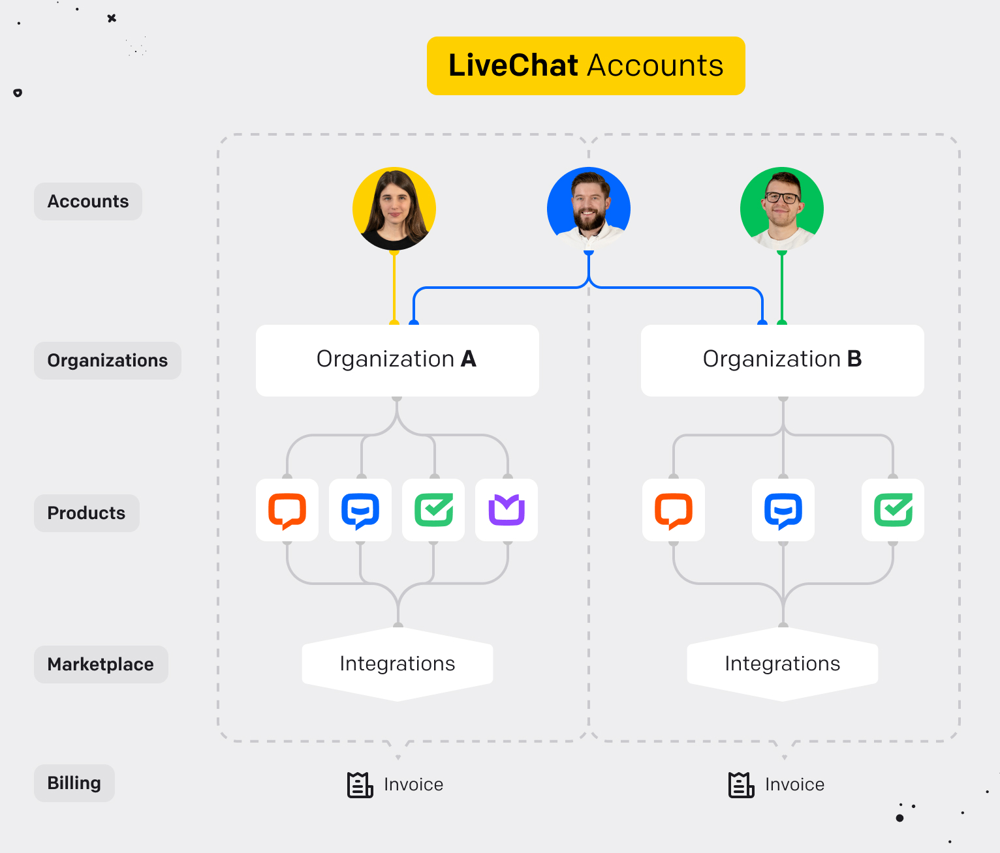

# Introduction

LiveChat is not the only tool in our toolbox. Some of our customers use <a href="https://www.chatbot.com/" target="_blank">ChatBot</a>, <a href="https://www.helpdesk.com/" target="_blank">HelpDesk</a>, or <a href="https://www.knowledgebase.ai/" target="_blank">KnowledgeBase</a>. We no longer want to keep the products separate. Joining the common parts of all products would bring an ease of access to customers and would open the door to new integration possibilities for developers.

Here's where **LiveChat Accounts** comes in. It's a service where our customers can configure options and resources that are common across all products. You can think of LiveChat Accounts as a separate, top-level product. <a href="https://www.livechat.com/help/livechat-accounts-a-new-way-to-log-in-to-livechat/" target="_blank">Learn more...</a>.

## Organization

LiveChat Accounts will comprise a set of products. Such a set has its name; it's an organization. In a single organization, all available products can be enabled, managed, or configured with a single limitation: one unique product per organization.

### Account

An account is a top-level definition of a user. It's like an agent in LiveChat but shared between all products.

An organization must have at least one account assigned to it. One account can be assigned to many organizations (like the blue account in the picture).

### Account Role

An account has individual roles in each organization it belongs to. Within an organization, a top-level role called **Accounts** is mandatory.
There are three Accounts roles to choose from:

- `owner` - a unique role in an organization. The owner is the first account in every organization. Ownership can be transferred to another account.
- `administrator` - a role that gives rights to manage an organization.
- `member` - a basic role that gives an account the rights to manage itself.

An account can be granted with many additional secondary roles that are product-specific. For example, when an account wants to launch the LiveChat product, such an account needs to have a secondary role, specifically for this product (LiveChat).

### Role types

In general, we can distinguish three role types:

- `primary` - required in an organization (the LiveChat Accounts product). It's always set.
- `secondary` - required for a given product. It can be set only for enabled products.
- `custom` - an optional role with additional permissions

| product  | role type | roles                              |
| -------- | --------- | ---------------------------------- |
| Accounts | primary   | `owner`, `administrator`, `member` |
| Accounts | custom    | `billing_editor`                   |
| LiveChat | secondary | `administrator`, `normal`          |

### Product roles

All products define their own roles. If you've been using LiveChat, you're probably familiar with the roles in this product: `owner`, `viceowner`, `administrator`, `agent`.

There are two roles gone from LiveChat:
- `owner` - returned from LiveChat API, on organization level it's a combination of Accounts `owner` and LiveChat `administrator`
- `viceowner` - returned from LiveChat API, on organization level it's a combination of Accounts `administrator`, Accounts `billing_editor` and LiveChat `administrator`

To read about roles in other products, visit their documentation:
- ChatBot
- HelpDesk

# LiveChat Accounts API (Open-API definitions)
