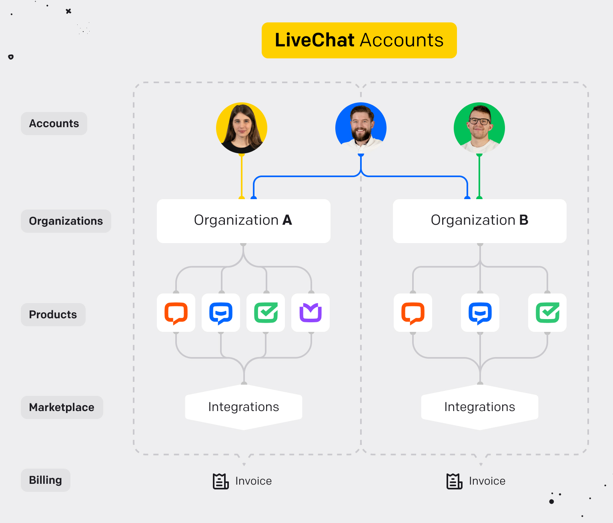

# Introduction

LiveChat is not the only tool in our toolbox. Some of our customers use ChatBot, HelpDesk, or Knowledge Base. We no longer want to keep the products separate - joining common parts of them would benefit our customers with ease of access and developers with new possibilities for integrations. Here comes LiveChat Accounts - a service where our customers can configure common options and resources between all products. You can <a href="https://www.livechat.com/help/livechat-accounts-a-new-way-to-log-in-to-livechat/" target="_blank" rel="noopener noreferrer">learn more here</a>.

## Organization

LiveChat Accounts is going to be a set of products. Such a set has its own name - it's an organization. In a single organization all available products can be enabled, managed, or configured with a single limitation - one unique product per organization.

### Account

An account is a top-level definition of a user. It's like an agent in LiveChat but shared between all products.

An organization must have at least one account assigned to it. One account can be assigned to many organizations (like the blue account on the picture).

### Account Role

An account has separate roles in every organization it belongs to. Within an organization, a top-level role, called Accounts role is mandatory.
There are three Accounts roles to choose from:

- `owner` - a unique role in an organization, first account in an organization is an owner, the ownership can be transferred to another account
- `administrator` - a role that gives rights to manage an organization
- `member` - a basic role that gives rights for the account to manage itself

The account can be granted with many additional secondary roles. These roles are product roles and are required in a given product.
For example, when an account wants to launch LiveChat product, it has to have assigned a secondary role for product LiveChat.

# LiveChat Accounts API (Open-API definitions)
