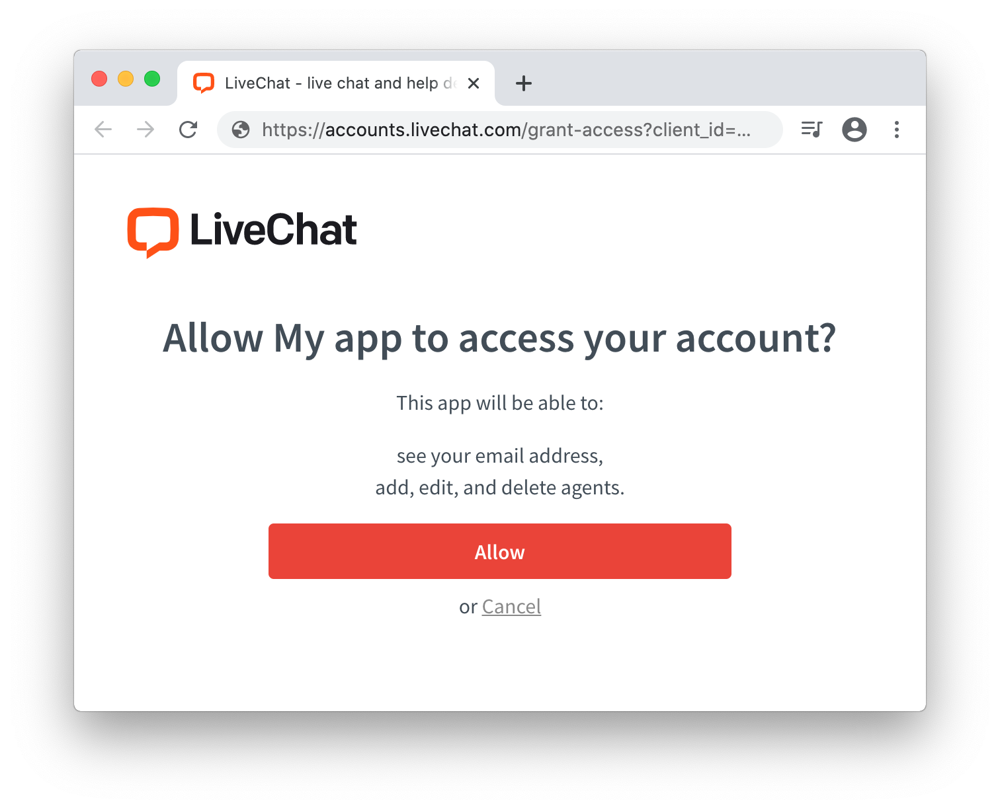

# Introduction

LiveChat uses [OAuth 2.0](https://oauth.net/2/) protocol for **authentication** and **authorization** for all of its services. Before you continue, make sure you understand the difference between them.

- **Authentication** is making sure that somebody really is who they say they are. <br/>_E.g.: Checking your passport at the security check is authentication._
- **Authorization** is assigning rules about who is allowed to do what. <br/>_E.g.: Allowing you to take first class seat is authorization._

In terms of LiveChat apps, authentication is when you check the user credentials to see if they are signed in. Authorization is when you look up whether you allow them to do something.

Throughout the document, we'll also use the terms **public** and **private** apps:

- **public apps** are available to all LiveChat customers, who can install it from the LiveChat <a href="https://www.livechat.com/marketplace/" target="_blank" rel="noopener noreferrer">Marketplace</a>.
- **private apps** are only available within a LiveChat license that created the app. They're a way to go if you want to build an internal app for your chat Agents only. Unlike public apps, private apps don't ask users for an access grant.

## Use cases

Decide which authorization flow to choose based on your use case.

| Use case                              | Recommended flow                                                                                                                                                                                                                                           |
| ------------------------------------- | ---------------------------------------------------------------------------------------------------------------------------------------------------------------------------------------------------------------------------------------------------------- |
| **Sending requests to LiveChat API**  | [Personal Access Tokens](#personal-access-tokens) is the fastest way, but all other flows are also possible                                                                                                                                                |
| **Testing an app during development** | [Sign in with LiveChat](/getting-started/authorization/sign-in-with-livechat/) is the fastest, but all other flows are also possible                                                                                                                       |
| **Building public web apps**          | [Sign in with LiveChat](/getting-started/authorization/sign-in-with-livechat/), [Implicit grant](#implicit-grant)                                                                                                                                          |
| **Building private web apps**         | [Sign in with LiveChat](/getting-started/authorization/sign-in-with-livechat/), [Implicit grant](#implicit-grant)                                                                                                                                          |
| **Building public server-side apps**  | [Sign in with LiveChat](/getting-started/authorization/sign-in-with-livechat/), [Authorization code grant](#authorization-code-grant)                                                                                                                      |
| **Building private server-side apps** | [Personal Access Tokens](#personal-access-tokens) for the personal use of the app, [Sign in with LiveChat](/getting-started/authorization/sign-in-with-livechat/) or [Authorization code grant](#authorization-code-grant) for all Agents within a license |

Read more about [creating LiveChat apps](/getting-started/guides/#creating-livechat-apps) or go straight to <a href="https://developers.livechat.com/console/" target="_blank" rel="noopener noreferrer">Developer Console</a>  and start building.

# Agent authorization flows

All of the following authorization flows let your app acquire an `access_token`. With this token, the app can make calls to the Agent Chat API, Configuration API, and Reports API, Billing API, and Partner Program API on behalf of an Agent.
To make calls to Customer Chat API, you need a different `access_token`. For that, see [Customer authorization flow](#customer-authorization-flow).

## Personal Access Tokens

Unlike other authorization flows that let you acquire a token for your app, **Personal Access Tokens (PATs)** are generated per Agent. PATs are great when you want to make a quick call to the LiveChat API or test out the app you're working on.

To sign a request with a Personal Access Token, you need to:

1. Create a PAT in <a href="https://developers.livechat.com/console" target="_blank">Developer Console</a>.
2. Use your `account_id` and PAT in the **Basic authentication scheme** to send a request.

### Step 1: Generate a PAT

Start in <a href="https://developers.livechat.com/console/" target="_blank">Developer Console</a>. Then, go to **Tools -> Personal Access Tokens** and create a new token together with necessary [scopes](/messaging/agent-chat-api/#scopes-1). You won't be able to change those scopes once you create the token.


### Step 2: Use your credentials to send the request

Personal Access Tokens use the <a href="https://developer.mozilla.org/en-US/docs/Web/HTTP/Authentication#Basic_authentication_scheme/" target="_blank">Basic authentication scheme</a>. For that reason, you need a username and a password.

Use:

- **Account ID** as the **username** for API v3
- **Entity ID (your LiveChat login)** as the **username** for API v2
- **PAT** as the **password** for API v2 and v3

Once you have your credentials, you can send requests to, for example, [Agent Chat API](/messaging/agent-chat-api/).


## Implicit grant

Implicit grant is an authorization flow recommended for JavaScript web apps.

To set up your own web app, you must define the URL of the app and the list of scopes. Scopes determine which parts of a LiveChat user's account your app will have access to. A LiveChat customer who enters your app URL will be asked to enter their login and password and grant the access for your app. Then, the user is redirected to your app with `access_token` included in the URL.

There are a few steps in the process:

- **Step 1:** Create an app in Developer Console and configure the Authorization building block
- **Step 2:** Redirect the users of your app to the LiveChat OAuth Server
- **Step 3:** Get an access token from the URL
- **Step 4:** Use the token in API calls

### Step 1: Create an app

If you don't have an app yet, start by creating one in <a href="https://developers.livechat.com/console/" target="_blank" rel="noopener noreferrer">Developer Console</a>. The app is a LiveChat OAuth 2.0 Client with its **Id** and **Secret**. You need to configure the Authorization building block of your application. [See the guide](/getting-started/authorization/authorization-in-practice/#step-1-configure-the-authorization-building-block) to learn how to do that. Since this is the Implicit grant authorization flow, you won't use the **Client Secret** of your app. Feel free to skip the part about **Client Secret** in the guide; the rest applies without any change.

### Step 2: Redirect users to LiveChat OAuth Server

When users run your app, they should be redirected to the LiveChat OAuth Server, which can be found under this URL:

```url
https://accounts.livechat.com/
```

<Section>
<Text>

#### Request

| Parameter       | Required | Description                                                                                                                                                                                                                                                                 |
| --------------- | -------- | --------------------------------------------------------------------------------------------------------------------------------------------------------------------------------------------------------------------------------------------------------------------------- |
| `response_type` | yes      | Value: `token`                                                                                                                                                                                                                                                              |
| `client_id`     | yes      | **Client Id** from Developer Console (Authorization block)                                                                                                                                                                                                                  |
| `redirect_uri`  | yes      | One of the URLs defined in the Authorization block during app configuration.The LiveChat OAuth Server will redirect the user back to this URL after successful authorization.                                                                                               |
| `state`         | no       | Any value that might be useful to your application. It's strongly recommended to include an anti-forgery token to mitigate the <a href="https://en.wikipedia.org/wiki/Cross-site_request_forgery" target="_blank" rel="noopener noreferrer">cross-site request forgery</a>. |
| `prompt`        | no       | Value: `consent`. **For testing purposes.** It forces the app to ask for access to certain resources. It’s necessary for you to test the app as if you were a user who installs the app from Marketplace.                                                                   |

</Text>
<Code>
<CodeSample path={'EXAMPLE REDIRECTION TO LIVECHAT OAUTH SERVER'}>

```
https://accounts.livechat.com/
  ?response_type=token
  &client_id=9cbf3a968289727cb3cdfe83ab1d9836
  &redirect_uri=https%3A%2F%2Fmy-application.com
  &state=i8XNjC4b8KVok4uw5RftR38Wgp2BFwql
```

</CodeSample>
</Code>
</Section>

At this point, the app should ask the user to allow it to access certain resources and perform certain actions. The list of resources and actions is automatically created based on the scopes selected for your app in Developer Console.



Keep in mind that as the app author, you won't see this screen. Use `prompt:consent` to verify this step from the user perspective.
This step is also omitted for private web apps installed by Agents from the same license.  

### Step 4: Get an access token from the URL

After a user authorizes the app by clicking **Allow**, they are redirected back to your application (to the **Redirect URI** you specified in Developer Console). The URL includes a number of parameters, including the `access_token`.

<Section>
<Text>

#### Response

| Parameter      | Description                                                                                                                                                                     |
| -------------- | ------------------------------------------------------------------------------------------------------------------------------------------------------------------------------- |
| `access_token` | The token you can use to call LiveChat APIs on behalf of the user.                                                                                                              |
| `expires_in`   | The number of seconds the `access_token` will be valid; 28800 sec by default. When it expires, you will need to repeat the authorization process to get the new `access_token`. |
| `token_type`   | Value: `Bearer`                                                                                                                                                                 |
| `state`        | The value of the `state` param that you passed to LiveChat OAuth Server in redirection.                                                                                         |

</Text>
<Code>
<CodeResponse title={'EXAMPLE REDIRECTION BACK TO THE APP'}>

```
https://my-application.com/
  #access_token=dal%3A0i0CSDQTRHGbZCFkAoss4Q
  &token_type=Bearer
  &expires_in=28800
  &state=i8XNjC4b8KVok4uw5RftR38Wgp2BFwql
```

</CodeResponse>
</Code>
</Section>

### Step 4: Use the token in API calls

Once you extract the token from the URL, yoour app can use it to sign requests to the LiveChat API.
Your application should store the `access_token` in localStorage or a cookie until it expires. Caching the token prevents you from redirecting the user to LiveChat OAuth Server every time they visit your app.

### Example implementation

This sample web app makes a call to Agent Chat API to [return the list of customers](/messaging/agent-chat-api/#get-customers), which is then logged in the console. The application uses the **Implicit grant** to get an access token.

<CodeSample path={'index.html'}>

```html
<!DOCTYPE html>
<html>
​
<body>
  <script src="//ajax.googleapis.com/ajax/libs/jquery/3.2.1/jquery.min.js"></script>
  <script src="https://unpkg.com/axios/dist/axios.min.js"></script>
  <script src="/get_customers.js"></script>
​
  <script>
    function getHashParam(key) {
      var params = location.hash.substring(1).split("&");
      var value = params.find(function (item) {
        return item.split("=")[0] === key;
      });
      return value ? value.split("=")[1] : "";
    }
​
    var clientId = "bb9e5b2f1ab480e4a715977b7b1b4279"; // Client Id of your app
    var redirectUri = "https://get-customers-app.samplehosting.com/"; // URL of your app
    var accessToken = decodeURIComponent(getHashParam("access_token"));
​
    if (accessToken) {
      get_customers();
    } else {
      location.href =
        "https://accounts.livechat.com/" +
        "?response_type=token" +
        "&client_id=" +
        clientId +
        "&redirect_uri=" +
        redirectUri;
    }
  </script>
</body>
​
</html>
```

</CodeSample>

<CodeSample path={'get_customers.js'}>

```js
function get_customers() {
        axios({
                method: 'post',
                url: 'https://api.livechat.com/v3.1/agent/action/get_customers',
                headers: {
                        'Content-Type': 'application/json',
                        'Authorization': 'Bearer ' + accessToken,
                },
                data: {
                }
        }).then((response) => {
                console.log(response.data);
        }, (error) => {
                console.log(error);
        });
}
```

</CodeSample>

To make it work, run this app on localhost or [deploy it to Firebase](/getting-started/guides/#creating-livechat-apps) to host it. Update `index.html` with your own `redirectUri` (link to your app) and `clientId`.
Make sure to use the exact same Redirect URI in Developer Console. Also, to use the **Get Customers** method, your app needs the `customers:ro` scope, which you should select in Developer Console.
When everything is ready, install the app privately for your license.

## Authorization code grant

Authorization code grant flow is recommended for server-side apps. Unlike web apps, they can store confidential info, such as **Client Secret**, on a server without ever exposing it.
When a user runs your app, they are redirected to the LiveChat OAuth Server only once. After successful authorization, the user is redirected back to your app along with a single-use authorization code. Then, your application exchanges the code for an access token and a refresh token using the Client Secret. From now on, the app can regenerate new access tokens without any action required from the user.

This flow is very similar to **Implicit grant**, but contains one additional step of exchanging a code for an access token.

The steps are as follows:

- **Step 1:** Create an app in Developer Console and configure the Authorization building block
- **Step 2:** Redirect the users of your app to the LiveChat OAuth Server
- **Step 3:** Get a code from the URL
- **Step 4:** Exchange the code for an access token
- **Step 5:** Use the token in API calls


### Step 1: Create an app

If you don't have an app yet, start by creating one in <a href="https://developers.livechat.com/console/" target="_blank" rel="noopener noreferrer">**Developer Console**</a>. The app is a LiveChat OAuth 2.0 Client with its **Id** and **Secret**. You need to configure the Authorization building block of your application. [See the guide](/getting-started/authorization/authorization-in-practice/#step-1-configure-the-authorization-building-block) to learn how to do that.

### Step 2: Redirect users to LiveChat OAuth Server

When users run your app, they should be redirected to the LiveChat OAuth Server, which can be found under this URL:

```url
https://accounts.livechat.com/
```

<Section>
<Text>

#### Request

| Parameter       | Required | Description                                                                                                                                                                                                            |
| --------------- | -------- | ---------------------------------------------------------------------------------------------------------------------------------------------------------------------------------------------------------------------- |
| `response_type` | yes      | Value: `code`                                                                                                                                                                                                          |
| `client_id`     | yes      | **Client Id** from Developer Console (Authorization block)                                                                                                                                                             |
| `redirect_uri`  | yes      | One of the URLs defined in the Authorization block during app configuration. The LiveChat OAuth Server will redirect the user back to this URL after successful authorization.                                         |
| `state`         | no       | Any value that might be useful to your application. It's strongly recommended to include an anti-forgery token to mitigate the [cross-site request forgery](https://en.wikipedia.org/wiki/Cross-site_request_forgery). |
| `prompt`        | no       | Value:  `consent`. **For testing purposes.** It forces the app to ask for access to certain resources. It’s necessary for you to test the app as if you were a user who installs the app from Marketplace.             |

</Text>
<Code>
<CodeSample path={'EXAMPLE REDIRECTION TO LIVECHAT OAUTH SERVER'}>

```
https://accounts.livechat.com/
  ?response_type=code
  &client_id=9cbf3a968289727cb3cdfe83ab1d9836
  &redirect_uri=https%3A%2F%2Fmy-application.com
  &state=i8XNjC4b8KVok4uw5RftR38Wgp2BFwql
```

</CodeSample>
</Code>
</Section>

At this point, the app should ask the user to allow it to access certain resources and perform certain actions. The list of resources and actions is automatically created based on the scopes selected for your app in Developer Console.


Keep in mind that as the app author, you won't see this screen. Use `prompt:consent` to verify this step from the user perspective.
This step is also omitted for private server-side apps installed by Agents from the same license.  

### Step 3: Acquire the code

After a user authorizes the app by clicking **Allow**, they are redirected back to your application (to the **Redirect URI** you specified in Developer Console). The URL includes a number o parameters, including `code`.

<Section>
<Text>

#### Request

| Parameter | Notes                                                                                             |
| --------- | ------------------------------------------------------------------------------------------------- |
| `code`    | A single-use code you need to exchange it for an access token. It's only valid for a few minutes. |
| `state`   | The value of the `state` param that you passed to LiveChat OAuth Server in redirection.           |

</Text>
<Code>
<CodeResponse title={'EXAMPLE REDIRECTION BACK TO THE APP'}>

```
https://my-application.com/
  ?code=4/P7q7W91a-oMsCeLvIaQm6bTrgtp7
  &state=i8XNjC4b8KVok4uw5RftR38Wgp2BFwql
```

</CodeResponse>
</Code>
</Section>

<Section>
<Text>

### Step 4: Exchange code for access token and refresh token

To exchange the `code` for an `access_token` and a `refresh_token`, you need to make an HTTP POST request to the following URL:

```
https://accounts.livechat.com/token
```

#### Request

| Parameter       | Required | Description                                                                                                                                                                    |
| --------------- | -------- | ------------------------------------------------------------------------------------------------------------------------------------------------------------------------------ |
| `grant_type`    | yes      | Value: `authorization_code`                                                                                                                                                    |
| `code`          | yes      | The authorization code returned from the request in the previous step.                                                                                                         |
| `client_id`     | yes      | **Client Id** from Developer Console (Authorization block)                                                                                                                     |
| `client_secret` | yes      | Unique, confidential identifier of your app from Developer Console (Authorization block).                                                                                      |
| `redirect_uri`  | yes      | One of the URLs defined in the Authorization block during app configuration. The LiveChat OAuth Server will redirect the user back to this URL after successful authorization. |

#### Response

The response is a JSON with the following parameters:

| Parameter         | Description                                                                                                                                                                                                                                                      |
| ----------------- | ---------------------------------------------------------------------------------------------------------------------------------------------------------------------------------------------------------------------------------------------------------------- |
| `access_token`    | A token you can use to call LiveChat APIs on behalf of the user.                                                                                                                                                                                                 |
| `account_id`      | The ID of the Agent's account                                                                                                                                                                                                                                    |
| `entity_id`       | The requester's email address                                                                                                                                                                                                                                    |
| `license_id`      | The LiveChat license number                                                                                                                                                                                                                                      |
| `expires_in`      | A number in seconds specifying how long the `access_token` will be valid; 28800 sec by default. When it expires, you will need to generate new `access_token` using `refresh_token` (read [Using the refresh token](#using-the-refresh-token) for more details). |
| `organization_id` | The ID of the organization's account.                                                                                                                                                                                                                            |
| `refresh_token`   | A token that can be used to generate new access tokens.                                                                                                                                                                                                          |
| `scope`           | A comma-separated list of permissions an `access_token` has.                                                                                                                                                                                                     |
| `token_type`      | Value: `Bearer`                                                                                                                                                                                                                                                  |

</Text>
<Code>
<CodeSample path={'EXCHANGE CODE FOR TOKEN'}>

```shell
curl "https://accounts.livechat.com/token" \
  -X POST \
  -d "grant_type=authorization_code&\
  code=dal:BSnfZtnlRmy73mg9eaFESA&\
  client_id=9cbf3a968289727cb3cdfe83ab1d9836&\
  client_secret=nBdMN8d7MEp1YYo3&\
  redirect_uri=https://my-application.com"
```

</CodeSample>
<CodeResponse title={'Response'}>

```json
{
  "access_token": "dal:Lp6DVYTJQ6GDVgQf8kQDPw",
  "account_id": "b7eff798-f8df-4364-8059-649c35c9ed0c",
  "entity_id": "smith@example.com",
  "expires_in": 28800,
  "license_id": 104130623,
  "organization_id": "390e44e6-f1e6-0368c-z6ddb-74g14508c2ex",
  "refresh_token": "-/khgiugfalskdbcakg2347o8326",
  "scope": "chats--my:ro,chats--all:ro,chats--all:rw",
  "token_type": "Bearer"
}
```

</CodeResponse>
</Code>
</Section>

### Step 5: Use the token in API calls

Once you extract the token from the URL, yoour app can use it to sign requests to the LiveChat API.
Your application should store the `access_token` in localStorage or a cookie until it expires. Caching the token prevents you from redirecting the user to LiveChat OAuth Server every time they visit your app.

<Section>
<Text>

### Using the refresh token

When an `access_token` expires, your app needs to acquire a new one. To do that, it has to send an HTTP POST request using the `refresh_token`.

```url
https://accounts.livechat.com/token
```

#### Request

| Parameter       | Required | Description                                                                               |
| --------------- | -------- | ----------------------------------------------------------------------------------------- |
| `grant_type`    | yes      | Value: `refresh_token`                                                                    |
| `refresh_token` | yes      | The refresh token returned from when exchanging the `code`.                               |
| `client_id`     | yes      | **Client Id** from Developer Console (Authorization block)                                |
| `client_secret` | yes      | Unique, confidential identifier of your app from Developer Console (Authorization block). |

#### Response

The response is a JSON with the following parameters:

| Parameter         | Description                                                                                                                                                                                                                                |
| ----------------- | ------------------------------------------------------------------------------------------------------------------------------------------------------------------------------------------------------------------------------------------ |
| `access_token`    | A token you can use to call LiveChat APIs on behalf of the user.                                                                                                                                                                           |
| `account_id`      | The ID of the Agent's account                                                                                                                                                                                                              |
| `entity_id`       | The requester's email address                                                                                                                                                                                                              |
| `expires_in`      | A number in seconds specifying how long the `access_token` will be valid. When it expires, you will need to generate new `access_token` using `refresh_token` (read [Using the refresh token](#using-the-refresh-token) for more details). |
| `license_id`      | The LiveChat license number                                                                                                                                                                                                                |
| `organization_id` | the ID of the organization's account.                                                                                                                                                                                                      |
| `scope`           | A comma-separated list of permissions an `access_token` has.                                                                                                                                                                               |
| `refresh_token`   | A token that can be used to generate new access tokens.                                                                                                                                                                                    |
| `token_type`      | Value: `Bearer`                                                                                                                                                                                                                            |

</Text>
<Code>
<CodeSample path={'GET A NEW ACCESS TOKEN'}>

```shell
curl "https://accounts.livechat.com/token" \
  -X POST \
  -d "grant_type=refresh_token&\
  refresh_token=-/khgiugfalskdbcakg2347o8326&\
  client_id=9cbf3a968289727cb3cdfe83ab1d9836&\
  client_secret=nBdMN8d7MEp1YYo3"
```

</CodeSample>
<CodeResponse title={'response'}>

```json
{
  "access_token": "dal:Lp6DVYTJQ6GDVgQf8kQDPw",
  "account_id": "b7eff798-f8df-4364-8059-649c35c9ed0c",
  "entity_id": "smith@example.com",
  "expires_in": 28800,
  "license_id": 104130623,
  "organization_id": "390e44e6-f1e6-0368c-z6ddb-74g14508c2ex",
  "scope": "chats--my:ro,chats--all:ro,chats--all:rw",
  "refresh_token": "-/khgiugfalskdbcakg2347o8326",
  "token_type": "Bearer"
}
```

</CodeResponse>
</Code>
</Section>

<Section>
<Text>

### Revoking tokens

In some cases, a user may wish to revoke the access (the token) given to your application. The token can be either an access token or a refresh token. If it's an access token with a corresponding refresh token, both tokens will be revoked.
To revoke a token, make a DELETE HTTP request to the following URL:

```url
https://accounts.livechat.com/token
```

Code snippets present two alternative ways of making the same request.

#### Request

| Parameter | Required | Description                                                       |
| --------- | -------- | ----------------------------------------------------------------- |
| `code`    | yes      | The value of the `access_token` or the `refresh_token`  to revoke |

</Text>
<Code>
<CodeSample path={'REVOKE A TOKEN (URL PARAM)'}>

```shell
curl "https://accounts.livechat.com/token\
  ?code=dal:Lp6DVYTJQ6GDVgQf8kQDPw"
  -X DELETE
```

</CodeSample>

<CodeSample path={'REVOKE A TOKEN'}>

```shell
curl "https://accounts.livechat.com/token"
  -H "Authorization: Bearer <access_token|refresh token>"
  -X DELETE
```

</CodeSample>

<CodeResponse title={'response (200 OK)'}>

```json
{}
```

</CodeResponse>

</Code>
</Section>

<Section>
<Text>

### Validating access tokens

You can validate an `access_token` by making a GET HTTP request to the following URL:

```url
https://accounts.livechat.com/info
```

Please note that refresh tokens are not supported for direct validation. If an access token was obtained using a refresh token, the response will return both tokens.

#### Response

The response is a JSON with the following parameters:

| Parameter         | Description                                                                                                                                                                                                                                |
| ----------------- | ------------------------------------------------------------------------------------------------------------------------------------------------------------------------------------------------------------------------------------------ |
| `access_token`    | A token you can use to call LiveChat APIs on behalf of the user.                                                                                                                                                                           |
| `account_id`      | The ID of the Agent's account                                                                                                                                                                                                              |
| `client_id`       | **Client Id** of your app                                                                                                                                                                                                                  |
| `entity_id`       | The requester's email address                                                                                                                                                                                                              |
| `expires_in`      | A number in seconds specifying how long the `access_token` will be valid. When it expires, you will need to generate new `access_token` using `refresh_token` (read [Using the refresh token](#using-the-refresh-token) for more details). |
| `license_id`      | The LiveChat license number                                                                                                                                                                                                                |
| `organization_id` | The ID of the organization's account.                                                                                                                                                                                                      |
| `scope`           | A comma-separated list of permissions an `access_token` has.                                                                                                                                                                               |
| `refresh_token`   | A token that can be used to generate new access tokens. Returned optionally.                                                                                                                                                               |
| `token_type`      | Value: `Bearer`                                                                                                                                                                                                                            |

</Text>
<Code>
<CodeSample path={'VALIDATE AN ACCESS TOKEN'}>

```shell
curl "https://accounts.livechat.com/info"
  -H "Authorization: Bearer <access_token>"
```

</CodeSample>
<CodeResponse title={'response'}>

```json
{
    "access_token": "dal:Lp6DVYTJQ6GDVgQf8kQDPw",
    "account_id": "bbe8b147-d60e-46ac-a1e5-1e94b11ea6e1",
    "client_id": "9cbf3a968289727cb3cdfe83ab1d9836",
    "entity_id": "smith@example.com",
    "expires_in": 28725,
    "license_id": 104130623,
    "organization_id": "390e44e6-f1e6-0368c-z6ddb-74g14508c2ex",
    "scope": "chats--my:ro,chats--all:ro,chats--all:rw",
    "token_type": "Bearer"
}
```

</CodeResponse>
</Code>
</Section>

# Customer authorization flow

To authorize requests to the [Customer Chat API](/messaging/customer-chat-api/), you'll need a different access token than the one used for the [Agent Chat API](/messaging/agent-chat-api/) and [Configuration API](/management/configuration-api/).
Throughout the whole API documentation, we'll refer to it as `customer_access_token`.

<Section>
<Text>

## Creating a new customer

You can create a new customer on licence or use an existing one. The `<access_token>` mentioned below is the one that you get from the app authorization flow. Required scope: `customers:own`.
You need to make a POST HTTP request to the following URL:

```url
https://accounts.livechat.com/customer/
```

### Request

| Parameter       | Required | Description                                                                                                                                                                                                                                                         |
| --------------- | -------- | ------------------------------------------------------------------------------------------------------------------------------------------------------------------------------------------------------------------------------------------------------------------- |
| `client_id`     | yes      | Client ID of your application                                                                                                                                                                                                                                       |
| `response_type` | yes      | Value: `token`                                                                                                                                                                                                                                                      |
| `redirect_uri`  | yes      | One of the URLs defined in the Authorization block during app configuration. The LiveChat OAuth Server will redirect the user back to this URL after successful authorization.                                                                                      |
| `entity_id`     | no       | Customer ID. If you don't specify it, a new customer will be created. Specify it if you want to [acquire a new token for an existing customer](/getting-started/authorization/faq/#the-access-token-of-my-customer-has-expired-do-i-need-to-create-a-new-customer). |

### Response

The response is a JSON with the following parameters:

| Parameter      | Description                                                                                                                                                                                                                                                      |
| -------------- | ---------------------------------------------------------------------------------------------------------------------------------------------------------------------------------------------------------------------------------------------------------------- |
| `access_token` | A token you can use to call LiveChat APIs on behalf of the user (customer).                                                                                                                                                                                      |
| `client_id`    | **Client Id** of your app                                                                                                                                                                                                                                        |
| `entity_id`    | The ID of the newly created customer                                                                                                                                                                                                                             |
| `expires_in`   | A number in seconds specifying how long the `access_token` will be valid; 28800 sec by default. When it expires, you will need to generate new `access_token` using `refresh_token` (read [Using the refresh token](#using-the-refresh-token) for more details). |

</Text>
<Code>
<CodeSample path={'CREATE A NEW CUSTOMER'}>

```shell
curl "https://accounts.livechat.com/customer/" \
  -H "Authorization: Bearer <access_token>" \
  -X POST
  -d '{
    "client_id": "9cbf3a968289727cb3cdfe83ab1d9836",
    "response_type": "token",
    "redirect_uri": "https://my-application.com"
      }'
```

</CodeSample>
<CodeResponse title={'Sample response'}>

```json
{
  "access_token": "dev-J7ssSZhSSbShcZxrv580FA",
  "client_id": "9cbf3a968289727cb3cdfe83ab1d9836",
  "entity_id": "bf18d1a8-1afe-4a3e-4cc0-a3148f1143db",
  "expires_in": 28800
}
```

</CodeResponse>
</Code>
</Section>

# Token limitations

- There's a limit of 25 access tokens per client per user account. When the limit is reached, the oldest token is automatically revoked.

- There's a limit of 25 refresh tokens per client per user account. When the limit is reached, the oldest token is automaticaly revoked.

- There's a limit of 3 redirects in 30 seconds to the Livechat OAuth 2.0 server per client per user account. When the limit is reached, the server redirects to the error page with the `too_many_redirects` error details.

# Redirect URI rules

You can configure many comma-separated redirect URIs for your application. The redirect URI in the Authorization request is valid when it matches one of the URIs configured for your app (client) in Developer Console.

URIs are composed of several parts:

- **scheme** (`http://`, `https://`) - is required and must match exactly. See examples **10** and **11** in the table below.
- **host** (`google.pl`, `localhost:3000`, ...) - a hostname or IP and an optional port; is required and must match exactly. See examples **7**, **8**, and **9** in the table below.
- **path** (`/info`, `/test`, ...) - the client redirect URI path must be a substring of the authorization request redirect path; path traversals are forbidden. Optional. See examples **2**, **3**, **4**, **5**, and **6** in the table below.
- **query** (`?size=20`, ...) - is forbidden.
- **fragment** (`#paragraph`) - is forbidden.

## Examples

|     | client redirect configuration | authorization redirect URI         | is valid |
| --- | ----------------------------- | ---------------------------------- | -------- |
| 1   | http://livechat.com           | http://livechat.com                | yes      |
| 2   | http://livechat.com           | http://livechat.com/archives       | yes      |
| 3   | http://livechat.com           | http://livechat.com/archives/../   | no       |
| 4   | http://livechat.com/archives  | http://livechat.com                | no       |
| 5   | http://livechat.com/archives  | http://livechat.com/archives       | yes      |
| 6   | http://livechat.com/archives  | http://livechat.com/archives/chats | yes      |
| 7   | http://localhost:3000         | http://localhost:3000              | yes      |
| 8   | http://127.0.0.1:3000         | http://127.0.0.1:3000              | yes      |
| 9   | http://localhost:3000         | http://localhost:4000              | no       |
| 10  | https://livechat.com          | http://livechat.com                | no       |
| 11  | http://livechat.com           | https://livechat.com               | no       |

# Errors

All authorization errors redirect to the error page `https://accounts.livechat.com/ooops`, while authentication errors redirect to the login page `https://accounts.livechat.com/`.

Errors codes are returned in the query strings, in form of the `oauth_exception` parameter (for authorization errors) or `identity_exception` param (for authentication errors).
Additional `exception_details` may be passed with detailed information.

If you're looking for answers, see [Authorization FAQ](/getting-started/authorization/faq).

## Authorization errors

#### `invalid_request`

The request is missing a required parameter, includes an invalid parameter value, includes a parameter more than once, or is otherwise malformed. Possible reasons:

- wrong HTTP method
- invalid HTTP body encoding

#### `unauthorized_client`

The client is not authorized to request a token using this method. Possible reasons:

- missing client ID
- client ID not found
- refresh token not found
- invalid client secret
- invalid redirect URI

#### `access_denied`

The resource owner or authorization server denied the request. Possible reasons:

- the requested scopes include a scope that wasn't originally granted by the resource owner

Not helpful? See [`access_denied`](/getting-started/authorization/#access_denied-1) in **Authentication** errors.

#### `unsupported_response_type`

The authorization server does not support obtaining a token using this method. Possible reasons:

- response type is not `code` or `token`

#### `invalid_scope`

The requested scope is invalid, insufficient, unknown or malformed. Possible reasons:

- scope not found
- scope name not found

#### `server_error`

The authorization server encountered an unexpected condition that prevented it from fulfilling the request. Possible reasons:

- server down
- server storage down

Not helpful? See [`server_error`](/getting-started/authorization/#server_error-1) in **Authentication** errors.

#### `temporarily_unavailable`

The authorization server is currently unable to handle the request due to a temporary overloading or maintenance of the server. Currently not used.

#### `unsupported_grant_type`

The authorization grant type is not supported by the authorization server.

- using disabled authorization grant type, for example client credentials grant; <a href="https://tools.ietf.org/html/rfc6749#section-4.4" target="_blank" rel="noopener noreferrer">read more...</a>

#### `invalid_grant`

The provided authorization grant (e.g., authorization code, resource owner credentials) or refresh token is invalid, expired, revoked, does not match the redirection URI used in the authorization request, or was issued to another client. Possible reasons:

- refresh token expired
- access token expires

#### `invalid_client`

Client authentication failed (e.g., unknown client, no client authentication included, or unsupported authentication method). Possible reasons:

- using refresh token with wrong client id

#### `missing_grant`

The client is missing granted rights. Possible reasons:

- grants were rejected
- grants were never given
- client changed required grants

### Exception details

`client_id_not_found` - wrong client ID, client id does not exists

`redirect_uri_not_set` - client misconfiguration, the client has not set a redirect URI

`invalid_redirect_uri` - redirect URI is not one of the client's allowed redirects

`too_many_redirects` - the server has detected a redirect loop; the client shouldn't redirect too many times

## Authentication errors

#### `invalid_request`

The request is missing a required parameter, includes an invalid parameter value, includes a parameter more than once, or is otherwise malformed.

Not helpful? See [`invalid_request`](/getting-started/authorization/#invalid_request) in **Authorization** errors.

#### `unauthorized`

The request is valid, but identity data is wrong or identity does not exists. If identity id is known, it's added to querystring as `entity_id`.

#### `server_error`

The server encountered an unexpected condition that prevented it from determining identity.

Not helpful? See [`server_error`](/getting-started/authorization/#server_error) in **Authorization** errors.

#### `access_denied`

The identity is known, but access is denied because of bussiness reasons. For example, identity can be banned or have the wrong account version, etc.

Not helpful? See [`access_denied`](/getting-started/authorization/#access_denied) in **Authorization** errors.

#### `identity_lost`

The identity was removed due logout, password reset, remote logout, etc.

#### `credentials_login_disabled`

Identity has disabled credentials login strategy. Identity should be verified with other stategies like Google Oauth or SAML.

# Contact us

If you have questions, see [Authorization FAQ](/getting-started/authorization/faq) or contact us at **developers@livechatinc.com**.
