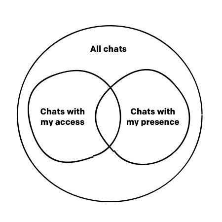

Scopes define access to certain resources. Your app will ask users for access to those resources during the installation. Depending on the functionality of the app you're building, you'll need to configure different scopes in {{DEVELOPER_CONSOLE_URL}}. To check which scopes your app needs, refer to method descriptions.

## General rules

- `ro` means read only
- `rw` means read/write
- all `rw` scopes contain `ro` privileges
- all `access` scopes contain `my` privileges
- all `all` scopes contain `access` privileges and `my` privileges

## Accessing chat

This chart shows every possible chats scenarios:

- chats without my access and without my presence (`chats -A -P`)
- chats with my access but without my presence (`chats +A -P`)
- chats with my presence but without my access (`chats -A +P`)
- chats with my access and with my presence (`chats +A +P`)

The table shows scopes dependency of accessing chat:

|          | `chats -A -P` | `chats +A -P` | `chats -A +P` | `chats +A +P` |
| -------- | ------------- | ------------- | ------------- | ------------- |
| `all`    | ✓             | ✓             | ✓             | ✓             |
| `access` | -             | ✓             | ✓             | ✓             |
| `my`     | -             | -             | ✓             | ✓             |

## Accessing parts of chat

The table shows scopes dependency of accessing chat parts:

|                           | meta data | conversation data |
| ------------------------- | --------- | ----------------- |
| `chats-*:rw`              | rw        | rw                |
| `chats.conversation-*:rw` | ro        | rw                |
| `chats-*:ro`              | ro        | ro                |

## Scope types

<Scopes
  title="Agent scopes"
  scopes="agents--my:rw,agents--my:ro,agents--all:rw,agents--all:ro,access_rules:ro,access_rules:rw"
/>

<Scopes
  title="Accounts scopes"
  scopes="accounts--all:rc"
/>

<Scopes
  title="Bot scopes"
  scopes="agents-bot--my:ro,agents-bot--my:rw,agents-bot--all:ro,agents-bot--all:rw"
/>

<Scopes
  title="Group scopes"
  scopes="groups--my:rw,groups--my:ro,groups--all:rw,groups--all:ro"
/>

<Scopes
  title="Chat scopes"
  scopes="chats--all:ro,chats--access:ro,chats--my:ro,chats.conversation--all:rw,chats.conversation--access:rw,chats.conversation--my:rw,chats--all:rw,chats--access:rw,chats--my:rw"
/>

- chats conversation data applies to:
  - chat events
  - chat properties
  - thread properties
- chats meta data applies to:
  - chat users

_NOTICE: currently `chats.conversation--all:rw` allows joining chats too because you have to join the chat to be able to write to it_

<Scopes
  title="Customer scopes"
  scopes="customers.ban:rw,customers:own,customers:ro,customers:rw"
/>

<Scopes
  title="Multicast scopes"
  scopes="multicast:rw"
/>

<Scopes
  title="Properties scopes"
  scopes="properties--my:ro,properties--my:rw,properties--all:ro"
/>

<Scopes
  title="Webhook scopes"
  scopes="webhooks--my:ro,webhooks--my:rw,webhooks--all:ro,webhooks--all:rw"
/>
