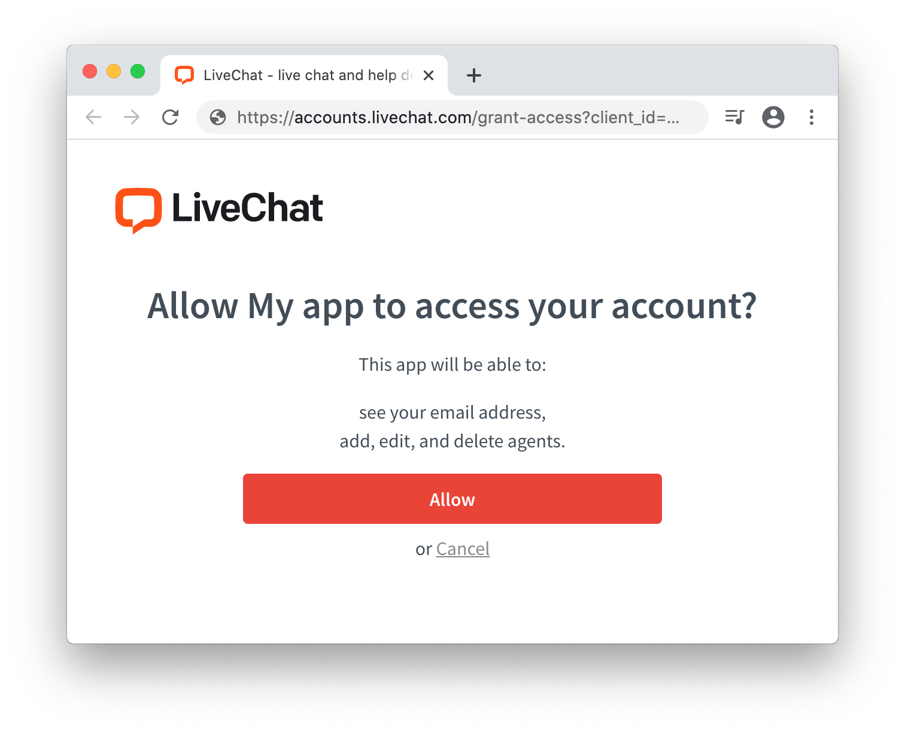

# Introduction

## User flow

"Sign in with LiveChat" flow is the easiest way to get access to basic information in LiveChat accounts. It allows you to quickly build an app that can access this information.

User starts the flow by clicking the "Sign in with LiveChat" button:


If user is not signed in to LiveChat, he is asked to do that:


Then, user must allow the app to access specified parts of his LiveChat account:



Finally, the app receives an `access_token` that allows it perform LiveChat API calls, limited to what the user agreed to in the prompt.

For example, you can display the LiveChat tracking code, which already includes the user's account number:

<CodeSample path={'TRACKING CODE'}>

```js
<!-- Start of LiveChat (www.livechat.com) code -->
<script>
    window.__lc = window.__lc || {};
    window.__lc.license = 11069052;
    ;(function(n,t,c){function i(n){return e._h?e._h.apply(null,n):e._q.push(n)}var e={_q:[],_h:null,_v:"2.0",on:function(){i(["on",c.call(arguments)])},once:function(){i(["once",c.call(arguments)])},off:function(){i(["off",c.call(arguments)])},get:function(){if(!e._h)throw new Error("[LiveChatWidget] You can't use getters before load.");return i(["get",c.call(arguments)])},call:function(){i(["call",c.call(arguments)])},init:function(){var n=t.createElement("script");n.async=!0,n.type="text/javascript",n.src="https://cdn.livechatinc.com/tracking.js",t.head.appendChild(n)}};!n.__lc.asyncInit&&e.init(),n.LiveChatWidget=n.LiveChatWidget||e}(window,document,[].slice))
</script>
<noscript><a href="https://www.livechatinc.com/chat-with/11069052/" rel="nofollow">Chat with us</a>, powered by <a href="https://www.livechatinc.com/?welcome" rel="noopener nofollow" target="_blank">LiveChat</a></noscript>
<!-- End of LiveChat code -->
```

</CodeSample>

## Use cases

With the "Sign in with LiveChat" flow, you can easily build an app which:

- obtains access to LiveChat user's email or license number,
- will receive an `access_token` that can be used to perform different LiveChat API calls.

# Setup

## Step 1: Create a new app

Create a new "LiveChat OAuth 2.0 Client" app in <a href="https://developers.livechatinc.com/console/">Developers Console</a>. You will receive a new `client_id` that can be used in the next steps.

Please note that **Redirect URI** field must match the URL of the website that has the "Sign in with LiveChat" button installed. The button will not work with any other URL addresses.

## Step 2: Include the SDK library

The SDK is available in two formats: an NPM module and a CDN-hosted library.

### NPM module

```bash
npm install --save @livechat/accounts-sdk
```

```js
import { accountsSdk } from "@livechat/accounts-sdk";
```

If you build an app using Webpack, you can just import the `accountsSdk` module from the NPM.

### CDN-hosted library

```html
<script src="//cdn.livechatinc.com/accounts/accounts-sdk.min.js"></script>
```

If you do not use Webpack, you can still include the library using a `<script>` tag in your HTML. This will create an `AccountsSDK` global object.

---

**Note:** SDK objects from NPM and CDN-hosted libraries have different names:

- NPM module: `accountsSdk`
- CDN-hosted library: `AccountsSDK`

If you use the CDN-hosted version of this SDK, change `accountsSdk` that you see in all examples in this documentation to `AccountsSDK`.

## Step 3: Prepare button container

> Native "Sign in with LiveChat" button

```html
<div class="livechat-login-button"></div>
```

> Custom "Sign in with LiveChat" button

```js
// javascript
const instance = accountsSdk.init({ ... });
```

```html
<!-- html -->
<a href="" onclick="instance.openPopup()">Sign in with LiveChat</a>
```

Insert HTML code to prepare the container for the "Sign in with LiveChat" button. Its `class` attribute must have value of `livechat-login-button`. The button will be automatically inserted into the container.

If you prefer to design your own button, you can do that, too. Just bind the [`openPopup()`](#instanceopenpopup) method of `AccountsSDK` instance to the `onclick` attribute of your link or button.

## Step 4: Initialize the SDK

```html
<script>
  const instance = accountsSdk.init({
    client_id: "<your_client_id>",
    onIdentityFetched: (error, data) => {
      if (data) {
        console.log("User authorized!");
        console.log("License number: " + data.license);
      }
    }
  });
</script>
```

Insert the JavaScript code you can see above **before the closing `</body>` tag**.

That's it!

Your users will see the "Sign in with LiveChat" button if they are not yet logged in or they didn't grant access for your app.

If they are already logged in, you will immediately receive valuable information about your user, such as their `access_token` or `license` number.

<Warning>

[**Don't forget to test the give consent step**](/monetization/app-review-process/#common-problems). Use `prompt: "consent"` to force the app to **ask you for access** to certain resources. It’s necessary for you to test the app as if you were a user who installs the app from Marketplace.

</Warning>

# SDK documentation

## Methods

### **accountsSdk.init({ ... })**

> Example `init()` method usage

```js
const instance = accountsSdk.init({
  client_id: "<your_client_id>",
  onIdentityFetched: (error, data) => {
    // ...
  }
});
```

This method initiates the SDK and returns the `accountsSdk` object instance. It accepts an object with the following properties:

- **client_id** – obtained from the [Developers Console](https://developers.livechatinc.com/console/) when you create your app.

- **response_type** – (optional, defaults to `token`) Defines the type of the response that you will receive in `onIdentityFetched` callback. Two options are supported:

  - **token** (default) – the response will include `access_token` that can be immediately used for calling LiveChat APIs. Best suitable for client-side apps.
  - **code** – the response will include `code` that can be exchanged for `access_token` and `refresh_token`. Best suitable for backend apps that authorize a user only once and refresh the `access_token` themselves from that moment.<br/><br/>Read more about client-side and backend apps in <a href="https://developers.google.com/identity/protocols/OAuth2#webserver">Google OAuth tutorial</a>.

- **onIdentityFetched(error, data)** – the callback executed when user's identity is fetched. The callback will include either `error` or `data` object depending on the current user authorization status. You will find the detailed documentation in <a href="#response-format">Response format</a> section.

- **linkLabel** – (optional, defaults to empty string) allows to change default _Sign in with LiveChat_ label with custom text.

- **popupRoute** – (optional, defaults to empty string) it lets you change the default popup endpoint. Possible values are:
  - `''` (default) – an empty string, which will show the sign-in view.
  - `'signup'` – it will point a user directly to the first step of the signup.

<aside class="notice">
  <code>accountsSdk</code> object exposes only one method: <code>init()</code>.
  All other methods must be called by the object instance returned by the{" "}
  <code>init()</code> method.
</aside>

### **instance.updateOptions()**

> Example `updateOptions()` method usage:

```js
// javascript
const instance = accountsSdk.init({ ... });

 document.getElementById('signup-button').onclick = function() {
   instance.updateOptions({
     popupRoute: 'signup'
   });
   instance.openPopup();
 };

 document.getElementById('signin-button').onclick = function() {
   instance.updateOptions({
     popupRoute: ''
   });
   instance.openPopup();
 };
```

```html
<button id="signup-button">Sign up with LiveChat!</button>
<button id="signin-button">Already have an account? Sign in!</button>
```

Allows to update SDK options after calling `init()` method. It accepts an object with same schema as `init()` method.

### **instance.openPopup()**

> Example `openPopup()` method usage:

```js
// javascript
const instance = accountsSdk.init({ ... });
```

```html
<!-- html -->
<a href="" onclick="instance.openPopup()">Sign in with LiveChat</a>
```

Binds `onclick` param for custom HTML `<a>` element that replaces the "Sign in with LiveChat" button. See the example of custom button in [Prepare button container](#3-prepare-button-container) section.

### **instance.signOut(callback)**

> Sample `signOut()` method usage:

```js
// javascript
const instance = accountsSdk.init({ ... });

function signMeOut(e) {
  e.preventDefault();

  instance.signOut(function() {
    console.log('User signed out');
  });
}
```

```html
<a href="" onclick="signMeOut(event)">Sign out</a>
```

It signs the user out and executes the `callback` function (with no arguments) when it's done.

### **instance.displayButtons()**

> Sample `displayButtons()` method usage:

```js
const instance = accountsSdk.init({ ... });

// some DOM changes which cause buttons to disappear from DOM
// (...)

// inject buttons once again
instance.displayButtons();
```

It re-renders the "Sign in with LiveChat" buttons in the DOM. It's helpful when you reload the app's state and the DOM is cleared. This method is automatically executed by the `init` method.

## Response format

`onIdentityFetched` callback is the heart of this SDK. It will be fired when user's authorization status is fetched. This is where you pass authorization `access_token` to your app to build what you need.

### Success

If the user passes through "Sign in with LiveChat" flow, `error` param will be null and `data` param will include authorization data, depending on `response_code` param value.

If `response_code` was set to **access_token**:

- **access_token** – used for authorization in LiveChat API calls,
- **scopes** – array of scopes that `access_token` has access to,
- **expires_in** – number of seconds from now that `access_token` will be valid,
- **entity_id** – LiveChat user email,
- **license** – LiveChat license number,
- **client_id** – `client_id` that you passed in the `init` method.

If `response_code` was set to **code**:

- **code** – must be exchanged to `access_token` and `refresh_token`,
- **scopes** – array of scopes that `access_token` generated by this code will have access to,
- **expires_in** – number of seconds from now that `code` will be valid,
- **entity_id** – LiveChat user email,
- **license** – LiveChat license number,
- **client_id** – `client_id` that you passed in the `init` method.

### Error

If the user is not logged in to LiveChat, `data` param will be `null` and `error` param will include the following properties:

#### Authentication errors

- **identity_exception** – error type. Possible values:<br/><br/>
  - `invalid_request` – request is missing a required parameter, includes an invalid parameter value, includes a parameter more than once or is otherwise malformed.<br/><br/>
  - `unauthorized` – request is valid, but identity data is wrong or identity does not exists. If identity id is known, it's added to querystring as `entity_id`.<br/><br/>
  - `server_error` – server encountered an unexpected condition that prevented it from determining identity.<br/><br/>
  - `access_denied` – identity is known, but access is denied because of business reasons. For example identity can be banned or has wrong unsupported account version.<br/><br/>

#### Authorization errors

- **oauth_exception** – error type. Possible values:<br/><br/>

  - `invalid_request` – request is missing a required parameter, includes an invalid parameter value, includes a parameter more than once or is otherwise malformed. Examples: wrong HTTP method, invalid HTTP body encoding.<br/><br/>
  - `unauthorized_client` – client is not authorized to request a token using this method. Examples: missing `client_id` param, incorrect `client_id` value, `refresh_token` not found, invalid `client_secret`, invalid `redirect_uri`.<br/><br/>
  - `access_denied` – resource owner or authorization server denied the request. For example, requested scope includes a scope not originally granted by the resource owner.<br/><br/>
  - `unsupported_response_type` – authorization server does not support obtaining a token using this method. For example, `response_type` is not `token` or `code`.<br/><br/>
  - `invalid_scope` – requested scope is invalid, insufficient, unknown or malformed. Examples: scope not found, scope name not found.<br/><br/>
  - `server_error` – authorization server encountered an unexpected condition that prevented it from fulfilling the request. For example, server is not responding.<br/><br/>
  - `temporarily_unavailable` – authorization server is currently unable to handle the request due to a temporary overloading or maintenance of the server.<br/><br/>
  - `unsupported_grant_type` – authorization grant type is not supported by the authorization server. For example, user is using disabled authorization grant type, such as <a href="https://tools.ietf.org/html/rfc6749#section-4.4">client credentials grant</a>.<br/><br/>
  - `invalid_grant` – provided authorization grant (authorization code, resource owner credentials) or refresh token is invalid, expired, revoked, does not match the redirection URI used in the authorization request or was issued to another client. Examples: refresh token expired, access token expires.<br/><br/>
  - `invalid_client` client authentication failed (unknown client, no client authentication included, unsupported authentication method). For example, user is using refresh token with wrong `client_id`.<br/><br/>
  - `missing_grant` – client is missing granted rights. Examples: grants were rejected, grants were never given, client changed required grants.<br/><br/>

- **exception_details** – error description. It is returned only in some cases. Possible values:<br/><br/>
  - `client_id_not_found` – wrong `client_id`, `client_id` does not exist.<br/><br/>
  - `redirect_uri_not_set` – client misconfiguration, client has not set redirect uri.<br/><br/>
  - `invalid_redirect_uri` – redirect uri is not one of client's allowed redirects.<br/><br/>
  - `too_many_redirects` – server has detected redirect loop, client should not redirect too many times.

