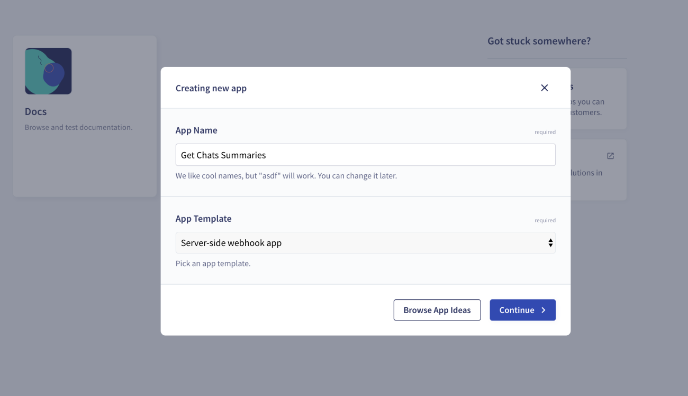
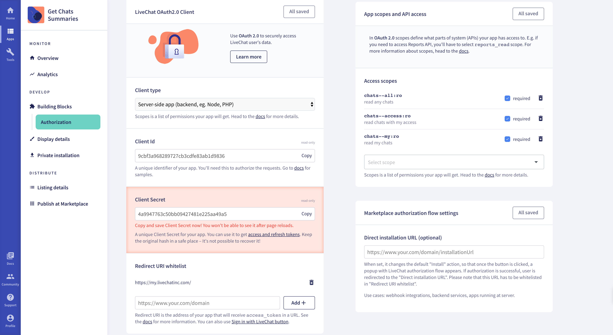
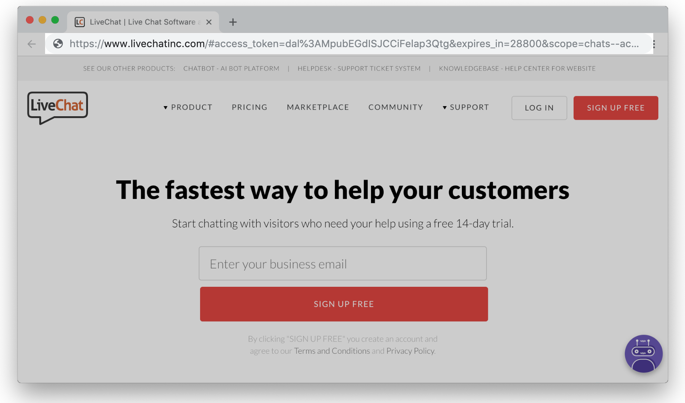
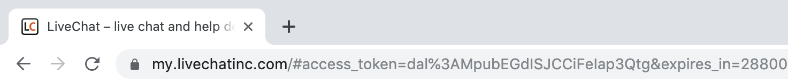
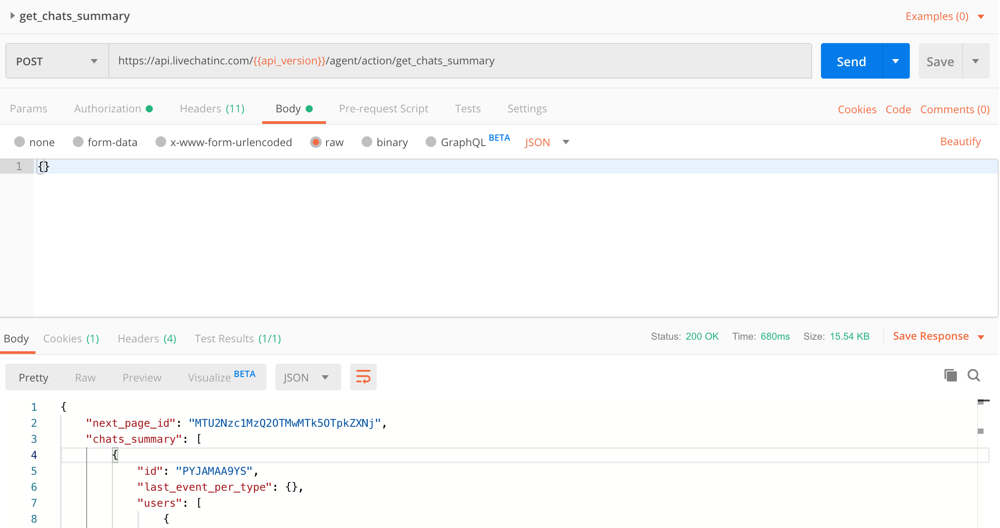

If you're not sure how to use our APIs, this tutorial will guide you through the process of sending a sample request. We'll cover all necessary aspects including authorization, the request format, as well as recommended tools.
To demonstrate the process, we'll show you how to **get chat summaries**.

In short, there are 3 main steps:

1. Creating an app in Developer Console

2. Acquiring an access token

3. Sending a request


# Getting started

Before you start, make sure you have a <a href="https://accounts.livechatinc.com" target="_blank">LiveChat account</a>.

# Step 1 Creating an app in Developer Console

Start by logging in to <a href="https://developers.livechatinc.com/console/" target="_blank">Developer Console</a> and [create a new server-side app](../#creating-livechat-apps). The **Authorization** building block is added automatically.



Next, fill in the **Redirect URI whitelist** field and choose scopes. 

To get chat sumamries, you'll need `chats--all:ro` and `chats--access:ro`, and `chats--my:ro`. You can check out method details in our [API documentation](../../../messaging/agent-chat-api/#get-chats-summary).




When it's all set, we can proceed with token generation. Make sure to have your **Client Id** and **Redirect URI** at hand.

# Step 2 Acquiring the access token

Everything you need to know about authorization can be found in [this document](../../../getting-started/authorization), so keep this source for future reference.

Start by pasting your **Client Id** and **Redirect URI** in the following request:

```shell
https://accounts.livechatinc.com/
?response_type=token
&client_id=<Client_Id_from_Developer_Console>
&redirect_uri=<Redirect_URI_from_Developer_console>
```

Given that your **Client Id** was **0805e283233042b37f460ed8fbf22160** and **Redirect URI** was **https://my.livechatinc.com/**, this is how your request will look: 

```shell
https://accounts.livechatinc.com/
?response_type=token
&client_id=0805e283233042b37f460ed8fbf22160
&redirect_uri=https://my.livechatinc.com/
```

Paste your request in the browser and don't miss the response. 



Your access token will be returned in a long string:

```
https://my.livechatinc.com/
#access_token=dal%3ALW9Guwt8QMiPK6P6G8cSDw
&expires_in=28800
...
```



Managed to get your token? Great! You can now use it to authorize the request sent via <a href="https://developers.livechatinc.com/docs/messaging/agent-chat-api/" target="_blank">Agent Chat API</a> and <a href="https://developers.livechatinc.com/docs/management/configuration-api/" target="_blank">Configuration API</a>.


# Step 3 Sending the request

Once you have the token, we're ready to send the actual request. To do that, you can use e.g. terminal, but Postman is our recommendation. This way you'll be able to access our <a href="https://app.getpostman.com/run-collection/ac23e81bc6b8054480e5" target="_blank">Postman collection</a> with all the requests ready to use.

In our Postman environment, we make use of variables to pass on the **API version** and the **access token**. If your not familiar with variables configuration, 
Postman has a great <a href="https://learning.getpostman.com/docs/postman/environments_and_globals/variables/" target="_blank">guide</a> covering this topic. 
You can create variables from the ground up, or download <a href={`data:text/json;charset=utf-8,${encodeURIComponent(JSON.stringify({"id": "b0db5d30-df90-4d87-89c4-7fede8bd769a","name": "LiveChat Web API", "values": [{"key": "api_version", "value": "v3.1", "enabled": true},{"key": "access_token","value": "<your_access_token>","enabled": true}],"_postman_variable_scope": "environment","_postman_exported_at": "2019-09-19T10:24:52.465Z","_postman_exported_using": "Postman/7.6.0"}))}`} download="environment.json">environment.json</a> containing sample variables.



In case of `get_chats_summary`, you can send a basic request without specifying any parameters. You could, however, filter chat summaries or look for them on a particular page. For more details on possible parameters, refer to our [docs](../../../messaging/agent-chat-api/#get-chats-summary).


# Mission completed

And that would be about it! You can use our Postman collection as your playground, and try out other methods. Remember that you cannot use the sme token for **Customer Chat API**. Instead, use the token you have for [creating a customer](../../../authorization/#creating-new-customer), and acquire a new one.
In case of doubts, make sure to check out our [documentation](https://developers.livechatinc.com/docs/messaging/). You can always reach out to us at [developers@livechatinc.com](mailto:developers@livechatinc.com).