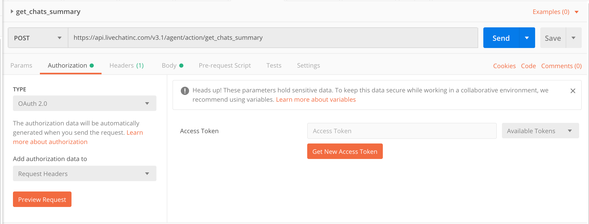
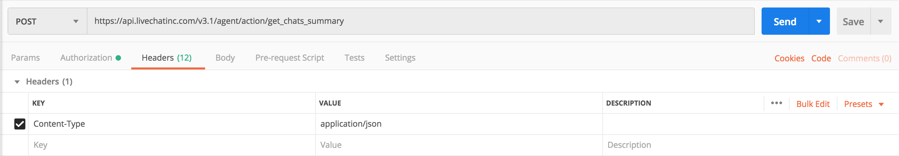
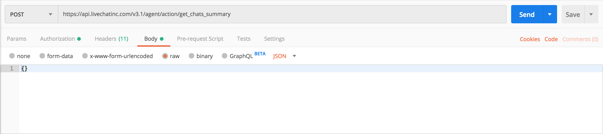
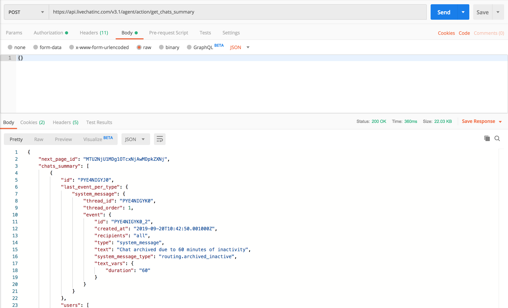

If you're not sure how to use our APIs, this tutorial will guide you through the process of sending a sample request. We'll cover all necessary aspects including authorization, the request format, as well as recommended tools.
To demonstrate the process, we'll show you how to <a href="https://developers.livechatinc.com/docs/messaging/agent-chat-api/#get-chats-summary" target="_blank">get chat summaries</a> using <a href="https://developers.livechatinc.com/docs/messaging/agent-chat-api/" target="_blank">the Agent Chat Web API</a>.

In short, there are 3 main steps:

1. Creating an app in Developer Console

2. Acquiring an access token

3. Sending a request


# Getting started

Before you start, make sure you have acess to the LiveChat Admin or Owner account. If you don't have an account yet, take a minute to <a href="https://accounts.livechatinc.com" target="_blank">sign up</a> for free.
Apart from that, you'll also need:

- an application in <a href="https://developers.livechatinc.com/console/" target="_blank">Developer Console</a>
- correct scopes for the selected method
- an access token with the chosen scopes
- any tool that will allow you to send requests (Postman, terminal, etc.)

When you already know what you need, let's find out how to get it!

# Step 1 Creating an app in Developer Console

Start by logging in to <a href="https://developers.livechatinc.com/console/" target="_blank">Developer Console</a> and [create a new server-side app](../#creating-livechat-apps). The **Authorization** building block is added automatically. 
Using any method from the Agent Chat, Customer Chat, and Configuration API requires your app to have an Authorization block.


Next, fill in the **Redirect URI whitelist** field and choose scopes. usually, each method has certain scopes you need to define to be able to use that method. 

To get chat summaries, you'll need `chats--all:ro` and `chats--access:ro`, and `chats--my:ro`. You can check out method details in our [API documentation](../../../messaging/agent-chat-api/#get-chats-summary).


When it's all set, we can proceed with token generation. Make sure to have your **Client Id** and **Redirect URI** at hand.

# Step 2 Acquiring the access token

Everything you need to know about authorization can be found in [this document](../../../getting-started/authorization), so keep this source for future reference.

Start by pasting your **Client Id** and **Redirect URI** in the following request:

```shell
https://accounts.livechatinc.com/
?response_type=token
&client_id=<Client_Id_from_Developer_Console>
&redirect_uri=<Redirect_URI_from_Developer_console>
```

Given that your **Client Id** was **0805e283233042b37f460ed8fbf22160** and **Redirect URI** was **https://my.livechatinc.com/**, this is how your request will look: 

```shell
https://accounts.livechatinc.com/
?response_type=token
&client_id=0805e283233042b37f460ed8fbf22160
&redirect_uri=https://my.livechatinc.com/
```

Paste your request in the browser and don't miss the response. 


Important note: You have to be logged in to the exact LiveChat account that was used to create the app in Developers Console. If you are not logged in to LiveChat and enter the link, it will ask you to login first.


Your access token will be returned in a long string:


and it contains lot of informations. For now you need only the part after *access_token=* and before *&expires_in*:

```
https://my.livechatinc.com/
#access_token=dal%3ALW9Guwt8QMiPK6P6G8cSDw
&expires_in=28800
...
```


Managed to get your token? Great! You can now use it to authorize the request sent via <a href="https://developers.livechatinc.com/docs/messaging/agent-chat-api/" target="_blank">Agent Chat API</a> and <a href="https://developers.livechatinc.com/docs/management/configuration-api/" target="_blank">Configuration API</a>.


# Step 3 Sending the request via Postman

Once you have the token, we're ready to send the actual request. To do that, you can use e.g. terminal, but Postman is our recommendation.

Let's start with our request URL:

<CodeSample>

```json
POST https://api.livechatinc.com/v3.1/agent/action/get_chats_summary
```

</CodeSample>

After that we can head on to Authorization:



Then move on to Headers and add *Content-Type* with value *application/json*:



Last step before sending the request will be filling *Body* with our parameters. In case of `get_chats_summary`, you can send a basic request without specifying any parameters, like this:

<CodeSample>

```html
{}
```

</CodeSample>



You could, however, filter chat summaries or look for them on a particular page. For more details on possible parameters, refer to our [docs](../../../messaging/agent-chat-api/#get-chats-summary).

Finally, hit **Send** button and wait for your response:



# Mission completed

And that would be about it! You can use our Postman collection as your playground, and try out other methods. Remember that you cannot use the sme token for **Customer Chat API**. Instead, use the token you have for [creating a customer](../../../authorization/#creating-new-customer), and acquire a new one.
In case of doubts, make sure to check out our [documentation](https://developers.livechatinc.com/docs/messaging/). You can always reach out to us at [developers@livechatinc.com](mailto:developers@livechatinc.com).