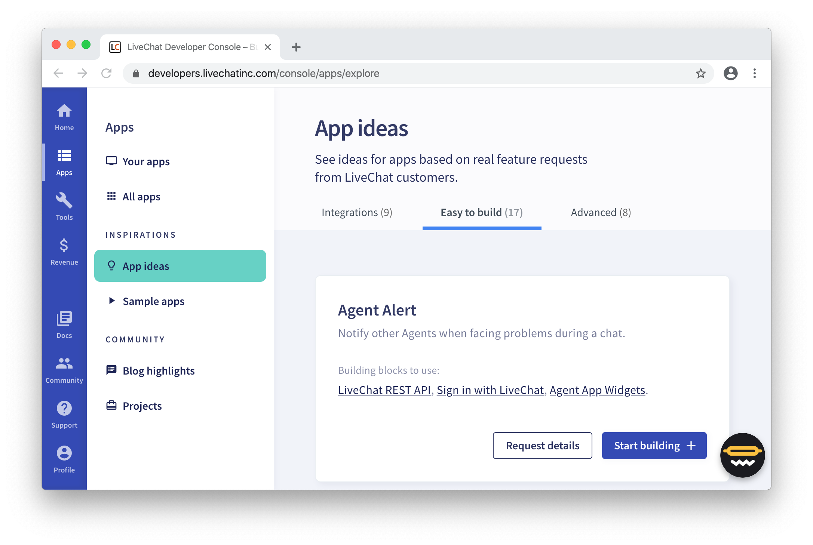
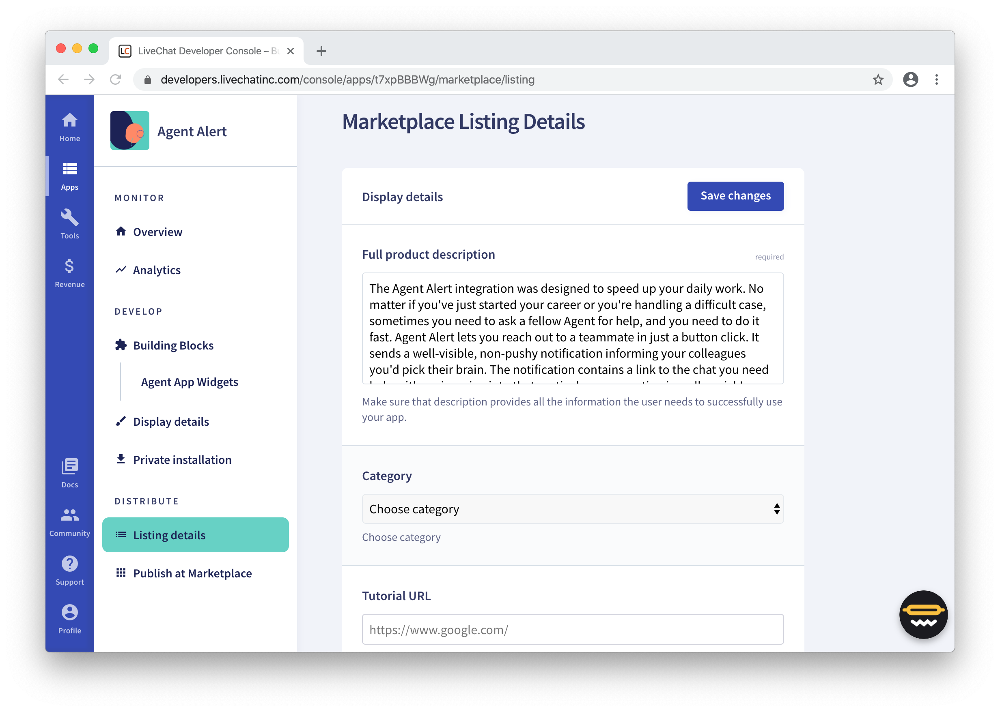
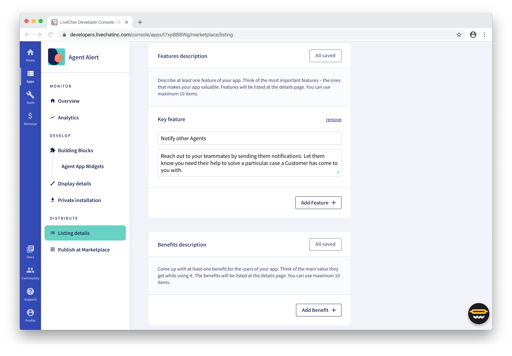
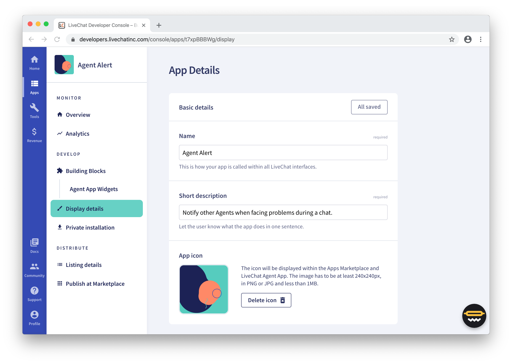

# Introduction

The goal of the LiveChat Marketplace is to provide trusted space for high quality LiveChat apps, plugins, and integrations.

With over 28,000 businesses using LiveChat daily, we want to make sure that what we offer in the Marketplace, provides our customers with tangible value and enriches their LiveChat experience. For that reason, all apps in the LiveChat Marketplace must meet our criteria for quality and content.

The decision to feature your app on the LiveChat Marketplace depends mainly on technical requirements, but not only. We also assess how your app contributes to the LiveChat ecosystem and community. This document covers most cases, however, some exceptions may be allowed at the reviewer’s discretion.

# Developer's responsibilities

As a developer, you need to know how we go about reviewing apps and how to make your app go through the process with success.

Each app is thoroughly checked before releasing it to the LiveChat Marketplace. It involves a team of three or more specialists.
Since we aim to offer top-quality products, we've prepared the list of responsibilites for developers and app owners. We highly encourage you to familiarize yourself with all the aspects.

## Restricted content

First things first, we don’t accept apps that offend other people. That includes: violence, threats, bullying, harassment, sexually explicit content, discrimination based on nationality, race, ethnic origin, gender identity, sexual orientation, age, disability, or religion. 
Any other forms of attack or discrimination, which are not present on the list, will be also forbidden.

The reviewer makes the final decision on whether an app violates the ethical norms. 

## Privacy, safety, data collection

To learn about terms and regulations, see [**Developers Terms**](https://developers.livechatinc.com/developers-terms/).

## Quality

Before you submit the app, test it meticulousy to ensure it’s usable and bug-free. Make sure it looks and performs well on desktop, tablet, and mobile for the best cross-platform experience.

Keep your code human-readable, clean, and optimized. Respect the generally accepted standards.
Remmeber about the cleanup - remove all unused assets, references, etc.

## App details

**App details** and **Listing details** are sections in Developer Console you should never forget about. It's where you can make your integration shine, exposing its features and benefits. 
Filling out this section is crucial for the promotion of your app on the LiveChat Marketplace. This is why you cannot skip it - it's always mandatory.

The most important fields are:

- [App name](#app-name)
- [Description](#description)
- [Screenshots](#screenshots)
- [App icon](#app-icon)
- [Tutorial](#tutorial)

### App Name

Make your app name descriptive, yet snappy and easy to remember. Keep the name below 30 characters, otherwise it will be truncated. The name should be properly capitalized and use only English characters.
Don't inlcude app description in the title - there's plenty of space for that in other fields.

If you want to use the word "LiveChat" in your app name, the only acceptable way to do this is "_App Name_ for LiveChat". "LiveChat _App Name_" will be rejected.

Let's use an example from the [App ideas](https://developers.livechatinc.com/console/apps/explore) section in Developer Console.

**Acceptable name:** _Agent Alert for LiveChat_           

**Not acceptable name:** _LiveChat Agent Alert_

Or, you could simply go with _Agent Alert_.

### Description

Based on the app descriptions you provide, potential users we'll be able to find your app and decide if it matches their needs. You need to include a short and long descriptions. They should be accurate and up to date. The recommended length is one sentence for a short description and not more than 10 sentences for the long one.

Both descriptions must be written in English, but if you offer the app in another language, feel free to add a translated version as well.

Apart from descriptions, remember to add at least one **feature** and one **benefit**.

### Screenshots

Most of us are visualizers. We're tempted by images, videos, or animations. That's why you should include 3 - 5 screenshots presenting the most important features of your app. And not just _some_ screenshots. Give them extra care, it will pay off. 

The screenshots should be crisp and clear, accurately picturing the functionalities of your app. The maximum file size can’t exceed 1 MB.

### App icon

A good icon helps your app stand out. Design something original, unique. Something that represents your app or even your entire brand. Make the logo crisp and readable.
The icons should have full-bleed background, and their size should be at least 240 x 240 px.

Using LiveChat’s logo, its derivatives or fragments in your icon is not allowed.

For our example, _Agent Alert_, we used the icon generator available in Developer Console. However, it's always better if a logo conveys more meaning regarding the app it represents. 

### Tutorial

As soon as your app is ready, prepare a guide for it. Remember, you know your product backwards and forwards, but your customers don't. Make sure their first experience of your application isn't frustrating or discouraging. 
A good first impression may tip the balance in your favor when the trial period ends.

## App Requirements

Before you submit the app for review, ensure you meet the following requirements:

- You've added at least one Building block.

- You accept the Marketplace Terms.

- You're ready to provide the app documentation (if there is any).

- You can provide a valid reason for using specific authorization scopes in your app (if asked by us).

- You can provide us with the testing instructions for the app.

- You've got your demo testing environment ready.

- You can provide the main use case of the app.

- You're capable of providing [support](#support) during and after the App Review process.

## Support

Make sure that users know how to get started with the app, how to use it, and are never left on their own.

If your application requires from users some more advanced configuration, provide a link to a guide or manual. It should be written in English and contain all necessary instructions. Keep in mind that not all customers are tech savvies, so consider combining text and visuals materials in the instruction.

Always keep the contact details in your profile up to date, and check your email regularly.

# App Statuses

The App Review process has 4 steps.
Developers have constant access to the current status of the App Review process in **Developer Console > App > Monitor > Overview**.

- **Developing** - Your app is in development. As a Developer, you're able to work on the app and make changes to it.

- **Submitted** - The app has been submitted for review. You can no longer make changes to the app unless you decide to cancel the submission.

- **Accepted** - The app has been accepted. You can now publish the app on the public LiveChat Marketplace.

- **Published** - The app has been published to the public Marketplace. You can cancel the publication and we will take down your app from the LiveChat Marketplace. If you want to change your app, you need to fork it, and then submit it a new version for the App Review process once again.

# Guidelines & Rules

We are constantly improving the App Review process so that the cooperation is smooth for both parts. For that purpose, we have prepred a few guidelines and rules to make things go easier.

## Three bugs rule

Once we find 3 bugs or issues in your app, we discontinue the review and reject the app. We will share with you the reason of rejection via email. 

## Make a tutorial

Every app should have a tutorial that covers its basic usage and explains all its features. As an example, see how the [ChatBot integration](https://www.livechatinc.com/help/chatbot-integration/) is described.

## Design system

We recommend using our Design System to keep apps consistent with the LiveChat look & feel. 

<SectionLink to={"/design-system/"}>
  See Design System
</SectionLink>

# FAQ

Frequently Asked Questions

*Coming soon*

# Contact us

If you found a bug or a typo, you can let us know directly on GitHub.
In case of any questions or feedback, don't hesitate to contact us at [developers@livechatinc.com](mailto:developers@livechatinc.com). We'll be more than glad to hear from you!
