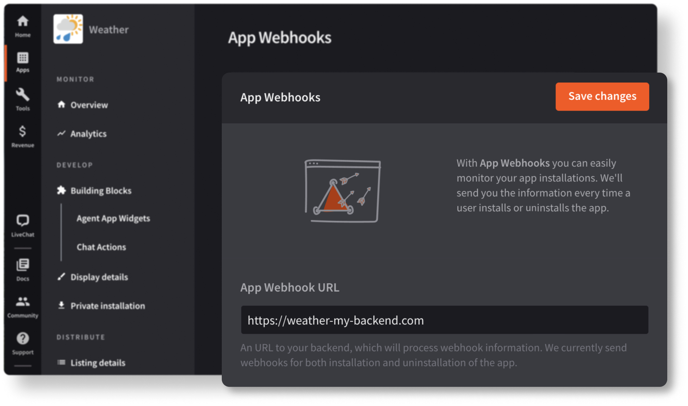

App webhooks allow you to keep track of how often your application is installed and uninstalled.

## Bulding block configuration

If you want to be notified about your app installation and uninstallation events, configure an App Webhooks building block in {{DEVELOPER_CONSOLE_URL}}. To do that, provide a URL to your backend that will receive the webhooks.



## Webhook reference

### `application_installed`

Informs that an application was installed.

<CodeResponse>

```json
{
  "applicationID": "aPbNnrwZg",
  "applicationName": "Google Calendar for LiveChat",
  "clientID": "6b069c72042dd0a9ab823b4688c78e41",
  "date": "2020-09-14T15:29:53+02:00",
  "event": "application_installed",
  "licenseID": 10414122,
  "payload": {
    "applicationID": "aPbNnrwZg"
  }
}
```

</CodeResponse>

### `application_uninstalled`

Informs that an application was uninstalled.

<CodeResponse>

```json
{
  "applicationID": "aPbNnrwZg",
  "applicationName": "Google Calendar for LiveChat",
  "clientID": "6b069c72042dd0a9ab823b4688c78e41",
  "date": "2020-09-14T15:29:49+02:00",
  "event": "application_uninstalled",
  "licenseID": 10414122,
  "payload": {
    "applicationID": "aPbNnrwZg"
  }
}
```

</CodeResponse>
