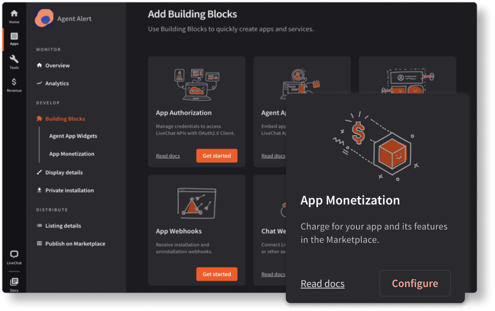
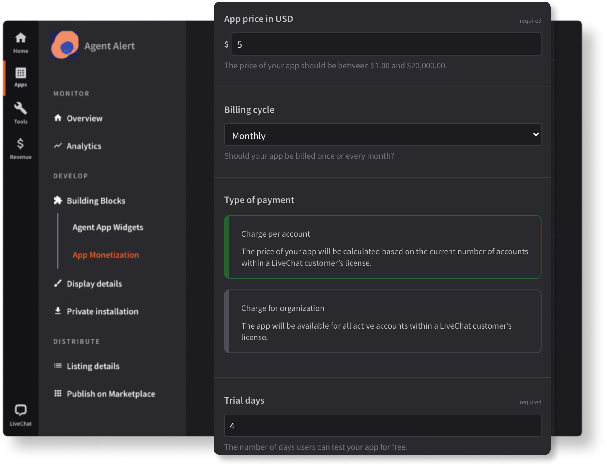
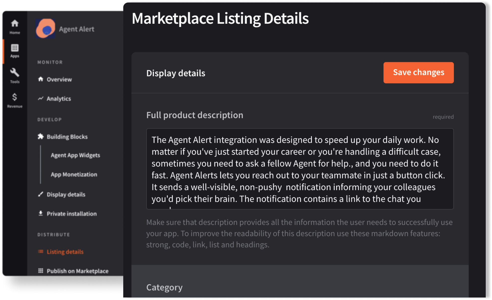
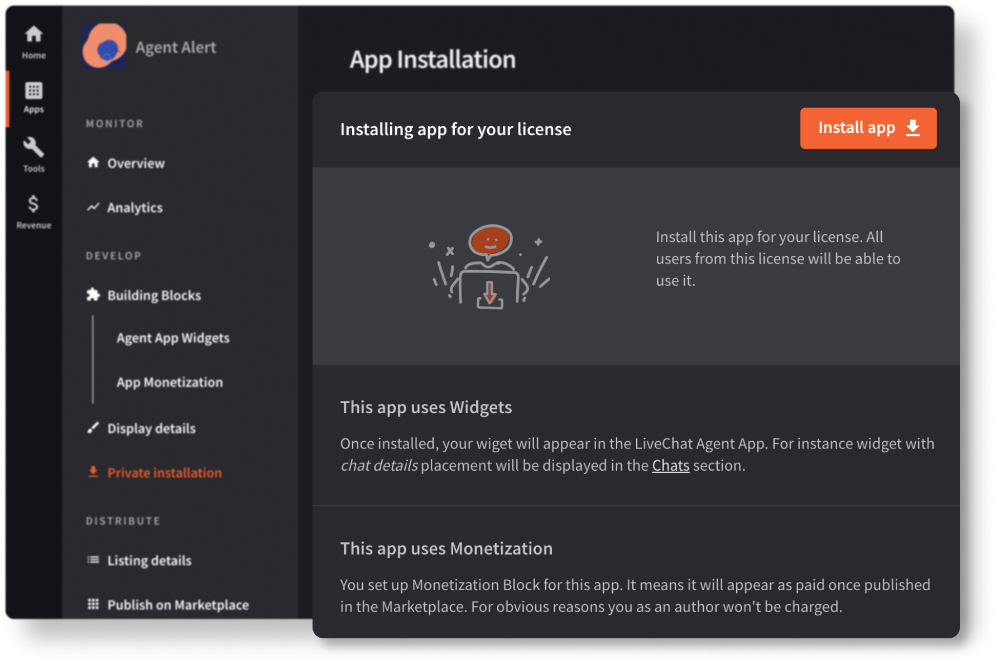
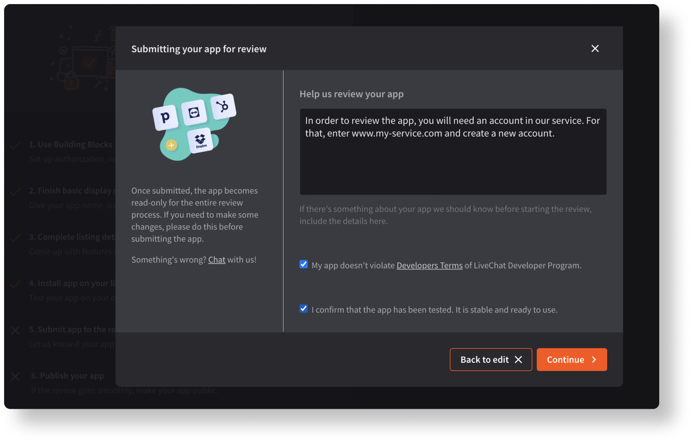
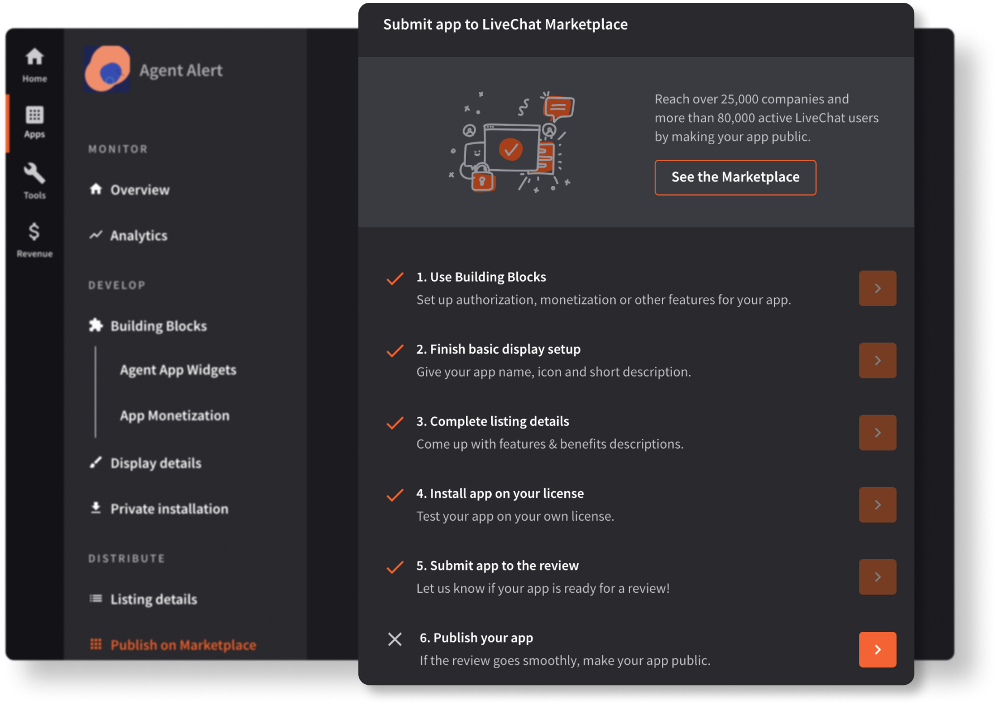
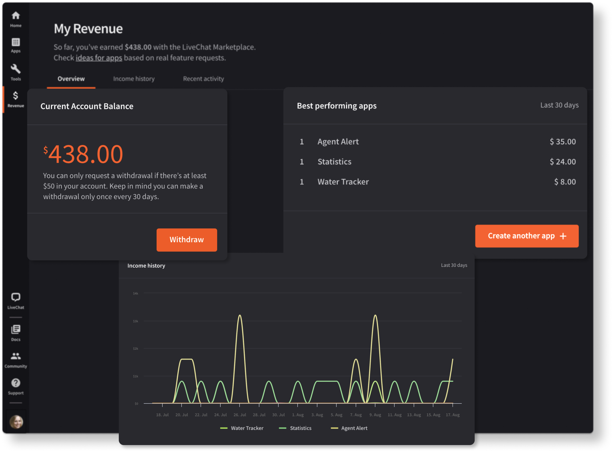

# Introduction

Whether your app is already up and running or you're just starting off, the topic of **app monetization** will eventually cross your mind. If you don't know how to go about generating income from your apps, this is the place for you to start.

## If you are new to LiveChat

{{LIVECHAT_HOME_URL}} is an online customer service platform. Developers can extend LiveChat by building applications. Such apps may introduce new features or adjust the behavior of LiveChat products. The goal is to satisfy the specific business needs and use cases.

If you'd like to know what types of applications can be built upon the LiveChat Platform, check out the [Building LiveChat apps](/getting-started/guides/) doc.

The place to start creating your apps with different building blocks is our {{DEVELOPER_CONSOLE_URL}}. If your app is ready, you can continue with the monetization process.

## Core information

Here's the core info about monetization at **LiveChat**:

- You can set up monetization in {{DEVELOPER_CONSOLE_URL}} with just a few easy steps.
- We take care of processing the payments. Then, we transfer your earnings to you via PayPal.
- The commission is 20%, so if you set the app price to be $10, you will earn $8 net.
- We offer two billing cycles: **once a month** and **one-time payment**. We recommend the recurring payment option.
- There're two types of payment to choose from: **Charge per account** and **Charge per organization**. We explain them [here](#step-2-setting-up-payment-details).
- You can leverage LiveChat [Billing API](/monetization/billing-api/) to implement micropayments in your app.

## Your role vs. Our role

### Specify billing details

The only action on your side is to define the billing model for your app and set up monetization. It's as simple as using the **App Monetization Building Block**. Payments will be collected automatically depending on the billing cycle you picked.

### Get help with marketing

Our part is to help you successfully launch your app. We're ready to support the **promotion** of your product. We can, for example, present your service on a dedicated landing page, popularizing it among potential customers.

# Sample configuration

If you want to know the process inside out, follow the sample configuration we've prepared. We'll use an app named **Statistics** as our example.

## **Step 1 Starting in the UI**

Make sure you are signed in to your {{DEVELOPER_CONSOLE_URL}}. We begin in the **Building Blocks** tab. This is where we can find the **App Monetization** tile.

## **Step 2 Setting up payment details**

What you need to do next is set up the following information:

1. the **price** of your application
2. the **billing cycle**
   - once a month
   - one-time payment
3. the **type of payment**
   - **Charge per account** - the price of your app will be calculated based on the current number of accounts within a LiveChat customer’s license.
   - **Charge per organization**  - the app will be available for all active accounts within a LiveChat customer’s license.
4. the **trial period**

<Warning>

**Annual app subscriptions**

Some customers will be interested in purchasing an **annual subscription** for your app. It's possible only for the apps with the monthly payment billing cycle. By default, customers who purchase an annual subscription get a **15% discount**, which is applied to the **app base price**. Then, we calculate the **commission (20%)** and **your net profit (80%)**. You will be paid for **a year in advance**.

</Warning>

## **Step 3 Creating the app description**

Then, go to **Listing details** and fill in the required fields. This is the place for you to inform about the app and encourage potential users. Make sure to present your app's main functionality and key features.

<SectionLink to={"/monetization/app-review-process/#app-details"}>
  How to fill in app details
</SectionLink>

## **Step 4 Testing the app**

After that, it's time for you to install the app on your account and test it. You can install it in the **Private installation** tab.

<SectionLink to={"/monetization/app-review-process/#common-problems"}>
  Things to remember when testing the app
</SectionLink>

## **Step 5 Submitting for review**

When your application is ready, submit it for review. It will be an action point for us. We will review your application and get back to you as soon as possible. At this point you can also mention any important info, such as test credentials or the necessity to create a new account in your service.

If you need help along the way, you can always reach us at [developers@livechatinc.com](mailto:developers@livechatinc.com).

## **Step 6 Publishing**

You'll know that your app is ready for publishing when you see a note saying that **the app is accepted**. In case of rejection, we'll contact you via email to give you feedback and discuss what needs to be changed.

Publish the app and that's it! Your app will be available on our Marketplace in up to 4 hours.

<SectionLink to={"/monetization/app-review-process/#app-statuses"}>
  See all app statuses
</SectionLink>

# Look up your revenue

You can check your current account balance in the **My Revenue** section. You'll find there your **current account balance**, **income history**, **detailed recent income activity**, as well as some **statistics** on your best performing apps. Also, this is the place to request a money withdrawal.

# Request a withdrawal

Clicking the **request a withdrawal** button will prompt to you to send us an email, so that we can take care of further billing operations. Here are some rules regarding the process:

- You can request a withdrawal only if there's **at least \$50** in your account.
- You can request a withdrawal not more often than **once a month**.
- We will handle the withdrawal request and get back to you in **up to two weeks**.

# Questions?

We're happy to provide our support in case you need it. If you have any questions or suggestions, feel free to contact us at [developers@livechatinc.com](mailto:developers@livechatinc.com)!
