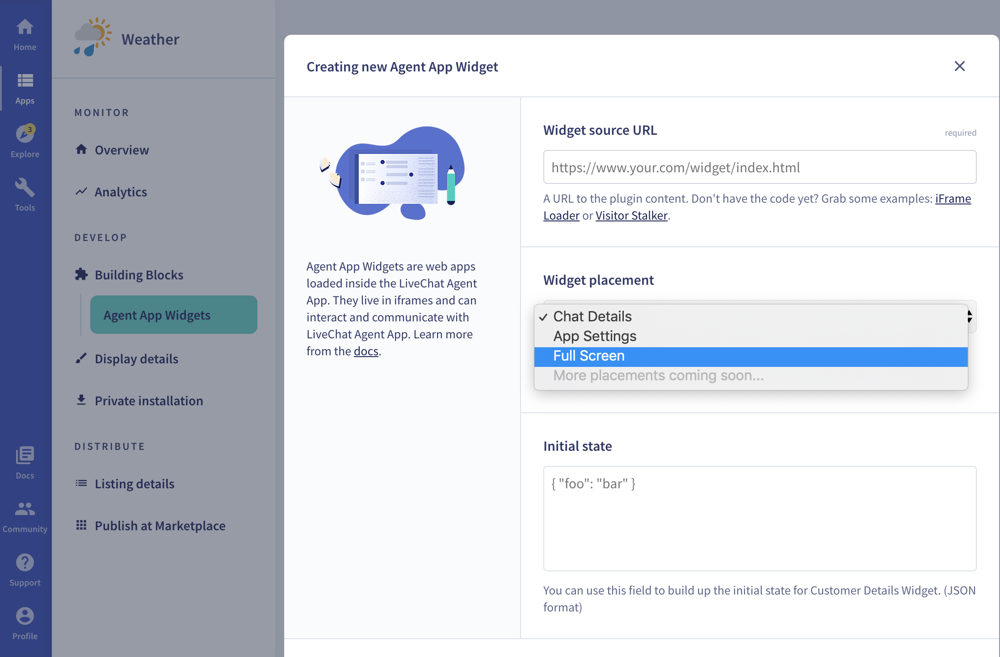

# Extending the LiveChat user interface

Some applications are front-end elements of the **LiveChat user interface**. From a technical perspective, they are regular web applications build with HTML, CSS, and JavaScript. For the sake of classification, we divide them based on the two properties they might have: [_location_](#location) and [_settings_](#settings). 

Apart from the above-mentioned options, there's also a third way of extending the LiveChat UI. It makes use of [**Chat Actions**](#chat-actions) and is independent of the property-based classification.

## Location

Value of the _location_ property determines the app placement in the **Agent App UI**. Further classification includes:

1. [Apps in the sidebar](#agent-apps-in-the-sidebar)
2. [Apps in the **Details** section](#customer-details-apps)
3. [Fullscreen Apps ](#fullscreen-apps)

### Apps in the sidebar

This is one of the most common types of the LiveChat Agent App UI extensions. These apps are displayed in the right sidebar of the Agent App:

In this example, the **Tag Master** app is installed in the Agent App. It's one of our [Sample Applications](https://developers.livechatinc.com/docs/agent-app-widgets/#sample-widgets), which you can [download](https://github.com/livechat/sample-apps/tree/master/tag-master) and install for free. There's no limit when it comes to the number of apps that you can install in this area of the UI. Each app would open in a separate tab.

#### Benefits
Apps in the sidebar allow for easy customization of the **LiveChat Agent App** to meet one's business needs, and get the most of LiveChat.

#### Creating an app located in the sidebar
If you're interested in creating this type of application from scratch, we encourage you to take a look at the [Agent App Widgets](https://developers.livechatinc.com/docs/agent-app-widgets/) document. 

### Apps in the Details section

Another popular kind of applications are those located in the **Details** section. They don't open in separate tabs, but are displayed one below another. In this example, LiveChat Agent App is extended with **Cards for Shopify** and **CartValue**. 

#### Benefits

This is a great solution for displaying information that agents need to have at hand, as they don't need to switch between tabs.

#### Creating an app located in the Details section

To extend your **LiveChat Agent App** with an application located in the **Details** section, follow the steps in [Getting started](https://developers.livechatinc.com/docs/agent-app-widgets/#getting-started).

### Fullscreen apps

The third option are the applications with the _location_ property set to _fullscreen_. The application icon is located in the **navigation bar** on the left. 

In this example, we added an app named **Weather** (visible above the **Marketplace** icon), which loads a weather forecast website. 
Clicking the icon loads the app URL as an iframe. The application is displayed fullscreen, right in the Agent App. 

<!--GRAPHICS HERE (navigation icon) & (fullscreen app)-->

Keep in mind that this feature is not supported on the mobile version of the LiveChat Agent App.

#### Benefits

The greatest advantage of Fullscreen applications is _context switching_. Users no longer need to switch between the Agent App and tabs in the browser. As long as the application they work with is installed as a **Fullscreen app**, they can perform all the operations without leaving the Agent App.

#### Creating a Fullscreen app

The process of creating a Fullscreen app is identical to the one described in [Getting started](https://developers.livechatinc.com/docs/agent-app-widgets/#getting-started). Make sure to select _fullscreen_ as the **Widget placement** in **Step 4**.

<!--GRAPHIC HERE (settings)-->

## Settings

Some applications require settings configuration, especially when they use external services. After installing the app, users need to do the setup in order for the application to work. Let's take **MailChimp** as our example. 

Users can install it from the [Marketplace](https://www.livechatinc.com/marketplace/).

**MailChimps** is installed, but not yet ready to use. In this case, settings need to be configured in the **Agent App**.

After the successful configuration, **MailChimp** can be used within the LiveChat Agent App.

## Chat Actions

Another method of extending the **LiveChat Agent App** is based on **Chat Actions**. The name of this feature speaks for itself- those are different actions that agents can perform when chatting. 

Frequently used chat actions allow for ticket creation, sending conversation transcript, and banning a visitor. If you decide to define your own chat action, this is where it will be displayed in the UI:
<!---->

On our blog, we published a [post](https://developers.livechatinc.com/blog/chat-actions/) dedicated to Chat Actions, so feel free to check it out.

