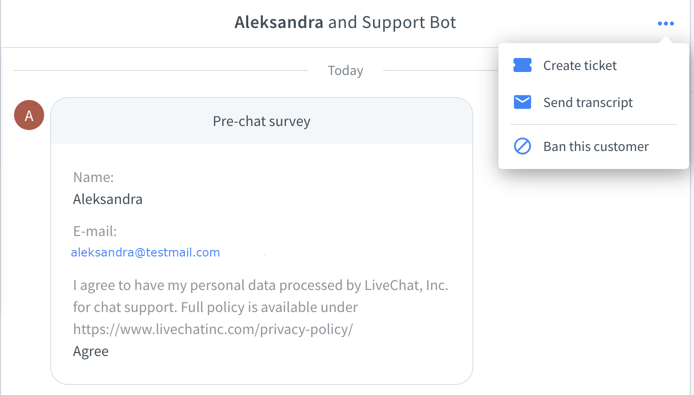
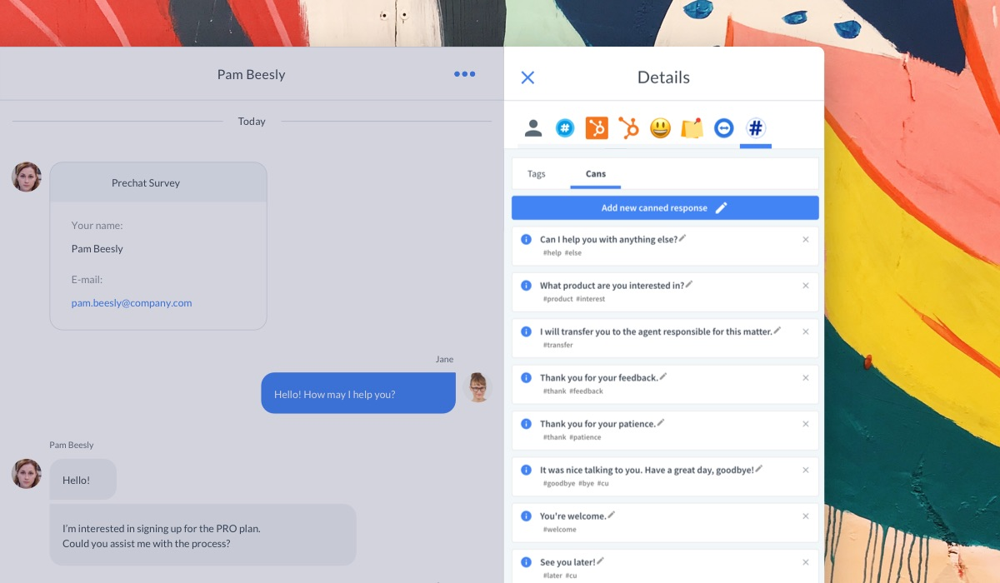
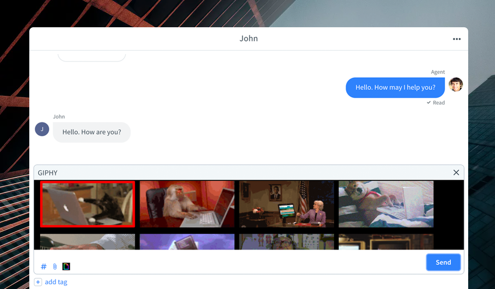

# Extending user interfaces

LiveChat Platform provides simple tools to extend the Agent App interface. With apps, you can add new panels, widgets, and other UI elements.

From a technical perspective, you can build a web application with HTML, CSS, or JavaScript and embed it in different locations of the LiveChat Agent interface. We also provide some native primitives, which don't require from you any coding skills.

You're not limited to the Agent App only. There are several options to [extend the Chat Widget](#extending-the-chat-widget) as well! 

## Extending the Agent App

### Chat Actions

The simplest way to extend the LiveChat Agent App is by using Chat Actions. They are buttons available at hand while chatting.

Popular use cases handle actions such as ticket creation, sending chat transcript, or banning a visitor. This is where Chat Actions are displayed in the UI:

<!--  -->

Check out our [blog post](https://developers.livechatinc.com/blog/chat-actions/) about Chat Actions to learn more.

### App locations

Currently, your app can extend three areas of the the LiveChat Agent interface:

- the Details section, by adding a new tab with your web content or a new widget in the default Customer Details tab
- the Main menu, by adding a new, fullscreen section with your web content
- Chat Actions, by adding a new action button in the Chat Action menu

If you feel we lack some options, please drop us a line at [developers@livechatinc.com](mailto:developers@livechatinc.com)!

#### Details section

Apps in the Details tabs are the most common way to extend LiveChat UI. They are displayed in the right sidebar of the Agent App when browsing Chats or Archives.

In the example above, the **Tag Master** app is installed. It's one of the open-source [sample apps](https://developers.livechatinc.com/docs/agent-app-widgets/#sample-widgets) you can [clone](https://github.com/livechat/sample-apps/tree/master/tag-master) and play with.

Apps located in the Details section are **contextual**. It means they inherit the properties of the currently opened chat. You can use this information to present contextual data for the particular chats.

##### Customer Details widgets

Additionally, those apps can expose a widget in the native Customer Details tab. Those widgets serve as shortcuts or essence of the information presented in the app.

Widgets are simply tiles displayed one below another. In this example, we see how **Cards for Shopify** and **CartValue** extend default Customer Details tab. Widgets are a great solution for displaying information that agents need to have at hand, as they don't need to switch between tabs.

See the [documentation](https://developers.livechatinc.com/docs/agent-app-widgets/) to learn how to embedd your app in the Details section.

#### Main menu (fullscreen apps)

The application icon is located in the **navigation bar** on the left.

Clicking the icon loads the app URL as an iframe. The application is displayed fullscreen, right in the Agent App.

Keep in mind that this feature is not supported on the mobile version of the LiveChat Agent App.

Fullscreen apps help to reduce _context switching_. Users no longer need to switch between the Agent App and tabs in the browser. As long as the application they work with is installed as a **Fullscreen app**, they can perform all the operations without leaving the Agent App. It's particularly important for LiveChat Desktop App users.

See how to create a fullscreen app in the [documentation](https://developers.livechatinc.com/docs/agent-app-widgets/).

#### MessageBox

With this type of widget placement you can integrate your apps in the Message Box. You could use it to send gifs or present items from an online store. This type of integration makes the whole chatting experience much more engaging.

It works in a simple and intuitive way. You open the app, select the element, and confirm your choice by clicking **Send**. This mechanism protects you from sending an element by accident. To learn more about the implementation, see [MessageBox](https://developers.livechatinc.com/docs/agent-app-widgets/#messagebox).

#### App settings

Some applications require settings configuration, especially when they use external services. After installing the app, users need to do the setup in order for the application to work.

We provide a special place called Settings page, where you can embed a page with configuration. It's recommended to use it together with [Sign in with LiveChat](/docs/sign-in-with-livechat/).

See how to setup a Settings page for your app in the [documentation](https://developers.livechatinc.com/docs/agent-app-widgets/).

## Extending the Chat Widget

### Mobile Chat Widgets

Have you got a mobile app? You can still make use of LiveChat and improve your *mobile* user experience! All you need to do is install the mobile **Chat Widget** compatible with your app.

- Mobile [Chat Widget for iOS](https://developers.livechatinc.com/docs/ios-widget/) apps
- Mobile [Chat Widget for Android](https://developers.livechatinc.com/docs/android-widget/) apps
- Mobile [Chat Widget for React Native](https://developers.livechatinc.com/docs/react-native-livechat/) apps 
 

### JavaScript API

[**Chat Widget JavaScript API**](https://developers.livechatinc.com/docs/js-api/) is an easy yet powerful way to integrate your website or application with the **LiveChat** platform.

The integration of your app with the **Chat Widget** can be multiform and contextual.      
E-commerce owners often use JavaScript API to pass visitor data or to track sales made via chat (read about [Sales tracker](https://www.livechatinc.com/kb/sales-tracker/) to learn more).

Also, it could be used to improve the customer support experience. There might be some app locations where users usually get stuck or have problems. To troubleshoot that, you could add a _chat-with-customer-support_ button. Users would click it to ask customer support for help. Similarily, you could put such a button in the _Contact_ or _Help_ section of your app. Those are the tabs where users normally look for support.

What's more, you could use [methods](https://developers.livechatinc.com/docs/js-api/#methods) and [callbacks](https://developers.livechatinc.com/docs/js-api/#callbacks) to send additional data about a chat or visitor. It's possible to manipulate the Chat Widget state (maximize, minimize, hide) and build handlers for the events happening in conversations.

Building a Single Page App (SPA)? We're fine with that! LiveChat integrates well with SPAs, and you will be able to use the API without any problem.

### Moments

[Chat Widget Moments](https://developers.livechatinc.com/docs/chat-widget-moments/) are webpages embedded in an iframe, displayed during a chat. 

Thanks to **Moments**, customers can perform specific actions. For example, you could pick a date from a popping up calendar instead of typing it manually, or let your customer make a purchase right on the spot. Moments were created to solve complex problems easily and securely. You can think of them as an accessible API to integrate the **Chat Widget** with some other software. 

### Rich messages

Sending a [Rich message](https://www.livechatinc.com/kb/rich-messages/) is the way to go when you want your reply to be more personal and visually attractive. Rich messages are more than just plain text. You can make use of images, buttons, quick replies, and cards as well. 

Rich messages are the core feature of our **ChatBot** integration. If you're not familiar with ChatBot, [this article](https://www.livechatinc.com/kb/chatbots-explained/) will come in handy. Currently, they're available either with our ChatBot integration or Beta Chat APIs*.

*) We're working on a new set of APIs, which introduce new features and multiple improvements. Got you curious? Hit us up at <a href="mailto:developers@livechatinc.com">developers@livechatinc.com</a> for more details and early access!

### Customer SDK

You can build advanced custom solutions with the use of Beta Customer SDK*. With this JavaScript library, you can create a chat widget from scratch. It allows you to meet a specific scenario, but is definitely the most challenging option.
Before you interact with this API, keep in mind that complicated solutions call for strong coding skills. 

*) We're working on a new set of APIs and SDKs, which introduce multiple improvements and advanced integration tools. Got you curious? Hit us up at <a href="mailto:developers@livechatinc.com">developers@livechatinc.com</a> for more details and early access!

 
