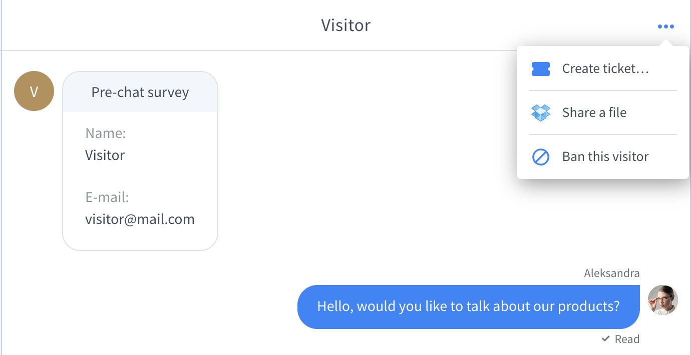
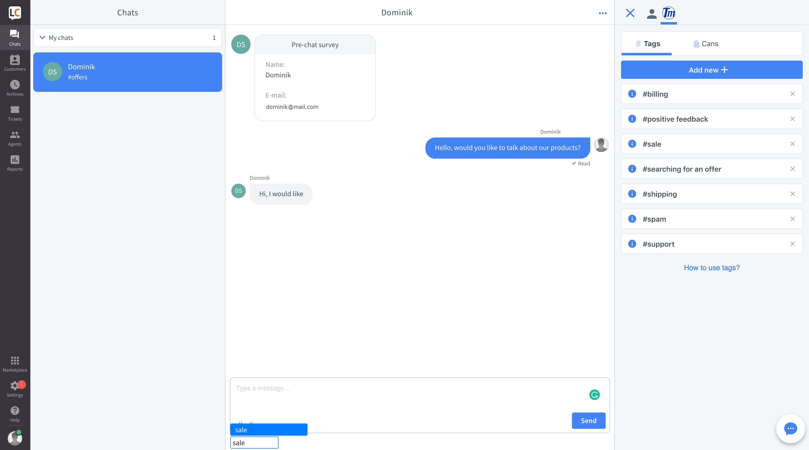
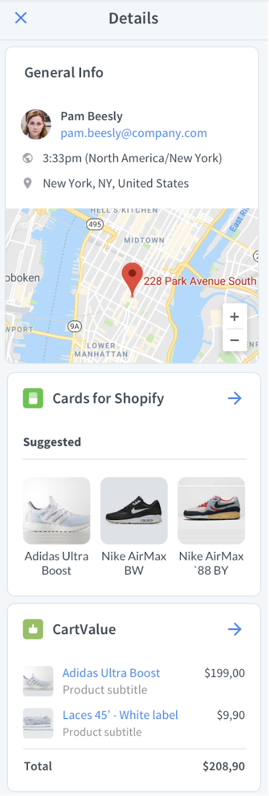
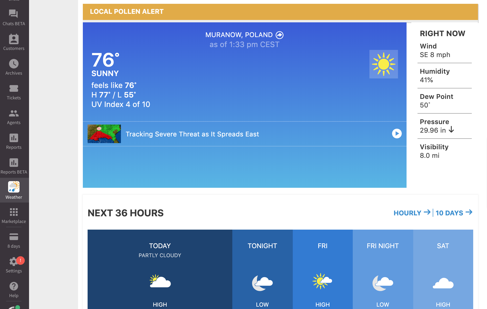
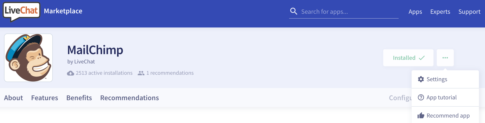
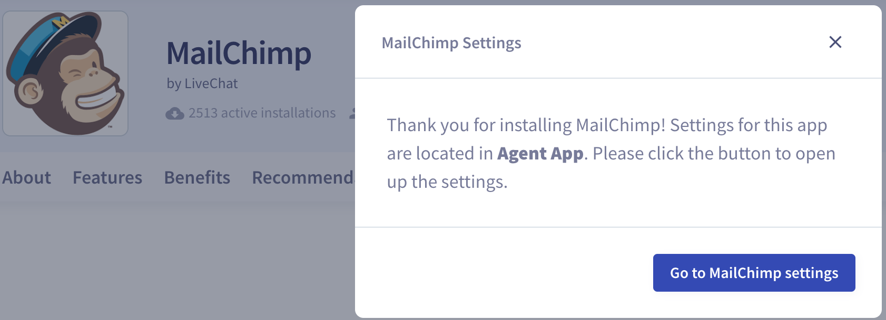
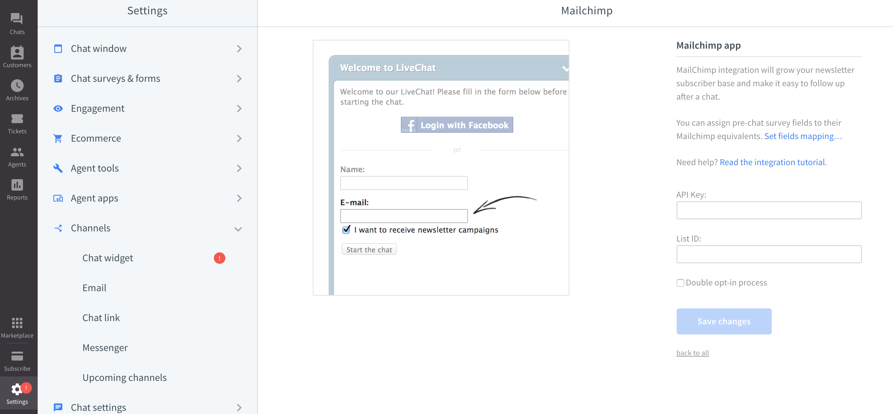

# Extending user interface

LiveChat Platform provides simple tools to extend Agent interface. With apps, you can add new panels, widgets and other UI elements.

From a technical perspective, you can build a web application with HTML, CSS, or JavaScript and embed it in different locations of LiveChat Agent interface. We also provide some native primitives which doesn't require you to code.

## Chat Actions

The simplest way to extend LiveChat Agent App is by using Chat Actions. Those are buttons available at hand while chatting.

Popular use cases are handling actions like ticket creation, sending chat transcript, or banning a visitor. This is where Chat Actions are displayed in the UI:

<!--  -->

Check out [blog post](https://developers.livechatinc.com/blog/chat-actions/) about Chat Actions to learn more.

## App locations

Currently, your app can extend three areas of the LiveChat Agent interface:

- Details section, by adding a new tab with your web content or a new widget at the default Customer Details tab,
- Main menu, by adding a new, fullscreen section with your web content,
- Chat Actions, by adding a new action button in Chat Action menu.

If you feel we miss some options, please drop us a line at [developers@livechatinc.com](mailto:developers@livechatinc.com)!

### Details section

Apps in the Details tabs are the most common way to extend LiveChat UI. They are displayed in the right sidebar of the Agent App when browsing Chats or Archives.

In the example above, the **Tag Master** app is installed. It's one of the open-source [sample apps](https://developers.livechatinc.com/docs/agent-app-widgets/#sample-widgets) you can [clone](https://github.com/livechat/sample-apps/tree/master/tag-master) and play with.

Apps located in the Details section are **contextual**. It means they get properties of the chat currently opened. You can use this information to present contextual data for the particular chats.

#### Customer Details widgets

Addtionally, those apps can expose a widget in native Customer Details tab. Those widgets serve as a shortcuts or essence of information presented in the app.

Widgets are simply tiles displayed one below another. In this example, we see how **Cards for Shopify** and **CartValue** extend default Customer Details tab. Widgets are great solution for displaying information that agents need to have at hand, as they don't need to switch between tabs.

See the [documentation](https://developers.livechatinc.com/docs/agent-app-widgets/) to learn how to embedd your app in the Details section.

### Main menu (fullscreen apps)

The application icon is located in the **navigation bar** on the left.

In this example, we added an app named **Weather** (visible above the **Marketplace** icon), which loads a weather forecast website.

Clicking the icon loads the app URL as an iframe. The application is displayed fullscreen, right in the Agent App.

Keep in mind that this feature is not supported on the mobile version of the LiveChat Agent App.

Fullscreen apps help to reduce _context switching_. Users no longer need to switch between the Agent App and tabs in the browser. As long as the application they work with is installed as a **Fullscreen app**, they can perform all the operations without leaving the Agent App. It's particularly important for LiveChat Desktop App users.

See how to create a fullscreen app in the [documentation](https://developers.livechatinc.com/docs/agent-app-widgets/).

## App settings

Some applications require settings configuration, especially when they use external services. After installing the app, users need to do the setup in order for the application to work.

<!-- Let's take **MailChimp** as our example.

Users can install it from the [Marketplace](https://www.livechatinc.com/marketplace/).

**MailChimps** is installed, but not yet ready to use. In this case, settings need to be configured in the **Agent App**.

After the successful configuration, **MailChimp** can be used within the LiveChat Agent App. -->
