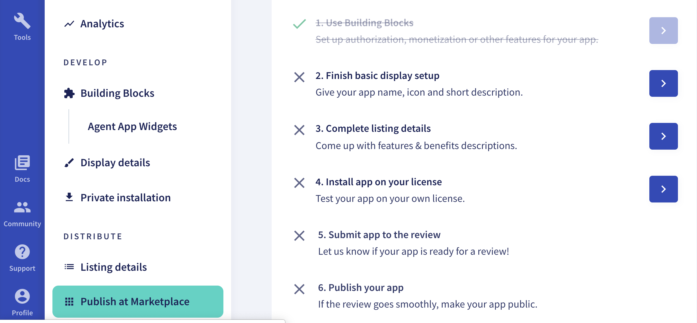
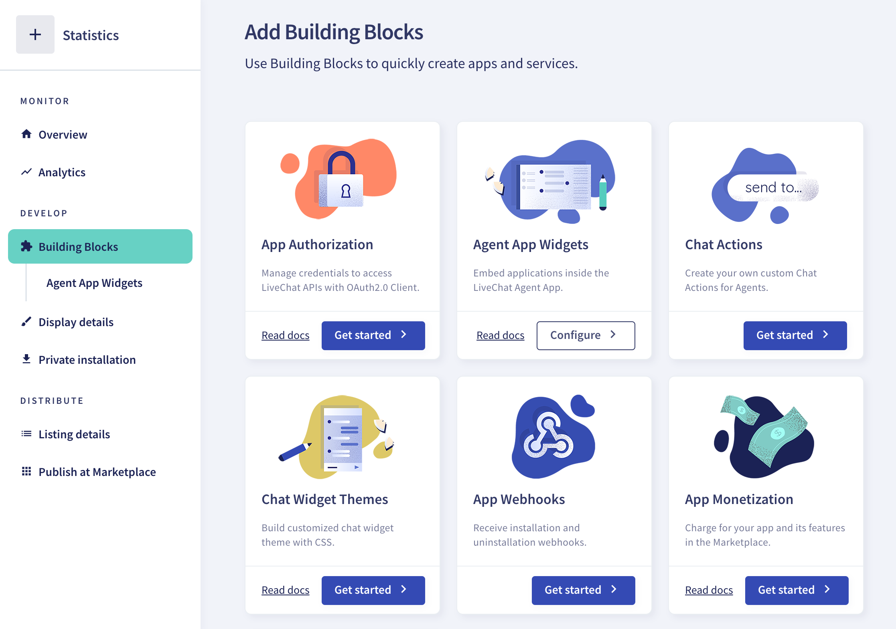
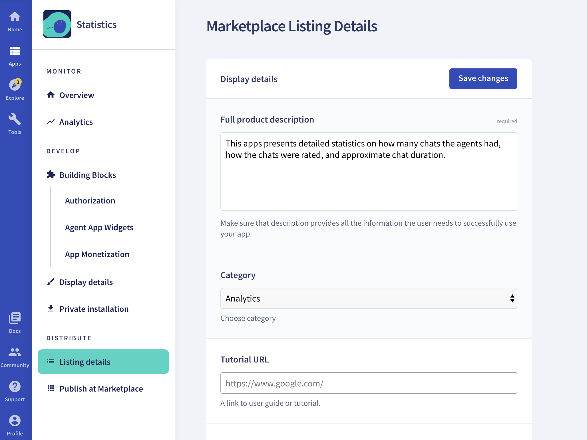
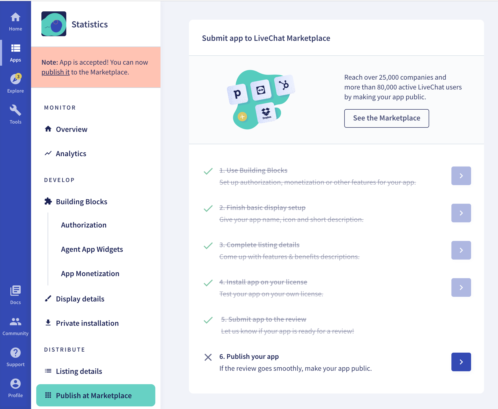

## Introduction

<!--Abstract, short intro -->
Whether your app is already up and running or you're just starting off, the topic of **app monetization** will eventually cross your mind. If you don't know how to go about generating income from your apps, this is the place for you to start.

<!-- Intro for newcomers -->
## If you're new to LiveChat

Developers can extend LiveChat by building applications. Such apps may introduce new features or adjust the behavior of LiveChat products. The goal is to satisfy the specific business needs and use cases.

If you're new to LiveChat, here's how things work in here. LiveChat can be extended with various applications built by developers. All of this is done to meet the specific business needs of those who use LiveChat. You, as a developer and app author, can sell it on our [Marketplace](https://www.livechatinc.com/marketplace/). 

Check out the [Building LiveChat apps](/building-apps-for-livechat/) doc to learn what types of applications can be built upon the LiveChat Platform.

The place to start creating your apps with different building blocks is our [Developer Console](https://developers.livechatinc.com/console/). If your app is ready, you can continue with the monetization process. 

<!-- How the process looks -->
## Core information

Here's the core info about monetization at **LiveChat**:

* Setting up monetization is easy and can be done entirely in [Developer Console](https://developers.livechatinc.com/console/).
* We take care of processing the payments. Then, we transfer your earnings to you via PayPal.
* The provision is 20%, so if you set the app price to be 10$, you will earn 8$ net. 
* We offer two billing cycles: **once a month** and **one-time payment**. We recommend the recurring payment option. 
* You can leverage LiveChat [Billing API](https://developers.livechatinc.com/docs/billing-api/) to implement micropayments in your app.
<!-- Czemu rekomendujemy recurring? Co mozna jeszcze powiedziec o micropayments?-->

## Your role vs. Our role

### **Choose the billing plan**
The only action on your side is to choose the app billing model and set up monetization. It's as simple as using the **App Monetization Building Block**. Payments will be collected automatically depending on the billing cycle you picked.

### **Get help with marketing**
Our part is to help you successfully launch your app. We're ready to support the **promotion** of your product. We can, for example, present your service on a dedicated landing page, popularizing it among potential customers.

## Sample configuration

If you want to know the process inside out, follow the sample configuration we've prepared. We'll use an app named **Statistics** as our example.

<!--Strange as it may seem, we'll start from the very end. Our goal is to **publish the app on Marketplace**, so that others can see and buy it. If you navigate to the tab of this very name, you'll find the list of all the actions you need to complete.

At any point during the configuration, you can go to this tab and check out what's still left to be done. -->

### **Step 1 Starting in the UI**
We begin in the **Building Blocks** tab. This is where we can find the **App Monetization** tile. 

### **Step 2 Setting up payment details**
What you need to do next is set up the following information:

* the **price** of your application 
* the **billing cycle**
* the **trial period** 
  
  

### **Step 3 Creating the app description**
Then, go to **Listing details** and fill in the required fields. This is the place for you to inform about the app and encourage potential users. Make sure to present your app's main functionality and key features.

### **Step 4 Testing the app**
After that, it's time for you to install the app on your account and test it. You can install it in the **Private installation** tab. 

### **Step 5 Submitting for review**
If you feel that your application is ready, submit it for review. It will be an action point for us. We will review your application and get back to you as soon as possible. If you need help along the way, you can always reach us at [developers@livechatinc.com](mailto:developers@livechatinc.com). 

### **Step 6 Publishing**

You'll know that your app is ready for publishing when you see a note saying that **the app is accepted**.
In case of rejection, we'll conact you via email to give you feedback and discuss what needs to be changed.

Publish the app and that's it! The very last thing for you to do is give us a bit of time. Your app will be visible on Marketplace in up to 30 minutes.

## Questions?
<!--As you can see, we propose a process that's quick and easy-to-follow, as the whole setup can be done in one place. 
To minimize your responsibilities, we take on billing issues and help you with promotion.-->

We 're happy to provide our support in case you need. If you have any questions or suggestions, feel free to contact us at [developers@livechatinc.com](mailto:developers@livechatinc.com)!