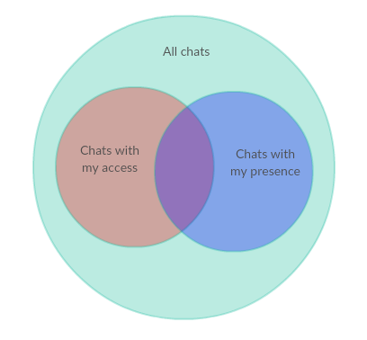

# Scopes

## Scopes list

### Chats scopes

| Scope | role | Description |
|-------|-------------|------------|
| `chats--all:read` | normal | Read permission for all license chats |
| `chats--access:read` | normal | Read permission for chats with my access |
| `chats--my:read` | normal | Read permission for the chats I belong to |
| `chats.conversation--all:write`| normal | Write permission for conversation data of all license chats |
| `chats.conversation--my:write` | normal | Write permission for conversation data of chats I belong to |
| `chats.meta--all:write` | administrator | Write permission for meta data of all license chats |
| `chats.meta--my:write` | normal | Write permission for meta data of chats I belong to |
| `chats--access:write` | normal | Write permission for chats with my access |

* `chats.conversation` applies to:
  * chat events
  * chat properties
  * thread properties
* `chats.meta` applies to:
  * chat users

*NOTICE: currently `chats.conversation--all:write` allows joining chats too because you have to join the chat to be able to write to it*

### Multicast scopes

| Scope | role | Description |
|-------|-------------|------------|
| `multicast:write` | normal | Permission for multicast data to agents or customers |

### Customers scopes

| Scope | role | Description |
|-------|-------------|------------|
| `customers.ban:write` | normal | Permission for banning customers |
| `customers.identity--manage` | administrator | Permission for managing customers identities |
| `customers:read` | normal | Read permission for customers |
| `customers:write` | normal | Write permission for customers |

### Agents scopes

| Scope | role | Description |
|-------|-------------|------------|
| `agents--my:write` | normal | Write permission for my profile configuration |
| `agents--all:write` | administrator | Write permission for all agents profiles configuration |

### Agents scopes

| Scope | role | Description |
|-------|-------------|------------|
| `auto_chat_scopes:read` | administrator | Read permission for auto chat scopes configuration |
| `auto_chat_scopes:write` | administrator | Write permission for auto chat scopes configuration |

### Properties scopes

| Scope | role | Description |
|-------|-------------|------------|
| `properties--my:read` | administrator | Read permission for chat/thread/events properties configuration (only in my namespace) |
| `properties--my:write` | administrator | Write permission for chat/thread/events properties configuration (only in my namespace) |
| `properties--all:read` | administrator | Read permission for chat/thread/events properties configuration (all in license) |

### Webhooks scopes

| Scope | role | Description |
|-------|-------------|------------|
| `webhooks--my:read` | administrator | Read permission for webhooks configuration (only my webhooks) |
| `webhooks--my:write` | administrator | Write permission for webhooks configuration (only my webhooks) |
| `webhooks--all:read` | administrator | Read permission for webhooks configuration (all in license) |
| `webhooks--all:write` | administrator | Write permission for webhooks configuration (all in license, delete only) |

### Bot agents scopes

| Scope | role | Description |
|-------|-------------|------------|
| `agents-bot--my:read` | administrator | Read permission for bot agents configuration (only my bot agents) |
| `agents-bot--my:write` | administrator | Write permission for bot agents configuration (only my bot agents) |
| `agents-bot--all:read` | administrator | Read permission for bot agents configuration (all in license) |
| `agents-bot--all:write` | administrator | Write permission for bot agents configuration (all in license, delete only) |

## Writing to chats

This chart shows every possible chats scenarios:
* chats without my access and without my presence (`chats -A -P`)
* chats with my access but without my presence (`chats +A -P`)
* chats with my presence but without my access (`chats -A +P`)
* chats with my access and with my presence (`chats +P +A`)

The table shows scopes dependency of writing to chat:

| | `chats -A -P` | `chats +A -P` | `chats -A +P` | `chats +P +A` |
| --- | --- | --- | --- | --- | 
| `chats.conversation--all:write` | ✓ | ✓ | ✓ | ✓ |
| `chats--access:write` | - | ✓ | ✓ | - |
| `chats.conversation--my:write` | - | ✓ | - | ✓ |
