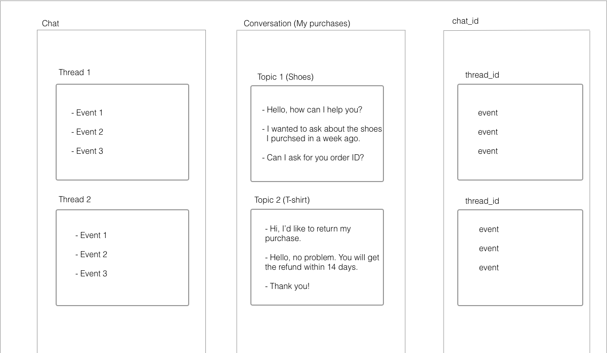

# Key concepts

## Chats and threads

By looking at the chat structure, you notice that each **chat** is is divided into **threads**. Every thread contains **events**, for example sent messages. You can think of a **chat** as _**a whole conversation**_, while **threads** are separate _**conversation topics**_.

Consider the example of an online store. A customer starts a chat to ask about the shoes he bought. If he hasn't got any previous chat history, **a new chat is started**. Within this chat, **a new thread is created** (conversation topic). The messages he exchanges with the customer service assistant are received by the thread as **events**. After solving the problem, the customer says goodbye and closes the chat, which automatically **closes the thread**. Let's say the customer is rude and leaves without saying goodbye. In this case, the thread closes after 30 minutes of inactivity (time periods are configurable). The chat **doesn't end**, though.

The next day, customer returns to ask about his other purchase. A new thread starts in the context of the chat, which has been **continuously open**. Each time customer returns and starts a new conversation topic, he needs to click **_start a chat_**. If we stuck to our naming convention, that would have to be **_start a thread_**, because this is what he actually does behind the scenes. 

A **message** is not the only event type, though. To check out other event types, see the [Events](#events) section.

### Rules and conditions

Here are some general rules, which summarize the previous section and add new info.

1. When a new chat is started, **a new active thread** is created within this chat. New threads within a single chat are created on the server side. 

2. There's always **only one active thread**. Only the **last thread** can be the **active** one. Events are always added to the active thread. 

3. There can be time gaps between threads in a chat, but once a chat is started, it's **continuously open**.

4. Messages are sent and delivered even when the recipient (both Customer and Agent) is **offline**.

5. **Multiple Agents** can participate in a single chat. 

6. Every user can have **multiple concurrent chats**. Read how it applies to [Agents](#chatting-as-an-agent) and [Customers](#chatting-as-a-customer).

7. The algorithm that decides how chats are distributed between Agents is called **routing**. It's documented in the [Routing](#routing) section.

### The flow 

To better understand the flow between services, watch a short video.

<video loop width="750" height="500" style="height: auto;" controls>
<source type="video/mp4" src="/beta-docs/platform-overview/images/simple_event_schema.mp4">
</video>

## Chat routing

Routing is the process of **assigning chats to agents**. The primary goal of the routing mechanism is to distribute chats to all available agents who use the same license.  

Chats are being assigned to agents **either automatically or manually**. Our default routing mechanisms are described in [Understanding chat routing](https://www.livechatinc.com/help/understanding-chat-routing/).

#### Router system messages

While the chat changes its state, the router sends system messages. Read more about **system messages** in [Agent](#agent-system-messages) and [Customer](#customer-system-messages) Chat API.

